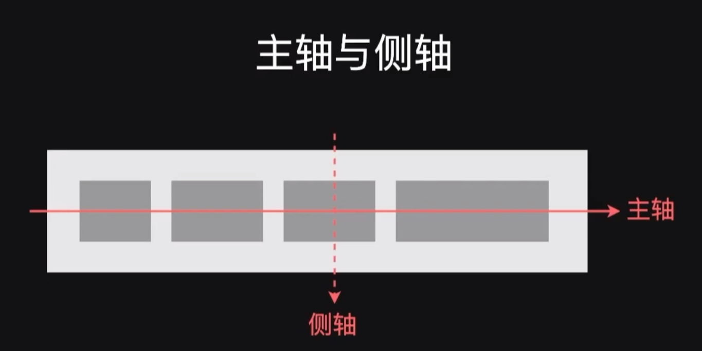
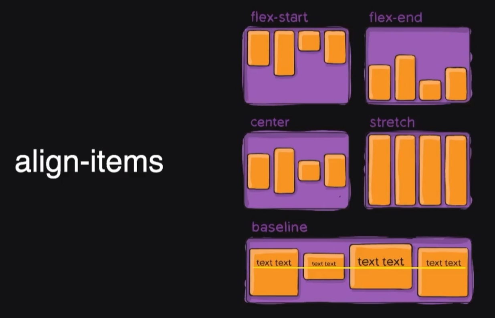
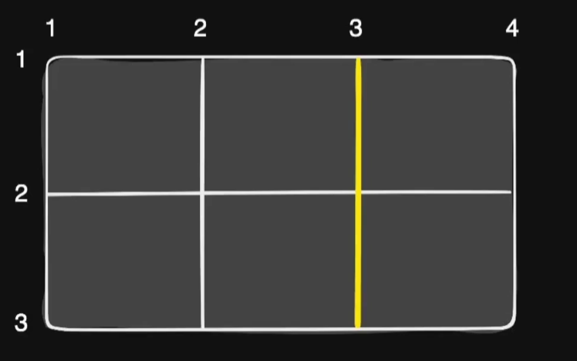

### 基础知识

#### Tips


+ `h1{   }`：一条规则

+ 起手式

  ```css
  *{
      margin: 0;
      padding: 0;
      box-sizing: border-box;  //width包含padding和border
                  content-box; //width只包含content
  }
  ```

+ 移除链接下划线

  ```css
  text-decoration: none;
  ```

+ 移除`li`圆点

  ```css
  list-style: none;
  ```

+ 居中

  ```css
  垂直：line-hight = height;
       vertical-align: baseline | top | middle | bottom //只适用于 行内元素 和 行内块元素
      // 对自己生效
  水平：text-align: center;
       padding: 0 auto;
  
      position: absolute;
      left: 50%;
      transform: translateX(-50%);
  ```

+ 背景颜色作用到border内

+ 清除`input`默认样式

  ```css
  outline: none;
  ```

#### 零碎

+ 定义常量

  ```css
  :root {
      --grey: #f7f7f7;
      --white: #fff;
  }
  div {
      background: var(--grey); 
  }
  ```

+ 单行文本溢出省略号

  ```css
  /*1. 宽度要固定，先强制一行内显示文本*/ 
  white-space: nowrap; （ 默认 normal 自动换行） 
  /*2. 超出的部分隐藏*/ 
  overflow: hidden; 
  /*3. 文字用省略号替代超出的部分*/ 
  text-overflow: ellipsis;
  ```

+ 多行文本溢出显示省略号

  ```css
  p {
      width: 300px;
      overflow: hidden;
      /*将对象作为弹性伸缩盒子模型显示*/
      display: -webkit-box;
      /*设置子元素排列方式*/
      -webkit-box-orient: vertical;
      /*设置显示的行数，多出的部分会显示为...*/
      -webkit-line-clamp: 3;
    }
  ```

+ inline-block元素间有空格，这是`著名的inline-block“换行符/空格间隙问题”`，[CSDN](https://blog.csdn.net/qq_33237207/article/details/86645648)，[ChatGPT 解决办法](https://chat.openai.com/share/7e3ea6f8-dc0e-4208-9e7d-3b172b33dcf8)

  1. 父元素字号设为0，或
  2. 子元素添加float属性

#### 在页面中使用CSS

```css
<!-- 外链 -->
<link rel="stylesheet" href="/assets/style.css">

<!-- 嵌入 -->
<style>
    li {margin: 0; list-style: none;}
    p {margin: lem 0;}
</style>

<!-- 内联 -->
<p style="magin: lem 0">Example Content</p>
```


### 选择器

#### 简介

+ Selector

+ 找出页面中的元素，以便给他们设置样式

+ 使用多种方式选择元素

  + 按照标签名、类名或id
  + 按照属性
  + 按照DOM树中的位置

种类：

+ 统配选择器 `* {......}`

+ 标签选择器 `h1 {}`

+ ID选择器 

  ```css
  <h1 id="title">
  
  #title {......}
  ```

+ 类选择器

  ```css
  <li class="done"></li>
  
  .done {......}
  ```

+ 属性选择器

  ```css
  <input value="zhao" disabled />
  <input value="123456" type="password" />
  
  [disabled] {......}
  input[type="password"] {......}
  ```


+ "~=" 表示属性中包含独立的单词为 value。
+ "|=" 表示属性中必须是完整且唯一的单词，或者以 "-" 分隔开。
+ "^=" 表示属性的前几个字母是 value 就可以。
+ "$=" 表示属性的后几个字母是 value 就可以。
+ "*=" 表示属性中做字符串拆分，只要能拆出来 value 这个词就行。

#### 伪类

+ pseudo-classes

+ 不基于标签和属性定位元素

+ 几种伪类

  + 状态伪类

    ```css
    <!-- 对<a>属性设置不同状态下的规则 -->
    a:link {color: black;}
    a:visited {color: gray;}
    a:hover {color: orange;}<!-- 鼠标移到链接上 -->
    a:active {color: red;}
    a:focus {outline: 2px solid orange}
    ```

  + 结构性伪类

    ```css
    <ol>
        <li>阿凡达</li>
        <li>泰坦尼克号</li>
        <li>星球大战</li>
        <li>复仇者联盟</li>
        <li>侏罗纪世界</li>
    </ol>
    
    <style>
    li {
        border-bottom: 1px solid;
        padding: 0.5em;
    }
    
    li: first-child {
        color: coral;
    }
    
    li: last-child {
        border-bottom: none;
    }
    </style>
    ```

    


区别：

1. nth-child 对父元素里面所有孩子排序选择（序号是固定的） 先找到第n个孩子，然后看看是否和E匹配
2. nth-of-type 对父元素里面指定子元素进行排序选择。 先去匹配E ，然后再根据E 找第n个孩子

##### 伪元素选择器

可以使用CSS创建新标签元素，二部需要HTML标签，从而简化HTML结构

+ `::before: `在元素内部的前面插入内容
+ `::after: `在元素内部的后面插入内容

1. 创建出来的是行内元素
2. 这个元素在DOM中找不到，故意我们称之为伪元素
3. 必须有`content`属性
4. 和标签选择器相同，权重为1

#### 组合

+ Combinators

| 名称       | 语法  | 说明                        |     示例     |
| ---------- | ----- | --------------------------- | :----------: |
| 直接组合   | AB    | 满足A的同时满足B            | input: focus |
| 后代组合   | A B   | 选中B，如果他是A的子孙      |    nav a     |
| 亲自组合   | A > B | 选中B，如果他是A的子元素    | section > p  |
| 兄弟选择器 | A ~ B | 选中B，如果他在A后且和A同级 |    h2 ~ p    |
| 相邻选择器 | A + B | 选中B，如果他紧跟在A后面    |    h2 + p    |

#### 选择器组

```css
body, h1, h2, h3 {
    margin: 0;
    padding: 0;
}

[type="checkbox"], [type="radio"] {
    box-sizing: border-box;
    padding: 0
}
```

### 继承、层叠、优先

+ 某些属性会自动继承其父元素的计算值，除非显示指定一个值
+ 和文字相关的一般都可以继承，和模型相关的都不可继承

#### 优先级

`继承/* < 元素 < 类 < id < 行内 < !important`

#### 特异度

+ Specificity


#### 显式继承

```css
* {
    box-sizing: inherit;
}

html {
    box-sizing: border-box;
}

.some-widget {
    box-sizing: content-box; 
}
```

#### 初始值

+ CSS中，每个属性都有一个初始值
  + `background-color`的初始值为`transparent`
  + `margin-left`的初始值为0
+ 可以用`initial`关键字显式重置为初始值
  + `background-color: initial` 

#### CSS求值过程


### 布局

#### 浮动

对于html: 

- 文本级标签：p、span、a、b、i、u、em。
- 容器级标签：div、h系列、li、dt、dd。

对于css: 

- 行内元素：除了p之外，所有的文本级标签，都是行内元素。p是个文本级，但是是个块级元素。
- 块级元素：所有的容器级标签都是块级元素，还有p标签。

行内元素：

- 与其他行内元素并排；
- 不能设置宽、高。默认的宽度，就是文字的宽度。

块级元素：

- 霸占一行，不能与其他任何元素并列；
- 能接受宽、高。如果不设置宽度，那么宽度将默认变为父亲的100%

pink网页布局准则

+ 多个块级元素纵向排列找标准流，多个块级元素和你选哪个排列找浮动
+ 

创建浮动

```css
float: right|left|none;
```

性质：

+ 脱离标准流的控制移动到指定位置（脱标）
+ 浮动的盒子不再保留原来的位置
+ **相当于行内块元素**

注意：

+ 兄弟们应该一起浮动
+ 浮动的盒子只影响后面的标准流，不会影响前面的标准流

清除浮动的方法：

+ 隔墙法：在末尾添加一个空块元素，如`div`

  ```html
  <div style="clear:both"></div>
  ```

+ 父级添加`overflow`属性，只适用于块级元素

  ```css
  overflow: hidden;
  ```

+ 父级添加`after`伪元素

  ```css
  .mainBox:after{
      display: block;
      clear:both;
      height:0;
      content: "";
      visibility: hidden;
      overflow:hidden;
  }
  ```

+ 父级添加双伪元素

  ```css
  .clearfix::before,.clearfix::after {
    content: "";
    display: table;
  }
  .clearfix::after {
    clear: both;
  }
  ```

#### Flex

[阮一峰Flex教程](https://www.ruanyifeng.com/blog/2015/07/flex-grammar.html)

```css
display: flex;
```

+ 一种新的排版上下文
+ 当我们为父盒子设为 flex 布局以后，子元素的 float、clear 和 vertical-align 属性将失效。
+ 他可以控制子级盒子的：
  + 摆放的流向(← →↑↓)
  + 摆放顺序
  + 盒子宽度和高度
  + 水平和垂直方向的对齐
  + 是否允许折行

---

==以下6个属性设置在容器上==

+ flex-direction：设置主轴的方向
+ justify-content：设置主轴上的子元素排列方式
+ flex-wrap：设置子元素是否换行
+ align-content：设置侧轴上的子元素的排列方式（多行）
+ align-items：设置侧轴上的子元素排列方式（单行）
+ flex-flow：复合属性，相当于同时设置了 flex-direction 和 flex-wrap

##### flex-direction属性

决定主轴的方向（即项目的排列方向）

```css
flex-direction: row | row-reverse | column | column-reverse
```



##### flex-wrap属性

是否换行

```css
flex-wrap: nowrap | wrap | wrap-reverse;
```

##### flex-flow

属性是`flex-direction`属性和`flex-wrap`属性的简写形式，默认值为`row nowrap`

##### justify-content属性

定义了项目在主轴上的对齐方式

```css
justify-content: flex-start | flex-end | center | space-between | space-around;
```

- `flex-start`（默认值）：左对齐
- `flex-end`：右对齐
- `center`： 居中
- `space-between`：两端对齐，项目之间的间隔都相等。
- `space-around`：每个项目两侧的间隔相等。所以，项目之间的间隔比项目与边框的间隔大一倍。


##### `align-items`属性

+ 定义项目在纵轴上如何对齐。

+ 该属性是控制子项在侧轴（默认是y轴）上的排列方式，在子项为单项（单行）的时候使用

```css
align-items: stretch | flex-start | flex-end | center | baseline;
```

- `flex-start`：纵轴的起点对齐。
- `flex-end`：纵轴的终点对齐。
- `center`：纵轴的中点对齐。
- `baseline`: 项目的第一行文字的基线对齐。
- `stretch`（默认值）：拉伸，如果项目未设置高度或设为auto，将占满整个容器的高度。



##### `align-content`属性

+ 定义了多根轴线的对齐方式。如果项目只有一根轴线，该属性不起作用。
+ 设置子项在侧轴上的排列方式 并且只能用于子项出现 换行 的情况（多行），在单行下是没有效果的。

```css
align-content: flex-start | flex-end | center | space-between | space-around | stretch;
```

- `flex-start`：与交叉轴的起点对齐。
- `flex-end`：与交叉轴的终点对齐。
- `center`：与交叉轴的中点对齐。
- `space-between`：与交叉轴两端对齐，轴线之间的间隔平均分布。
- `space-around`：每根轴线两侧的间隔都相等。所以，轴线之间的间隔比轴线与边框的间隔大一倍。
- `stretch`（默认值）：轴线占满整个轴，设置子项元素高度平分父元素高度


---

==以下6个属性设置在项目上==

+ flex 子项目占的份数
+ align-self 控制子项自己在侧轴的排列方式
+ order属性定义子项的排列顺序（前后顺序）

##### `order`属性

定义项目的排列顺序。数值越小，排列越靠前，默认为0。

##### `flex-grow`属性

定义项目的放大比例，默认为`0`，即如果存在剩余空间，也不放大

##### `flex-shrink`属性

定义了项目的缩小比例，默认为1，即如果空间不足，该项目将缩小。

##### `flex-basis`属性

定义了在分配多余空间之前，项目占据的主轴空间（main size）

浏览器根据这个属性，计算主轴是否有多余空间。它的默认值为`auto`，即项目的本来大小。

##### `flex`属性

是`flex-grow`, `flex-shrink` 和 `flex-basis`的简写，默认值为`0 1 auto`。后两个属性可选。

<a href="https://www.zhangxinxu.com/wordpress/2019/12/css-flex-deep/">简写</a>：

```css
flex: x;
相当于：flex: x 1 0;
```

- `flex-grow`就是家产剩余家产仍有富余的时候该如何分配。
- `flex-shrink`就是家产剩余家产不足的时候该如何分配。
- `flex-basis`就是分配固定的家产数量。

##### `algn-self`属性

允许单个项目有与其他项目不一样的对齐方式，可覆盖`align-items`属性。默认值为`auto`，表示继承父元素的`align-items`属性，如果没有父元素，则等同于`stretch`。

```css
align-self: auto | flex-start | flex-end | center | baseline | stretch;
```

##### Flexibility

+ 可以设置子项的弹性：当容器有剩余空间时，会伸展；容器空间不够时，会收缩
+ flex-grow 有剩余空间时的伸展能力
+ flx-shrink 容器空间不足时收缩的能力
+ flex-basis 没有伸展或收缩时的基础长度


#### Grid

gird游戏：https://cssgridgarden.com/#zh-cn

[阮一峰Grid教程](https://www.ruanyifeng.com/blog/2019/03/grid-layout-tutorial.html)


+ display: grid 使元素生成一个块级的 Grid 容器
+ 使用grid-template 相关属性将容器划分为网络
+ 设置每一个子项站哪些行、列

Grid-line网格线



```css
grid-area: grid-row-start/grid-column-start/grid-row-end/grid-column-end;
```

==作用于容器：==

##### `grid-template-*`

+ 指定行高和列宽

  ```css
  .container {
    display: grid;
    grid-template-columns: 100px 100px 100px;
    grid-template-rows: 100px 100px 100px;
  }
  ===
  .container {
    display: grid;
    grid-template-columns: repeat(3, 100px);
    grid-template-rows: repeat(3, 100px);
  }
  ```

  画了一个3x3的网格

关键字

1. `auto-fill`

+ 有时，单元格的大小是固定的，但是容器的大小不确定。如果希望每一行（或每一列）容纳尽可能多的单元格，这时可以使用`auto-fill`关键字表示自动填充

  ```css
  .container {
    display: grid;
    grid-template-columns: repeat(auto-fill, 100px);
    grid-template-columns: repeat(12, 1fr);
  }
  ```

  

2. `auto-fit`与`auto-fill`相似。他们的差异体现在盒子不足以填满一行、并且单元格的宽度不固定时：auto-fill会保留空格，auto-fit会拉伸以填满一行

3. `fr`指定比例的单位，相当于flex的`flex: number;`

   ```css
   .container {
     display: grid;
     grid-template-columns: 150px 1fr 2fr;
   }
   ```

4. `minmax()`，指定长度的范围

   ```css
   grid-template-columns: 1fr 1fr minmax(100px, 1fr);
   ```

   `minmax(100px, 1fr)`表示列宽不小于`100px`，不大于`1fr`

5. `auto`有浏览器计算宽度

   ```css
   grid-template-columns: 100px auto 100px;
   ```

   上面代码中，第二列的宽度，基本上等于该列单元格的最大宽度，除非单元格内容设置了`min-width`，且这个值大于最大宽度。

6. **网格线的名称**

   `grid-template-columns`属性和`grid-template-rows`属性里面，还可以使用方括号，指定每一根网格线的名字，方便以后的引用。

   ```css
   .container {
     display: grid;
     grid-template-columns: [c1] 100px [c2] 100px [c3] auto [c4];
     grid-template-rows: [r1] 100px [r2] 100px [r3] auto [r4];
   }
   ```

   网格布局允许同一根线有多个名字，比如`[fifth-line row-5]`。

##### grid-gap

+ `row-gap`属性设置行与行的间隔（行间距）
+ `column-gap`属性设置列与列的间隔（列间距）
+ `gap`属性是`grid-column-gap`和`grid-row-gap`的合并简写形式，适用于`flex`和`grid`
  + 如果`grid-gap`省略了第二个值，浏览器认为第二个值等于第一个值。

##### grid-template-areas

网格布局允许指定"区域"（area），一个区域由单个或多个单元格组成。

`grid-template-areas`性用于定义区域。

1. 下面代码先划分出9个单元格，然后将其定名为`a`到`i`的九个区域，分别对应这九个单元格

   ```css
   .container {
     display: grid;
     grid-template-columns: 100px 100px 100px;
     grid-template-rows: 100px 100px 100px;
     grid-template-areas: 'a b c'
                          'd e f'
                          'g h i';
   }
   ```

2. 多个单元格合并成一个区域的写法如下：

   ```css
   grid-template-areas: "header header header"
                        "main main sidebar"
                        "footer footer footer";
   ```

3. 如果某些区域不需要利用，则使用"点"（`.`）表示：

   ```css
   grid-template-areas: 'a . c'
                        'd . f'
                        'g . i';
   ```

   上面代码中，中间一列为点，表示没有用到该单元格，或者该单元格不属于任何区域

> 注意，区域的命名会影响到网格线。每个区域的起始网格线，会自动命名为`区域名-start`，终止网格线自动命名为`区域名-end`。
>
> 比如，区域名为`header`，则起始位置的水平网格线和垂直网格线叫做`header-start`，终止位置的水平网格线和垂直网格线叫做`header-end`

##### grid-auto-flow

+ 指定项目的填充顺序

+ 默认先行后列

+ `grid-auto-flow: column;`先列后行

+ `row dense`和`column dense`这两个值主要用于指定，某些项目指定位置以后，剩下的项目自动放置的方式——不留空格：

  ```css
  grid-auto-flow: row dense;
  ```

  

##### justify-items，align-items，place-items

+ `justify-items`属性设置单元格内容的**水平**位置（左中右）

+ `align-items`属性设置单元格内容的**垂直**位置（上中下）

+ `place-items`属性是`align-items`属性和`justify-items`属性的合并简写形式

```css
.container {
  justify-items: start | end | center | stretch;
  align-items: start | end | center | stretch;
}

place-items: <align-items> <justify-items>;
```

##### justify-content，align-content，place-content

+ 指定整个grid网表在容器中的位置（grid可能没有填满容器）
  1. start - 对齐容器的起始边框。
  2. end - 对齐容器的结束边框
  3. center - 容器内部居中
  4. stretch - 项目大小没有指定时，拉伸占据整个网格容器
  5. space-around - 每个项目两侧的间隔相等。所以，项目之间的间隔比项目与容器边框的间隔大一倍
  6. space-between - 项目与项目的间隔相等，项目与容器边框之间没有间隔
  7. space-evenly - 项目与项目的间隔相等，项目与容器边框之间也是同样长度的间隔
+ `place-content: <align-content> <justify-content>`如果省略第二个值，浏览器就会假定第二个值等于第一个值

##### grid-auto-columns，grid-auto-rows

+ 定义网格外部元素的宽高
+ 默认是单元格内容的大小

##### grid-template，grid

1. `grid-template`属性是`grid-template-columns`、`grid-template-rows`和`grid-template-areas`这三个属性的合并简写形式
2. `grid`属性是`grid-template-rows`、`grid-template-columns`、`grid-template-areas`、 `grid-auto-rows`、`grid-auto-columns`、`grid-auto-flow`这六个属性的合并简写形式

==项目属性==


##### grid-column-* 属性， grid-row-* 属性

1. `grid-column-start`属性：左边框所在的垂直网格线
2. `grid-column-end`属性：右边框所在的垂直网格线
3. `grid-row-start`属性：上边框所在的水平网格线
4. `grid-row-end`属性：下边框所在的水平网格线）
   + **支持负数**

+ 这四个属性的值，除了指定为第几个网格线，还可以指定为网格线的名字

  ```css
  .item-1 {
    grid-column-start: header-start;
    grid-column-end: header-end;
  }
  ```

+ 这四个属性的值还可以使用`span`关键字，表示"跨越"，即左右边框（上下边框）之间跨越多少个网格

  ```css
  .item-1 {
    grid-column-start: span 2;
    grid-column: 2 / span 3
  }
  ```

  

```css
.item {
  grid-column: <start-line> / <end-line>;
  grid-row: <start-line> / <end-line>;
}
```

斜杠以及后面的部分可以省略，默认跨越一个网格。

##### `grid-area`

+ 指定项目放在哪一个区域

  ```css
  .item-1 {
    grid-area: e;
  }
  ```

+ `grid-area`属性还可用作`grid-row-start`、`grid-column-start`、`grid-row-end`、`grid-column-end`的合并简写形式，直接指定项目的位置

  ```css
  .item-1 {
    grid-area: 1 / 1 / 3 / 3;
  }
  ```

##### justify-self 属性， align-self 属性， place-self 属性

+ `justify-self`属性设置单元格内容的水平位置（左中右），跟`justify-items`属性的用法完全一致，但只作用于单个项目

#### Position

+ static : 默认值，静态定位，不受`left/right...`影响

+ relative：相对自己，不影响文档流

  子绝父相

+ absolute：相对父亲偏移，移出文档流

  定位基点（一般是父元素）不能是`static`定位，否则定位基点就会变成整个网页的根元素`html`

+ fixed:  固定定位，相对浏览器窗口，脱离文档流。适合用于固定浮窗、导航条

  会把元素的宽高设置成内容的宽高，`right:0  left:0 `可以让宽度占满包含容器

+ sticky:  相当于relative和fixed的结合体

Layout

+ 确定内容的大小和位置的算法
+ 依据元素、容器、兄弟节点和内容等信息来计算

布局相关技术

+ 常规流
  + 行级
  + 块级
  + 表格布局
  + FlexBox
  + Grid布局
+ 浮动
+ 绝对定位

#### display

https://www.cnblogs.com/keithwang/p/3139517.html

+ `block`:  块级元素，相当于一行，独占一行。可以通过css设置宽高，只作用于content，同行仍然不能有其他元素
+ `inline`:  行级元素，无视**宽度和高度**，大小依内容，内容多大就占多大地方
+ `inline-block`:  高度和宽度都生效

+ block:  块级盒子

+ inline:  行级盒子

+ inline-block:  

  + 本身是行级，可以放在行盒中；

  + 可以设置宽高；

  + 作为一个整体不会被拆散成多行

+ none:  排版时完全忽略

#### 常规流

normal flow

+ 根元素、浮动和绝对定位的元素会脱离常规流
+ 其他元素都在常规流之内(in-flow)
+ 常规流中的盒子，在某种排版上下文中参与布局
  + 行级排版上下文
  + 块级排版上下文
  + Table 排版上下文
  + Flex 排版上下文
  + Grid 排版上下文

##### 行级排版上下文

+ Inline Formatting Context( IFC )
+ 只包含行级盒子和容器会创建一个 IFC
+ IFC 内的排版规则
  + 盒子在一行内水平摆放
  + 一行放不下时，换行显示
  + text-align 决定一行内盒子的水平对齐
  + vertical-align 决定一个盒子在行内的垂直对齐
  + 避开浮动( float )元素

##### 块级排版上下文

+ Block Formatting Context( BFC )

+ 某些元素会创建一个BFC

  + 根元素
  + 浮动、绝对定位、inlie-block
  + Flex 子项和 Grid 子项
  + overflow 值不是 visible 的块盒
  + display: flow-root

+ BFC 内的排版规则

  + 盒子从上到下摆放
  + 垂直 margin 合并
  + BFC 内盒子的 margin 不会与外面的合并
  + BFC 不会和浮动元素重叠

#### 定位

position

https://www.ruanyifeng.com/blog/2019/11/css-position.html

+ static 默认值，非定位元素
+ relative  相对于自身原本位置便宜，不脱离文档流
+ absolute  绝对定位，相对于非 static 祖先元素定位
+ fixed  相对于视口绝对定位
  + 当页面滚动，父元素开始脱离视口时（即部分不可见），只要与`sticky`元素的距离达到生效门槛，`relative`定位自动切换为`fixed`定位；等到父元素完全脱离视口时（即完全不可见），`fixed`定位自动切换回`relative`定位。

##### relative

+ 在常规流里面布局
+ 相对于自己本应该在的位置进行偏移
+ 使用 top、left、bottom、right 设置偏移长度
+ 流内其他元素当它没有偏移一样布局

##### absolue

+ 脱离常规流
+ 相对于最近的非static祖先定位
+ 不会对流内元素布局造成影响
+ 

### 盒模型

+ content → padding → border → margin

+ 内容 → 内边距 → 边框 → 外边距


##### width

+ 指定content box宽度
+ 取值为长度、百分数、auto
+ auto由浏览器根据其他属性确定
+ 百分数相对于容器的content box宽度

##### height

+ 指定content box 高度
+ 取值为长度、百分数、auto
+ auto 取值由内容计算得来
+ 百分数相对于容器的 content box 高度
+ 容器有指定的高度时，百分数才生效 

##### padding


+ 指定元素四个方向的内边距
+ 百分数相对于容器宽度
+ + padding
  + top-bottom left-right
  + top right bottom left

##### border

+ 指定容器边框样式、粗细和颜色

+ 三种属性
  + border-width
  + border-style
  + border-color
+ 四个方向
  + border-top
  + border-right
  + border-bottom
  + border-left

```css
border: 1px solid #ccc;

border-left: 1px solid #ccc;
border-right: 2px dotted red;

border-width: 1px 2px 3px 4px;
border-style: solid;
border-color: green blue;

border-left-width: 3px;
border-top-color #f00;
```

##### margin

+ 指定元素四个方向的外边距

+ 取值可以是长度、百分数、auto

+ 百分数相对于容器宽度

+ margin塌陷：父子嵌套的元素垂直方向的`margin`取最大值。（父元素会抢夺子元素竖直方向的margin值）

  解决：`overflow: hidden;`

1. margin: auto可以水平居中

   ```css
   div {
       width: 200px;
       height: 200px;
       background: coral;
       margin-left: auto;
       margin-right: auto;
   }
   ```

##### margin collapse

margin在垂直方向边距的冗合并/折叠

##### border-box

可以分为`content-box`和`border-box`，默认为前者


```css
.a {
    width: 100%;
    padding: 1em;
    border: 3px solid #ccc;
}

.b {
    box-sizing: border-box;
    width: 100%;
    padding: 1em;
    border: 3px solid #ccC;
}
<!-- a会比b宽一点 -->
* {
    box-sizing: border-box;
}
```

##### overflow

overflow: 

+ visible 
+ hidden
+ scroll（滚动）

#### 盒模型

**可以用`padding`撑开盒子**

+ 块级
  + 不和其他盒子并列摆放
  + 适用于所有的盒模型属性
+ 行级
  + 和其他行级盒子一起放在一行或拆开成多行
  + 盒模型中的width、height不适用

+ 块级元素
  + 生成块级盒子
  + body、article、div、main、section、h1-6、p、ul、li
  + display: block
  + `margin: 0 auto`可以水平居中
+ 行级元素
  + 生成行级盒子，内容分散在多个行盒(line box)中
  + span、em、strong、cite、code
  + display: inline

### 属性

#### 鼠标

`cursor`

https://developer.mozilla.org/zh-CN/docs/Web/CSS/cursor

+ pointer: 手，悬浮于链接上
+ not-allowed：禁止，不能执行
+ grab:  抓取
+ default:   默认，一般为箭头

#### 颜色

##### RGB

+ 6位十六进制数
+ rgb(a, b, c)，其中abc为0~255的10进制数

##### HSL

+ Hue色相，如红色、黄色等，取值范围0~350
+ Saturation饱和度，色彩的鲜艳程度，越高越鲜艳，取值范围0~100%
+ Lightness亮度，明亮程度，越高颜色越亮，取值范围0~100%

#### 字体

##### font-family


+ 上传字体：Web Fonts

  ```css
  <h1>web fonts are awesome!</h1>
  <style>
      @font-face {
      font-family: "Megrim";
      src: url(https: //fonts.gstatic.com/s/megrim/v11/46kulbz5wjvLqJZVam_hVUdI1w.woff2)format ( 'woff2' );
      }
  
  h1 {
      font-family: Megrim,Cursive;
      }
  </style>
  ```

##### font-size

+ 关键字
  + small, medium, large
+ 长度
  + px，一个像素
  + em，相对于父级的大小
+ 百分数
  + 相对于父元素字体大小

`text-indent: 2em`首行缩进

#### 盒子阴影

```css
box-shadow: h-shadow v-shadow blur spread color insert;
```


#### 背景

```css
background-image: url();
background-repeat: no-repeat;
background-size: cover 全覆盖背景
                 | contain  最大化显示
backdrop-filter: blur(25px);  //毛玻璃效果
```

渐变背景：

```css
background: -webkit-linear-gradent(red, blue)
backgorund: linear-gradient(45deg, white, black)
```

##### 字体属性

复合属性：

```css
font: font-style font-weight font-size/line-height font-family;
<!-- 一定要有字号和字体 -->
```

| 属性        | 值                                         | 备注                                       |
| ----------- | ------------------------------------------ | ------------------------------------------ |
| font-family | "微软雅黑"（"Microsoft Yahei"）, Consol    | 先后顺序代表优先级，在最后加一个通用字体族 |
| font-size   | 16px(像素)                                 | 必须加单位                                 |
| font-weight | lighter/ normal/ bold/ bolder/ number(700) | 字重，推荐用数字  100 ~ 900                |
| font-style  | normal/ italic                             | 很少用                                     |

##### 文本属性

| 属性                      | 值                                      | 备注                                         |
| ------------------------- | --------------------------------------- | -------------------------------------------- |
| color                     | red/ #000000/ rgb(0,0,0)                | 三种格式                                     |
| text-align  对齐文本      | left/ right/ center                     |                                              |
| text-decoration  装饰文本 | none/ underline/ overline/ line-through |                                              |
| text-indent  文本首行缩进 | xx px/ 2em                              | em是一个相对单位，恒为当前一个字符的大小     |
| line-height  行高/行间距  | xx px                                   | 没有单位时，表示为字体大小的xx倍，是相对大小 |

##### white-space

控制空白符的展示

+ normal
+ nowrap
+ pre
+ pre-wrap
+ pre-line

##### a标签

+ 文本内链接：`name`
+ `target="_blank|_self|_top|_parent"`

### 动画

https://juejin.cn/post/6970883520168198158

- 过渡：transition
- 2D 转换 transform
- 3D 转换 transform
- 自定义动画：animation

#### transition

实现**补间**动画

- 补间动画：自动完成从起始状态到终止状态的的过渡。不用管中间的状态。
- 帧动画：通过一帧一帧的画面按照固定顺序和速度播放。如电影胶片。

相关属性：

- `transition-property: all;` 如果希望所有的属性都发生过渡，就使用all。
- `transition-duration: 1s;` 过渡的持续时间。
- `transition-timing-function: linear;` 运动曲线。属性值可以是：
  - `linear` 线性
  - `ease` 减速
  - `ease-in` 加速
  - `ease-out` 减速
  - `ease-in-out` 先加速后减速
- `transition-delay: 1s;` 过渡延迟。多长时间后再执行这个过渡动画。

综合：

```css
transition: 让哪些属性进行过度 过渡的持续时间 运动曲线 延迟时间;
transition: all 3s linear 0s;
```

触发方式：

```css
.box{
    width: 200px;
    background-color: green;
    /* 谁要过渡给谁加 */
    transition: width 2s linear 0s;
}
.box:hover{
    width: 500px;
    background-color: orange;
}
```

当`:hover`伪类被触发后，会启动`transition`向`:hover`的属性变化

`transition`只用来控制时长

#### transform

+ 2D 转换：缩放、移动、旋转。
+ 3D 转换：

**2D:**

##### 缩放scale

```css
.box2:hover {
    background-color: yellowgreen;
    transform: scale(2, 0.5);
}
```

+ x:  x方向的缩放倍数
+ y:  y方向的缩放倍数

##### 位移translate

```css
transform:translate(-50%, -50%);
```

相对于自身移动

##### 旋转rotate

```css
transition: all 2s;
transform: rotate(45deg)
```

正值：顺时针；负值：逆时针

**transform: rotate()必须和transition**配合使用

rotate 旋转时，默认是以盒子的正中心为坐标原点的。如果想**改变旋转的坐标原点**，可以用`transform-origin`属性

```css
transform-origin: center bottom;   //旋转时，以盒子底部的中心为坐标原点
```

**3D:**

让元素保留立体空间

`transform-style: preserve-3d;`

旋转：

+ x: 右
+ y: 下
+ z: 垂直屏幕向上

```css
transform: rotateX(360deg);    //绕 X 轴旋转360度  //顺时针
transform: rotateY(360deg);    //绕 Y 轴旋转360度
transform: rotateZ(360deg);    //绕 Z 轴旋转360度
```

平移：

```css
transform: translateX(100px);    //沿着 X 轴移动
transform: translateY(360px);    //沿着 Y 轴移动
transform: translateZ(360px);    //沿着 Z 轴移动
```

透视：perspective

电脑显示屏是一个 2D 平面，图像之所以具有立体感（3D效果），其实只是一种视觉呈现，通过透视可以实现此目的。

透视可以将一个2D平面，在转换的过程当中，呈现3D效果。但仅仅只是视觉呈现出 3d 效果，并不是正真的3d。

格式有两种写法：

- 作为一个属性，设置给**父元素**，作用于所有3D转换的子元素
- 作为 transform 属性的一个值，做用于元素自身。

格式举例：

```css
perspective: 500px;
```

#### animation

```css
// 关键帧定义
@keyframes animateName{
    0%   { width:50px; height:50px; }    
    50%  { width:100px; height:100px; }    
    100% { width:50px; height:50px; }
}
// 0%和100%分别可以用from和to代替，也可以省略

.box {
    width: 50px;
    height: 50px;
    background-color: pink;
    // 使用
    // animation: 定义的动画名称 持续时间  执行次数  是否反向  运动曲线 延迟执行。(infinite 表示无限次)
    animation-name: test;
    animation-duration: 2s;
    animation-iteration-count: infinite;
    animation-timing-function: linear;
    // animation: 36.5s linear 0s infinite orbit;
}
```

+ `animation-duration`:  动画单次播放时间

+ `animation-iteration-count`:  动画播放次数

+ `animation-timing-function`:  速度函数

+ `animation-delay`:  动画延迟时间

  | 值                            | 描述                                                         |
  | ----------------------------- | ------------------------------------------------------------ |
  | linear                        | 动画从头到尾的速度是相同的。                                 |
  | ease（缓解）                  | **`默认值`**：动画以低速开始，然后加快，在结束前变慢。       |
  | ease-in                       | 动画以低速开始。                                             |
  | ease-out                      | 动画以低速结束。                                             |
  | ease-in-out                   | 动画以低速开始和结束。                                       |
  | cubic-bezier(*n*,*n*,*n*,*n*) | 贝塞尔曲线（自定义数值），可到[相关网站](https://link.juejin.cn?target=https%3A%2F%2Fcubic-bezier.com%2F)可视化设置。 |

+ `animation-direction`: 动画播放顺序：正序 / 逆序

  | 值                  | 描述                                 |
  | ------------------- | ------------------------------------ |
  | normal              | 默认值。动画按正常播放。             |
  | reverse             | 动画反向播放。                       |
  | alternate（交替的） | 动画正向交替执行（正向->反向）Loop。 |
  | alternate-reverse   | 动画反向交替执行（反向->正向）Loop。 |
  | inherit             | 从父元素继承该属性。                 |

+ `animation-fill-mode`用于设置动画的填充模式，主要应用的属性值为：

  | 值        | 描述                                                         |
  | --------- | ------------------------------------------------------------ |
  | none      | 默认值。动画在动画执行前后，不会应用任何样式到目标元素。     |
  | forwards  | 在动画结束后（**由 animation-iteration-count 决定**），目标元素将保持应用`最后帧`动画。 |
  | backwards | 在动画结束后（**由 animation-iteration-count 决定**），目标元素将保持应用`起始帧`动画。 |

### 媒体查询

+ 从小屏到大屏

```css
@media mediatype and|not|only (media feature){
    CSS-code;
}
或
<link rel="stylesheet" href="style.css" media="screen and (min-width:540px)">
```

+ `mediatype` 媒体类型

  | 值     | 解释                             |
  | ------ | -------------------------------- |
  | all    | 用于所有设备                     |
  | print  | 用于打印机和预览                 |
  | screen | 用于电脑屏幕、平板电脑、智能手机 |

+ `media feature` 媒体特性，必须加小括号

  | 值                | 说明                                                        |
  | ----------------- | ----------------------------------------------------------- |
  | `width`           | 定义输出设备中页面可见区域的宽度                            |
  | `min-width: xxx;` | 定义输出设备中页面最小可见区域宽度（当屏幕**大于**`xxx`时） |
  | `max-width: yyy;` | 定义输出设备中页面最大可见区域宽度（当屏幕**小于**`yyy`时） |

  

### 经典案例

#### tab切换

https://segmentfault.com/a/1190000015665887

```html
<div class="tabs">
  <div class="tab-pane">
    <input type="radio" name="tab" id="tab01" checked />
    <label class="tab-item" for="tab01">tab01</label>
    <div class="tab-content">111</div>
  </div>
  <div class="tab-pane">
    <input type="radio" name="tab" id="tab02"/>
    <label class="tab-item" for="tab02">tab02</label>
    <div class="tab-content">222</div>
  </div>
  <div class="tab-pane">
    <input type="radio" name="tab" id="tab03"/>
    <label class="tab-item" for="tab03">tab03</label>
    <div class="tab-content">333</div>
  </div>
</div>

<style>
.tabs{
  position:relative;
  width:400px;
  height:300px;
}
.tab-pane{
  display:inline-block;
}
.tabs input[type='radio']{
  position:absolute;
  clip:rect(0,0,0,0)
}
.tab-item{
  display:block;
  height:34px;
  line-height:34px;
  cursor:pointer;
  padding:0 10px
}

.tabs input[type='radio']:checked+.tab-item{
  background:orangered;
  color:#fff
}

.tab-content{
  position:absolute;
  border:1px solid #eee;
  padding:20px;
  left:0;
  top:36px;
  bottom:0;
  right:0;
  background:#fff;
}

.tabs input[type='radio']:checked+.tab-item+.tab-content{
  z-index:1
}
</style>
```

+ 使用`absolute`实现内容重叠
+ 使用`input[type='radio']`和`label`创建标签
+ 使用`clip:rect(0,0,0,0)`隐藏`input`标签


### CSS3

#### `filter`属性

+ `fluter: blur(5px);`

#### 计算属性

+ `width: calc(100% - 80px)`;
+ 永远比父元素小80像素

### Less & Sass

#### Less

+ Less （Leaner Style Sheets 的缩写） 是一门 CSS 扩展语言，也成为CSS预处理器。
+ 做为 CSS 的一种形式的扩展，它并没有减少 CSS 的功能，而是在现有的 CSS 语法上，为CSS加入程序式语言的特性。
+ 它在 CSS 的语法基础之上，引入了变量，Mixin（混入），运算以及函数等功能，大大简化了 CSS 的编写，并且降低了 CSS 的维护成本，就像它的名称所说的那样，Less 可以让我们用更少的代码做更多的事情。
+ Less中文网址： http://lesscss.cn/
+ 常见的CSS预处理器：Sass、Less、Stylus
+ 一句话：**Less 是一门 CSS 预处理语言，它扩展了CSS的动态特性。**

1. less变量

   定义`@var-name: var-value;`

   使用`@var-name`

2. less嵌套

   后继：`直接写，有空格`

   ```less
   div{
       a{
   
       }
   }
   ===
   div a{
   
   }
   ```

   同级：`加&，没空格`

   ```less
   div{
       &:hover{
   
       }
   }
   ===
   div:hover{
   
   }
   ```

3. less运算

   + 运算符两边必须加空格
   + 对于两个不同的单位的值之间的运算，运算结果的值取第一个值的单位
   + 如果两个值之间只有一个值有单位，则运算结果就取该单位

4. less互相引用

   ```less
   @import "common";
   ```

#### Sass

[Sass教程 Sass中文文档 | Sass中文网](https://www.sass.hk/docs/)

1. 定义变量：

   `$bg_color: #ccc`

2. 嵌套：同less

3. 插值语句：

   ```sass
   $name: foo;
   $attr: border;
   p.#{$name} {
       #{$attr}-color: blue;
   }
   
   // 编译：
   p.foo {
       border-color: blue;
   }
   ```

4. `@at-root:`：跳出一个css范围

   ```css
   .parent {
     ...
     @at-root .child { ... }
   }
   
   ======
   
   .parent { ... }
   .child { ... }
   ```

5. 混合指令

   定义：

   ```sass
   @mixin large-text {
     font: {
       family: Arial;
       size: 20px;
       weight: bold;
     }
     color: #ff0000;
   }
   ```

   使用：

   ```css
   .page-title {
     @include large-text;
     padding: 4px;
     margin-top: 10px;
   }
   ```

   效果：

   ```css
   .page-title {
     font-family: Arial;
     font-size: 20px;
     font-weight: bold;
     color: #ff0000;
     padding: 4px;
     margin-top: 10px; }
   ```

   还可以使用参数：

   ```sass
   @mixin sexy-border($color, $width) {
     border: {
       color: $color;
       width: $width;
       style: dashed;
     }
   }
   p { @include sexy-border(blue, 1in); }
   ```

### BootStrap


https://zhuanlan.zhihu.com/p/25770579


+ `mb-3`表示`margin-bottom: 1rem`

+ + `0` - for classes that eliminate the `margin` or `padding` by setting it to `0``

  + `1` - (by default) for classes that set the `margin` or `padding` to `$spacer * .25`
  + `2` - (by default) for classes that set the `margin` or `padding` to `$spacer * .5`

  + `3` - (by default) for classes that set the `margin` or `padding` to `$spacer`
  + `4` - (by default) for classes that set the `margin` or `padding` to `$spacer * 1.5`
  + `5` - (by default) for classes that set the `margin` or `padding` to `$spacer * 3`
  + `$spacer`表示一个`rem`

+ `col`表示占一列，当有多个时，会均匀分布