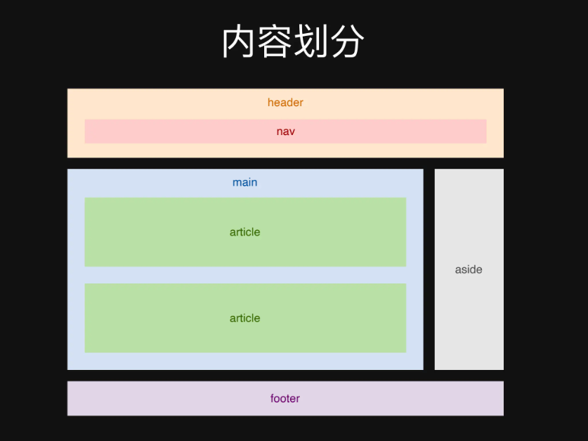
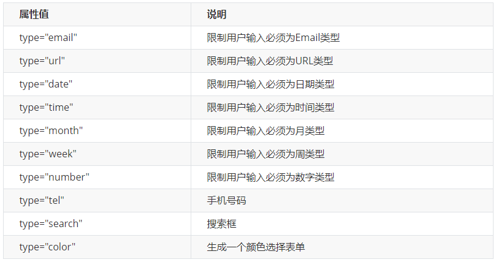

前端技术栈

+ HTML：结构
+ CSS：样式
+ JavaScript：交互
+ http协议：传输

快捷

+ `!`  快速生成html框架

+ `ul>li*6`   生成含有6个元素的无序列表

+ div.box 交集选择器
    div,p,span 并集选择器
+ `div`占一行

## HTML

自闭合：input, img

遇到的小标签

+ `<hr>`  分割线
+ 

### 基础

#### 保留字 / HTML 实体

| 字符 | 实体     | 说明                                                         |
| :--- | :------- | :----------------------------------------------------------- |
| &    | `&amp;`  | 解析为实体或字符引用的开头                                   |
| <    | `&lt;`   | 解析为 [tag](https://developer.mozilla.org/zh-CN/docs/Glossary/Tag) 的开头 |
| >    | `&gt`    | 解析为 [tag](https://developer.mozilla.org/zh-CN/docs/Glossary/Tag) 的结尾 |
| "    | `&quot;` | 解析为 [attribute](https://developer.mozilla.org/zh-CN/docs/Glossary/Attribute) 的值的开头和结尾 |
| 空格 | `&nbsp;` |                                                              |

#### 浏览器前缀

+ -moz-：代表 firefox 浏览器私有属性
+ -ms-：代表 ie 浏览器私有属性
+ -webkit-：代表 safari、chrome 私有属性
+ -o-：代表 Opera 私有属性

### 列表

三种列表

```html
<h2>世界电影票房排行榜</h2>
<ol>
    <li>阿凡达</li>
    <li>泰坦尼克号</li>
    <li>复仇者联盟</li>
</ol>

<h2>购物清单</h2>
<ul>
    <li>aaa</li>
    <li>bbb</li>
    <li>ccc</li>
</ul>
<!-- key-value形式 -->
<h2>霸王别姬</h2>
<dl>
    <dt>导演：</dt>
    <dd>陈凯歌</dd>
    <dt>主演：</dt>
    <dd>张国荣</dd>
    <dd>张丰毅</dd>
    <dd>巩俐</dd>
    <dt>上映日期：</dt>
    <dd>1993-01-01</dd>
</dl>
```

### 链接

#### 超链接

```html
<a href="https://www.baidu.com" target="_blank">百度</a>
```

+ `target = "_blank"`表示在新标签页打开

#### 图片

```html

```

#### 音频

```html
<audio src="/..." controls></audio>
```

+ `controls`显示控制音频的按钮

#### 视频

```html
<video src="/..." cintrols></video>
```

### 输入

```html
<input placeholder="请输入用户名">
<input type="range">
<input type="number" min="1" max="10" placeholder="input a number">
<input type="date" min="2018-02-10">
<textarea>Hey</textarea>
```

input使用：

+ `placeholder`用于提示人们在输入框中输入什么信息
+ 为了防止用户在缺少所需信息时提交你的表单，你需要将 `required` 属性添加到 `input` 元素。 无需为 `required` 属性设置值。 只需将单词 `required` 添加到 `input` 元素，确保它和其他属性之间有空格。

```html
<p>
    <label><input type="checkbox"/> 苹果</label>
    <label><input type="checkbox" checked/>梨</label>
</p>

<p>
    <label><input type="radio" name="sport" /></label>
    <label><input type="radio" name="sport" /></label>
</p>

<p>
    <select>
        <option>草莓</option>
        <option>香蕉</option>
        <option>橘子</option>
    </select>
</p>

<input list="countries"/>
<datalist id="countries">
    <option>Greece</option>
    <option>US</option>
    <option>UK</option>
</datalist>
<form action="/url">
    <!--action中为表单的接收地址-->
</form>
```

#### 事件

+ `change`：当元素的值改变并且失去焦点时触发。
+ `input`：元素的值改变时立即触发，无需等待元素失去焦点。
+ `focus`：元素获得焦点时触发。
+ `blur`：元素失去焦点时触发。


### 引用

```html
<blockquote cite="https://">
    <p>
        天才
    </p>
</blockquote>

<p>我最喜欢的一本书是<cite>小王子</cite>。</p>

<p>在<cite>第一章</cite>，我们讲过<q>字符串是不可变量</q>。</p>

<p><code>const</code>声明创建一个只读的常量。</p>

<pre><code>
const add=(a,b)=>a+b;
</code></pre>

<p>在投资之前，<strong>一定要做风险评估</strong>。</p>

<p>Cats <em>are</em> cute animals.</p>
```

### 语义化



+ HTML的语义化
+ 

语义化的好处

+ 代码可读性
+ 可维护性
+ 搜索引擎优化
+ 提升无障碍性

**HTML：传达内容，而不是样式**

如何做到可视化

+ 了解每个标签和属性的含义
+ 思考什么标签最适合描述这个内容
+ 不适用可视化工具生成代码

### HTML5


##### 表单

新增类别：



新增属性：


+ 选择器

  `input::placegolder{}`