### 基础语法

+ 变量声明：`let`
+ 常量声明：`const`

模板字符串

+ ``反引号包裹
+ 内部用`${}`包住变量

类型转换

+ `Number()`
+ `parseInt()`
+ `parseFloat()`

生命周期函数/立即执行函数：

```js
(function (){
    //function body
})();//加分号

!function (){}()
+function (){}()
~function (){}()
!(function (){})()
(function (形参){function body}(实参));
```

对象：

```js
let person={
    name: 'andy',
    sayHi: function(){
        document.write('hi~~~~')
    },
    song:......
}

//调用
person.sayHi()
```

+ 对象类型是浅拷贝

#### 控制语句

+ 支持`if, else, switch, case, while, do, for`，其用法和 C/C++ 语言几乎完全一致
+ 还支持类似Python的迭代方法

##### for ... in

+ `for...in` 语句以**任意顺序**迭代一个对象的除 `symbol` 以外的**可枚举**属性，包括继承的可枚举属性。

+ 可以遍历对象的键值

##### for ... of

+ 循环在可迭代对象（如 `Array`、`Map`、`Set`、`String`，自己创建可迭代对象可以参考[迭代协议](https://developer.mozilla.org/zh-CN/docs/Web/JavaScript/Reference/Iteration_protocols)）上创建迭代循环，最常见的是对数组元素进行迭代
+ 遍历数组

##### 异常处理

JavaScript 的异常处理与 C++ 相似：

```javascript
try {
    someDangerousFunction();
} catch (err) {
    console.log('error occurred');
}
```

#### 函数

参考：[清华大学计算机系科协技能引导文档](https://docs.net9.org/languages/javascript/function/)

我们一般把 JavaScript 的函数也认为是一种变量，因为在 JavaScript 之中，函数的行为很大程度上和变量类似。

+ `arguments`是参数的数组

  ```js
  function sum() {
      let s = 0;
      for (let i = 0; i < arguments.length; ++i) s += arguments[i];
      return s;
  }
  
  console.log(sum(1, 2, 3)); // 6
  ```

##### 自调用函数

```js
(function () {
    var x = "Hello!!";      // 我将调用自己
})();
```

##### 匿名函数

+ 匿名函数的`this`: 匿名函数最经典的总结：就是谁调用匿名函数，匿名函数中的this就指向谁
+ 匿名函数是有执行上下文，只是执行上下文是执行的时候传递过来，
+ [箭头函数](https://so.csdn.net/so/search?q=箭头函数&spm=1001.2101.3001.7020)中的执行上下文是父级的执行上下文，匿名函数可以作为箭头函数的父级（详见例3）

##### 箭头函数

实际上箭头函数的设计很大程度上是为了解决 `this` 问题。

```js
(参数1, 参数2, …, 参数N) => { 函数声明 }

(参数1, 参数2, …, 参数N) => 表达式(单一)
// 相当于：(参数1, 参数2, …, 参数N) =>{ return 表达式; }
```

当只有一个参数时，圆括号是可选的：

```
(单一参数) => {函数声明}
单一参数 => {函数声明}
```

没有参数的函数应该写成一对圆括号:

```js
() => {函数声明}
```

如果想返回一个对象，应该在函数体外面套一层小括号，防止解析错误

```js
const fn = (num) => ({num: num})
```

箭头函数不会创建自己的this,它只会从自己的作用域链的上一层沿用this。

> 箭头函数和 `function` 函数最大不同的地方是其 `this` 的指向跟随上下文的 `this`，也就是说其本身不具有 `this`，在箭头函数体里使用的 `this` 实际上是其上下文（一般是其所在的函数作用域）的 `this`。换句话说，**箭头函数的 `this` 在定义的时候就完成了绑定**，这样的性质就解决了 `this` 指向不明的问题。

```js
const foo = () => console.log(this);

foo(); // window

// Changing caller will not change 'this'
let obj = { foo: foo, };
obj.foo(); // window

// 'call' & 'bind' may fail
foo.call(obj); // window
foo = foo.bind(obj);
foo(); // window
```

在全局环境下设定的箭头函数的 `this` 永远跟随全局环境指向全局对象

##### 回调模式

这个函数现在传进去但暂且不调用，需要的时候再调用

1. 遍历数组的操作`forEach`

   ```js
   [1, 2, 3, 4].forEach(function (val, ind) {
       console.log(`The elem with index ${ind} is ${val}.\n`);
   });
   ```

2. 数组的映射函数 `map`

   ```js
   [1, 2, 3, 4].map(function (val) {
       return 2 * val;
   }); // [2, 4, 6, 8]
   ```

3. 数组的筛选方法 `filter`

   + **创建一个新的数组**，新数组中的元素是通过检查指定数组中符合条件的所有元素

##### 闭包

+ 概念：一个函数对周围状态的引用捆绑在一起，内层函数中访问到其外层函数的作用域

+ 简单理解：**闭包 = 内层函数 + 外层函数的变量**

+ 作用：外部能够访问函数内部的变量

+ 原因：引用的变量不会被GC立即释放（引用变量还能找到，所以不能释放）

+ 弊端：内存泄漏

+ 类比：

  + 外层函数 → 类
  + 内层函数 → 方法
  + 引用变量 → public型数据，类所公有

  ```js
  function outer() {
      let i = 1;
      function one() {
          i++;
          console.log(i);
      }
      function two() {
          i++;
          console.log(i);
      }
      return [one, two];
  }
  const [one, two] = outer();
  
  one(); // 2
  one(); // 3
  two(); // 4
  ```

```js
function lazy_sum(arr) {
    let sum = function () {
        return arr.reduce(function (x, y) {
            return x + y;
        });
    }
    return sum;
}
```

当我们调用`lazy_sum()`时，返回的并不是求和结果，而是求和函数：

```
var f = lazy_sum([1, 2, 3, 4, 5]); // function sum()
```

调用函数`f`时，才真正计算求和的结果：

```js
f(); // 15
```

以下参考：[清华大学计算机系科协技能引导文档](https://docs.net9.org/languages/javascript/function/)

```js
function getIncreaser(increment) {
    return function (x) {
        return x + increment;
    }
}

const increase5 = getIncreaser(5);
increase5(10); // 15
```

+ 闭包函数用来**创造函数**

+ 上面，`getIncreaser` 会把 `increment` 变量包装在其返回的匿名函数之中，这样就形成了一个**闭包**。

+ 闭包实际上就是一个函数和对其**周围状态（lexical environment，词法环境）的引用**捆绑在一起。

  这里要特别注意的是，闭包的所谓词法环境，指的是创建闭包时的**函数作用域**。

1. 比如这样就不会形成闭包

   ```js
   function getCounters() {
       let arr = [];
       for (let i = 0; i < 3; ++i) {
           arr.push(function () { console.log(i * i); });
       }
       return arr;
   }
   
   let counters = getCounters();
   counters[0](); // 0
   counters[1](); // 1
   counters[2](); // 4
   ```

2. 这样就会形成闭包

   ```js
   function getCounters() {
       let arr = [];
       let i;
       for (i = 0; i < 3; ++i) {
           arr.push(function () { console.log(i * i); });
       }
       return arr;
   }
   
   let counters = getCounters();
   counters[0](); // 9
   counters[1](); // 9
   counters[2](); // 9
   ```

3. 原因：变量的作用域不同。第一个变量`i`的作用域是`for`语句，第二个是函数作用域。

   在闭包捕获变量时，对局部作用域的变量会**复制**，而对函数作用域的变量会**引用**。

   因此，通过在 `for` 语句中使用 `let` 声明变量，我们声明了局部变量，从而获得了期望的复制捕获行为。

此外需要注意的是，JavaScript 在任何情况下都不会帮你复制**对象**（上面被捕获的 `int` 是基本值而非对象），如果你的闭包捕获一个对象的值，无论这个对象的作用域如何，都会产生类似问题。事实上，这里并非基本值被特殊地对待，而是对象类型的变量存储的值是到实际对象的引用，因此在捕获时复制的是引用（浅拷贝）而非实际对象（深拷贝）。除非你明确地想要保存一些值，否则在构造闭包时请注意捕获实际的值，而非引用。

### 面向对象

> JavaScript 的面向对象的实现逻辑并非是类封装逻辑，而是原型链逻辑。最初的 JavaScript 并不支持类语法，但由于原型链实在太过于特立独行，目前 ES6 标准将类语法作为**语法糖**加入了语言标准。这也就是说，JavaScript 的面向对象的底层依然是原型链而非类封装，如果真的想弄明白 JavaScript 的原型链机制，可以查看文档末尾的原型链章节。但对于初学者，我们建议只是用类语法，除非遇到不可解决的 bug，否则不要花时间钻研原型链。

#### this

> 作者：littleyu
> 链接：https://www.jianshu.com/p/ad22f8463afb

JS（ES5）里面有三种函数调用形式：

```js
func(p1, p2)
obj.child.method(p1, p2)
func.call(context, p1, p2)
```

只有第三种才是一般方式，前两种均为语法糖

context相当于python中的self,  是一个默认参数

前两种到第三种的变化方式：

```js
func(p1, p2) 等价于
func.call(undefined, p1, p2)

obj.child.method(p1, p2) 等价于
obj.child.method.call(obj.child, p1, p2)
```

==其中`context`就是`this`==,  即

+ **函数**中，`this`为`undefined`，但被替换为`window`
+ `obj.method()`中，`this`为`obj`

总结：this 就是 call 的第一个参数

> 来自：[清华大学计算机系科协技能引导文档](https://docs.net9.org/languages/javascript/oop/)

+ 严格来说，JavaScript 的 `this` 指向规则只有一条，即 **`this` 永远指向最近的调用者**

```js
function foo() {
    console.log(this);
}

foo(); // window

let obj = { foo: foo, };
obj.foo(); // { foo: foo }
```

这里两次调用的都是同一个 `foo` 函数，不同的是前者是全局调用（即直接调用），而后者是把函数作为一个对象 `obj` 的属性后通过 `obj` 调用。而 `this` 的指向就是在函数调用的时候确定的。全局调用 `foo` 函数，那 `this` 就指向全局对象，通过 `obj` 调用，那 `this` 就指向 `obj`。

事实上 JavaScript 的全局变量都是全局对象的属性，每一个 JavaScript 运行环境都有一个全局对象。比如说浏览器的全局对象往往是 `window`，而 Node.js 的全局变量则是 `global`。你声明的每一个全局变量都会绑定为全局对象的属性（下述代码在浏览器运行）：

```js
let a = 1;
window.a; // 1
```

而在全局环境下调用函数 `foo()`，实际上等价于通过全局对象在调用：

```js
foo();
window.foo();
```

上述两个语句没有差别。

#### Class

js的类是个语法糖

```js
function Pig(_name, _age, _gender) {
    this.name = _name;
    this.age = _age;
    this.gender = _gender;
}

const peppa = new Pig('佩奇', 18, 'female');

console.log(peppa);
// peppa.__proto__ === Pig.prototype
```

这里使用 `new` 关键字调用构造函数，这种调用方式就区分了构造函数和普通函数。并且，构造函数内部不用我们再自己构造一个空对象，而是直接使用 `this` 对象，并且在使用 `new` 调用的时候，函数会自动将 `this` 返回。实际上，如果不用 `new` 关键字调用构造函数也是合法的，这样的话该函数将会作为普通函数执行并返回 `undefined`。

1. 实例成员
   + **在构造函数内部声明**的属性和方法被称为实例成员
2. 静态成员
   + **在构造函数外部添加**的属性和方法被称为静态成员
   + **构造函数的属性和方法**被称为静态成员

```js
function Pig(_name, _age, _gender) {
    // 这些是实例成员
    this.name = _name;
    this.age = _age;
    this.gender = _gender;
}
// 静态成员
Pig.eyes = 2;
Pig.arms = 2;
Pig.walk = function () {
    console.log("walk");
}
```

#### 内置构造函数

##### Object

是内置的构造函数，用于创建普通对象

```js
const obj = new Object({name: '张三', age: '18'});
```

静态方法：

+ `Object.keys(obj)`：获取`obj`的所有键，返回一个数组
+ `Object.values(obj)`：获取`obj`的所有值，返回一个数组
+ `Object.entries(obj)`：获取键值对，是一个嵌套的数组
+ `Object.fromEntries(array)`：根据键值对数组，构造对象并返回
+ `Object.assign(oo, o)`：把o拷贝给oo


##### Array

https://zh.javascript.info/array-methods


实例方法：

|  方法   |   作用   |                             说明                             |
| :-----: | :------: | :----------------------------------------------------------: |
| forEach | 遍历数组 |  不返回，用于只读值，经常用于查找打印输出值（仅遍历，只读）  |
| filter  | 过滤数组 |            筛选数组元素，并生成新数组（筛选元素）            |
|   map   | 迭代数组 | 返回新数组，新数组里面的元素时处理之后的值，经常用于处理数据（遍历并生成新数组） |
| reduce  |  累积器  | 返回函数累计处理的结果，经常用于求和（遍历数组，返回一个值） |

`reduce`

+ ```js
  arr.reduce(function(累计值， 当前元素 [，索引号][，原数组]){}, 起始值)
  ```

+ 如果有起始值，则以起始值为准开始累计， 累计值 = 起始值

+ 如果没有起始值， 则累计值以数组的第一个数组元素作为起始值开始累计

+ 后面每次遍历就会用后面的数组元素 累计到 累计值 里面 （类似求和里面的 sum

其他实例方法：

1. 实例方法 `join` 数组元素拼接为字符串，返回字符串(重点)

2. 实例方法  `find(funciton)`  查找元素， 返回符合测试条件的第一个数组元素值，如果没有符合条件的则返回 undefined(重点)

   `findIndex(function)`：类似上者，返回下标

3. 实例方法 `every` 检测数组所有元素是否都符合指定条件，如果**所有元素**都通过检测返回 true，否则返回 false(重点)

4. 实例方法`some` 检测数组中的元素是否满足指定条件   **如果数组中有**元素满足条件返回 true，否则返回 false

5. 实例方法 `concat`  合并两个数组，返回生成新数组

6. 实例方法 `sort(function)` 对原数组单元值排序

   ```js
   // 降序
   arr.sort((a,b)=>b-a)
   ```

7. 实例方法 `splice(start[, deleteCount, elem1, ..., elemN])` 删除或替换原数组单元

8. 实例方法 `reverse` 反转数组

9. 实例方法 `findIndex(item=> item.id===target)`  查找元素的索引值

10. `indexOf(target)`：元素下标，使用的是`===`

11. `includes()`：是否包含元素

12. [pop/push, shift/unshift 方法](https://zh.javascript.info/array#poppushshiftunshift-fang-fa)

    + `push` 在末端添加一个元素， `pop`在末端移除元素
    + `unshift`在首端添加元素，`shift` 取出队列首端的一个元素，整个队列往前移，这样原先排第二的元素现在排在了第一。

13. `indexOf(item, from)  lastIndexOf 和 includes`

14. `at()`  相当于索引，但接受负数

静态方法

1. `from`把伪数组转换为真数组：`Array.from(list)`返回真数组
1. `isArray`：Array基于Object，使用`typeof`会返回`Object`


##### String

https://zh.javascript.info/string


1. 实例属性 `length` 用来获取字符串的度长(重点)

2. 实例方法 `split('分隔符')` 用来将字符串拆分成数组(重点)

3. 实例方法 `substring（需要截取的第一个字符的索引[,结束的索引号]）` 用于字符串截取(重点)

4. 实例方法 `includes(搜索的字符串[, 检测位置索引号])` 判断一个字符串是否包含在另一个字符串中，根据情况返回 true 或 false(重点)

5. 实例方法 `toUpperCase` 用于将字母转换成大写，`toLowerCase` 用于将就转换成小写

6. `indexOf(subStr[, pos])` 返回子字符串开始位置，从pos开始检测，找不到就返回-1。

   `lastIndexOf(substr, position)`，倒着检测

7. `startsWith`是否以某字符串开始

   `endsWith` 检测是否以某字符结尾

8. 实例方法 `replace` 用于替换字符串，支持正则匹配

9. 实例方法 `match` 用于查找字符串，支持正则匹配

10. `padding`：填充

    ```js
    'x'.padStart(4, 'ab');  //'abax'
    'x'.padEnd(5, 'ab');    //'xabab'
    ```

11. `str.repeat(num)` 把一个字符串重复num次


注：String 也可以当做普通函数使用，这时它的作用是强制转换成字符串数据类型。


##### 分割方法

字符串（返回新字符串）：

+ `slice(start [, end])` 接受负值
+ `substring(start [, end])` 负值被视为0
+ `substr(start [, length])`  接收负值，第二个参数是长度

+ `split(target)`：按照target分割字符串

数组：

+ `arr.slice([start], [end])`  切片，支持负数，不改变原数组
+ `arr.splice(start[, deleteCount, elem1, ..., elemN])`，删除后添加，支持负数，修改了原数组,返回删除的部分
+ 


##### Number

+ 实例方法 `toFixed` 用于设置保留小数位的长度：`num.toFixed(2)`

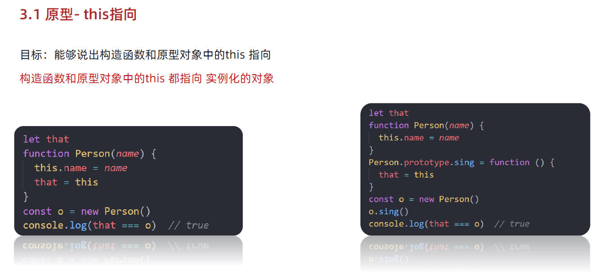


##### Function

实例方法：

1. `toString`：得到函数的字符串，保留空白字符


##### Map

https://zh.javascript.info/map-set

对象只允许字符串和Symbol作为键，map允许任何类型的键（key），包括对象

+ 保留了插入时的顺序（object没有这个特性）


API:

- `new Map()` —— 创建 map。

  ```js
  let recipeMap = new Map([
    ['cucumber', 500],
    ['tomatoes', 350],
    ['onion',    50]
  ]);
  ```

- 也可以由普通对象创建：因为`Object.entries(obj)`返回了一个二维数组

  ```js
  let obj = {
    name: "John",
    age: 30
  };
  let map = new Map(Object.entries(obj));
  // Object.entries 返回键/值对数组：[ ["name","John"], ["age", 30] ]
  
  alert( map.get('name') );
  ```

- 相反，从map创建对象：`Object.fromEntries();`可以由二维数组得到对象

  ```js
  let map = new Map();
  map.set('banana', 1);
  map.set('orange', 2);
  map.set('meat', 4);
  
  let obj = Object.fromEntries(map.entries()); // 创建一个普通对象（plain object）(*)
  
  // 简写：
  let obj = Object.fromEntries(map); // 省掉 .entries()
  
  // 完成了！
  // obj = { banana: 1, orange: 2, meat: 4 }
  
  alert(obj.orange); // 2
  ```

  

- `map.set(key, value)` —— 根据键存储值。

- `map.get(key)` —— 根据键来返回值，如果 `map` 中不存在对应的 `key`，则返回 `undefined`。

- `map.has(key)` —— 如果 `key` 存在则返回 `true`，否则返回 `false`。

- `map.delete(key)` —— 删除指定键的值。

- `map.clear()` —— 清空 map。

- `map.size` —— 返回当前元素个数。


每一次 `map.set` 调用都会返回 map 本身，所以我们可以进行“链式”调用：

```javascript
map.set('1', 'str1')
  .set(1, 'num1')
  .set(true, 'bool1');
```


迭代：

- `map.keys()` —— 所有键的可迭代对象，

- `map.values()` —— 所有值的可迭代对象，

- `map.entries()` ——所有实体 `[key, value]` 的可迭代对象，`for..of` 在默认情况下使用的就是这个。

  ```js
  for (let entry of recipeMap) { // 与 recipeMap.entries() 相同
    alert(entry); // cucumber,500 (and so on)
  }
  ```

  

##### Set

`Set` 是一个特殊的类型集合 —— “值的集合”（没有键），它的每一个值只能出现一次。


API:

- `new Set(iterable)` —— 创建一个 `set`，如果提供了一个 `iterable` 对象（通常是数组），将会从数组里面复制值到 `set` 中。
- `set.add(value)` —— 添加一个值，返回 set 本身
- `set.delete(value)` —— 删除值，如果 `value` 在这个方法调用的时候存在则返回 `true` ，否则返回 `false`。
- `set.has(value)` —— 如果 `value` 在 set 中，返回 `true`，否则返回 `false`。
- `set.clear()` —— 清空 set。
- `set.size` —— 返回元素个数。


`forEach` 的回调函数有**三个参数**：一个 `value`，然后是 **同一个值** `valueAgain`，最后是目标对象。这是为了兼容map

```js
set.forEach((value, valueAgain, set) => {
  alert(value);
});
```

`Map` 中用于迭代的方法在 `Set` 中也同样支持：

- `set.keys()` —— 遍历并返回一个包含所有值的可迭代对象，
- `set.values()` —— 与 `set.keys()` 作用相同，这是为了兼容 `Map`，
- `set.entries()` —— 遍历并返回一个包含所有的实体 `[value, value]` 的可迭代对象，它的存在也是为了兼容 `Map`。


案例：使用Set过滤重复元素

```js
function unique(arr){
  return [...new Set(arr)]
}
// 或
function unique(arr) {
  return Array.from(new Set(arr));
}
```


#### 构造函数与原型

```js
function Star() {}
const ldh = new Star();

console.log(Star.prototype.constructor === Star);
console.log(ldh.__proto__.constructor === Star);
console.log(ldh.__proto__ === Star.prototype);
```

+ 构造函数通过原型分配的函数是所有对象 所 共享 的 。

+ JavaScript 规定， 每一个构造函数都有一个 prototype 属性 ，指向另一个 对象，所以我们也称为原型对象

+ 这个对象可以 挂载函数，对象实例化不会多次创建原型上函数，节约内存

+ 我们 可以把那些不变的方法，直接定义在 prototype 对象上，这样 所有对象的实例就可以共享这些方法 。

+ 构造函数和原型对象中的 this 都指向 实例化的对象

+ `__proto__`是对象的，`prototype`是类的

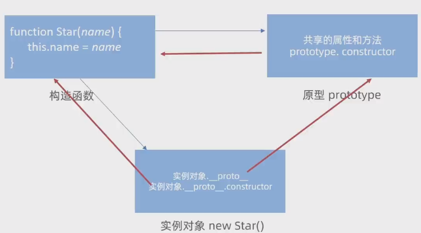

1. 原型是什么
   + 一个对象，我们也称为 prototype 为 原型对象
2. 原型的作用是什么 
   + 共享方法 可以把那些不变的方法，直接定义在 prototype 对象上
3. 构造函数和原型里面的 this 指向谁 
   + 实例化的对象

###### 对象原型

对象都会有一个属性`__proto__`指向构造函数的 prototype 原型对象，之所以 我们对象可以使用构造函数 prototype
原型对象的属性和方法，就是因为 对象有`__proto__ `原型 的存在。

###### 继承

+ `子类的prototype = new Person()`

###### 原型链

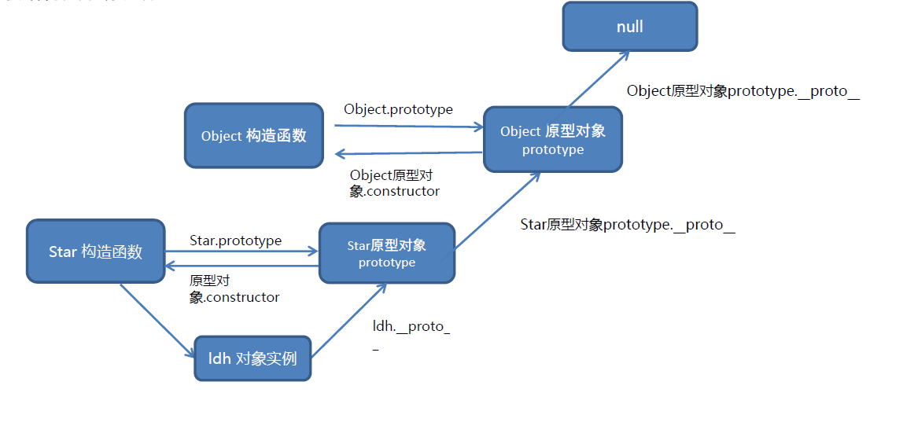

`instanceof `运算符用于检测构造函数的 prototype 属性是否出现在某个实例对象的原型链上

```js
[1,2,3] instanceof Array
```


```js
类.prototype === 对象.__proto__
```

他们指向同一个东西


==typeof 和 Object.getPrototypeOf()==

- **用途**: `typeof`用于获取数据的类型，而`Object.getPrototypeOf()`用于获取对象的原型。
- **返回值**: `typeof`返回一个表示类型的字符串，`Object.getPrototypeOf()`返回一个对象（原型对象）。
- **适用性**: `typeof`对基本数据类型和区分函数与普通对象很有用。`Object.getPrototypeOf()`专用于对象，用于访问其原型链。


### 异步

>  <a href="https://developer.mozilla.org/zh-CN/docs/Learn/JavaScript/Asynchronous/Promises">参考资料</a>：https://developer.mozilla.org/zh-CN/docs/Learn/JavaScript/Asynchronous/Promises
>
>  https://docs.net9.org/languages/javascript/async/

#### 回调函数

事件处理程序是一种特殊类型的回调函数。

而回调函数则是**一个被传递到另一个函数中的会在适当的时候被调用的函数。**

正如我们刚刚所看到的：回调函数曾经是 JavaScript 中实现异步函数的主要方式。

> 同步任务：都在主线程上执行，形成一个执行栈
>
> 异步任务：由回调函数实现，如时间、加载、定时器。
>
> 先执行同步，把异步放入队列中。同步执行完再执行异步

> 在详细叙述这个机制之前，我们首先需要重新认识一下回调函数。当主线程派遣出一个异步过程，比如说触发了网络请求，一般而言需要设定一个这个异步过程的回调函数。这个回调函数描述的，是这个异步过程执行完毕后需要做的事情。
>
> 需要定义这个回调函数的原因也很简单，主线程没有办法了解到异步过程何时才能结束，甚至并不清楚这个过程能否结束。在这样的情况下，主线程完全不能知晓什么时候做这个异步过程的善后工作（比如说从网络获取数据后，主线程应该把这些数据加载到页面上）。那么不如定义一个回调函数，具体什么时候调用，根据异步过程来确定。
>
> 回到事件循环和消息队列。JavaScript 的主线程上会有一个死循环，称为**事件循环**。其执行逻辑为在空闲的时候不断检查消息队列是否有消息，如果有，则执行，如果没有，则等待。而空闲的含义是当前函数栈空。
>
> 而需要异步执行的代码则会负载一个回调函数，当异步过程执行完毕后，则会把回调函数放入消息队列末尾。当主线程空闲且检测到消息队列之中有回调函数的时候，主线程就会执行回调函数，做好异步过程的善后工作。
>
> 通过这样的机制，JavaScript 依然是单线程的，对文档树的操作依然是同步的、不会出现冲突的。但依靠这个机制，JavaScript 实现了异步。

#### Promise

[贵系科协技能引导文档Promise](https://docs.net9.org/languages/javascript/async/#promise)

```js
new Promise((resolve, reject) => {
    let asyncSucceeded = Math.random() > 0.2;
    setTimeout(() => {
        if (asyncSucceeded) {
            resolve("Async succeeded!");
        } else {
            reject("Async failed!");
        }
    }, 1000);
})
    .then((res) => {
        console.log("Then");
        console.log(res);
    })
    .catch((err) => {
        console.log("Catch");
        console.log(err);
    });
```

其构造函数接受一个回调函数，这个回调函数的两个参数是另外的两个回调函数。

+ `resolve` 代表异步成功的回调函数，
+ `reject` 代表异步失败的回调函数。
+ 而构造函数接受的回调函数的函数体则是需要执行的耗时操作。

`Promise` 比直接写回调模式优越的地方就是这种写法解决了回调地狱。我们依然考虑依次获取多数据源数据的业务场景，由于 `then` 方法依然返回 `Promise` 对象，所以实际上我们可以在 `then` 后面接着调用 `then`。而上一个 `then` 之中的回调函数的返回值会被传入下一个 `then` 之中的回调函数的第一个参数：

```js
new Promise((resolve, reject) => {
    // Get Data #1
    resolve("Data #1");
})
    .then((res) => {
        console.log(res);
        // Get Data #2
        return "Data #2";
    })
    .then((res) => {
        console.log(res);
        // Get Data #3
        return "Data #3";
    })
    .then(console.log)
    .catch(console.log);
```

这种写法被称为 `then` 链，其好处是比回调函数写法更易读且易维护

另外，对于多依赖问题（需要多个异步全部结束后才能派遣下一个异步），`Promise` 提供了 `all` 方法：

```js
Promise.all(
    [1, 2, 3].map((val) => {
        return new Promise((resolve, reject) => {
            resolve(`Promise #${val}`);
        });
    })
)
    .then((res) => {
        console.log(res); // ["Promise #1", "Promise #2", "Promise #3"]
    })
    .catch((err) => {});
```

这里 `then` 之中的回调函数接受的参数是所有 `Promise` 对象 `resolve` 回调所接受的参数拼成的数组，`catch` 同理。

另外，注意两点：

- `Promise` 一旦创建，内部的异步过程就开始执行，且开始执行后就不会取消
- 创建 `Promise` 会写很多很长的回调，写完这些回调后很容易给编写者一种“异步已经执行结束”的错觉。实际上这么长的语句仅仅是**定义了 `Promise` 对象**，也就是仅仅只是派遣了异步。

样例展示：

```js
const incantations = "芝麻开门";
function init(el) {
  document.querySelector(".wrapper .btn").addEventListener("click", () => {
    mPrompt()
      .then((res) => {
        if (res === incantations) {
          document
            .querySelectorAll("#door .doors")[0]
            .classList.add("door-left");
          document
            .querySelectorAll("#door .doors")[1]
            .classList.add("door-right");
        }
      })
      .catch((err) => {
        console.log(err);
      });
  });
}
function mPrompt() {
  return new Promise((res, rej) => {
    document.querySelector('#confirm').addEventListener('click', () => {
      let input = document.querySelector(".message-body input").value;
      res(input);
      document.querySelector(".modal").remove();
    })
    document.querySelector('#cancel').addEventListener('click', () => {
      rej(false);
      document.querySelector(".modal").remove();
    })
  })
}


// 原理：
function myPromise(){
    return new Promise((res, rej) => {
        // 处理处理
        // 阿巴阿巴
        // 处理成功：
        res(a ba a ba);//调用then中传入的函数
        // 处理失败
        rej(err); //调用catch中传入的函数
    })
}

myPromise()
    .then((a ba a ba)=>{
        // 阿巴阿巴
        // 这个就是res函数
    })
    .catch(()=>{

    });
// 或者：
function a(){};
function b(){};
myPromise().then(a).catch(b);
```

```js
const fetchPromise = fetch('bad-scheme://mdn.github.io/learning-area/javascript/apis/fetching-data/can-store/products.json');

fetchPromise
  .then( response => {
    if (!response.ok) {
      throw new Error(`HTTP 请求错误：${response.status}`);
    }
    return response.json();
  })
  .then( json => {
    console.log(json[0].name);
  })
  .catch( error => {
    console.error(`无法获取产品列表：${error}`);
  });
```

Promise 对象的构造器（constructor）语法如下：

```javascript
let promise = new Promise(function(resolve, reject) {
  // executor（生产者代码，“歌手”）
    resolve(aaa)
});
```

传递给 `new Promise` 的函数被称为 **executor**。当 `new Promise` 被创建，executor 会自动运行。

是成功还是失败，由写的代码决定：

+ 调用了`resolve`，就是成功
+ 调用了`reject`，就是失败

`await promise`的返回值是`aaa`

`Promise` 的三种状态：

- **待定（pending）**：初始状态，既没有被兑现，也没有被拒绝。这是调用 `fetch()` 返回 Promise 时的状态，此时请求还在进行中。
- **已兑现（fulfilled）**：意味着操作成功完成。当 Promise 完成时，它的 `then()` 处理函数被调用。
- **已拒绝（rejected）**：意味着操作失败。当一个 Promise 失败时，它的 `catch()` 处理函数被调用。
- **已敲定（settled）**:   这个词来同时表示 **已兑现（fulfilled）** 和 **已拒绝（rejected）** 两种情况。


**promise传进去的函数会在遇到`.then`的时候执行**

```js
// 1. 创建Promise对象-模拟请求省份名字
const p = new Promise((resolve, reject) => {
    setTimeout(() => {
        resolve('北京市')
    }, 2000)
})

// 2. 获取省份名字
const p2 = p.then(result => {
    console.log(result)
    // 3. 创建Promise对象-模拟请求城市名字
    // return Promise对象最终状态和结果，影响到新的Promise对象
    return new Promise((resolve, reject) => {
        setTimeout(() => {
            resolve(result + '--- 北京')
        }, 2000)
    })
})
```

执行到第9行的时候才会打印出`北京市`


##### 解决回调地狱1

手动返回一个`Promise`对象

```js
/**
     * 目标：把回调函数嵌套代码，改成Promise链式调用结构
     * 需求：获取默认第一个省，第一个市，第一个地区并展示在下拉菜单中
    */
let pname = ''
// 1. 得到-获取省份Promise对象
axios({url: 'http://hmajax.itheima.net/api/province'}).then(result => {
    pname = result.data.list[0]
    document.querySelector('.province').innerHTML = pname
    // 2. 得到-获取城市Promise对象
    return axios({url: 'http://hmajax.itheima.net/api/city', params: { pname }})
}).then(result => {
    const cname = result.data.list[0]
    document.querySelector('.city').innerHTML = cname
    // 3. 得到-获取地区Promise对象
    return axios({url: 'http://hmajax.itheima.net/api/area', params: { pname, cname }})
}).then(result => {
    console.log(result)
    const areaName = result.data.list[0]
    document.querySelector('.area').innerHTML = areaName
})
```


##### Promise方法

+ `Promise.all`

合并多个Promise 对象，等待所有 同时成功 完成（或某一个失败），做后续逻辑

```js
// 1. 请求城市天气，得到Promise对象
const bjPromise = axios({ url: 'http://hmajax.itheima.net/api/weather', params: { city: '110100' } })
const shPromise = axios({ url: 'http://hmajax.itheima.net/api/weather', params: { city: '310100' } })
const gzPromise = axios({ url: 'http://hmajax.itheima.net/api/weather', params: { city: '440100' } })
const szPromise = axios({ url: 'http://hmajax.itheima.net/api/weather', params: { city: '440300' } })

// 2. 使用Promise.all，合并多个Promise对象
const p = Promise.all([bjPromise, shPromise, gzPromise, szPromise])
p.then(result => {
    // 注意：结果数组顺序和合并时顺序是一致
    console.log(result)
    const htmlStr = result.map(item => {
        return `<li>${item.data.data.area} --- ${item.data.data.weather}</li>`
    }).join('')
    document.querySelector('.my-ul').innerHTML = htmlStr
}).catch(error => {
    console.dir(error)
})
```

实现`Promise.all`

```js
let promise1 = new Promise(function (resolve) {
    resolve(1);
});
let promise2 = new Promise(function (resolve) {
    resolve(2);
});
let promise3 = new Promise(function (resolve) {
    resolve(3);
});
Promise.all = async(args) => {
    let ans = []
    await args.forEach( element => {
        element.then((res) => ans.push(res))
    });
    return ans
}

let promiseAll = Promise.all([promise1, promise2, promise3]);
promiseAll.then(function (res) {
    console.log(res);
});


// https://juejin.cn/post/6844903761505173512
function promiseAll(promises) {
    return new Promise(function (resolve, reject) {
        if (!isArray(promises)) {
            return reject(new TypeError('arguments must be an array'));
        }
        var resolvedCounter = 0;
        var promiseNum = promises.length;
        var resolvedValues = new Array(promiseNum);
        for (var i = 0; i < promiseNum; i++) {
            (function (i) {
                Promise.resolve(promises[i]).then(function (value) {
                    resolvedCounter++
                    resolvedValues[i] = value
                    if (resolvedCounter == promiseNum) {
                        return resolve(resolvedValues)
                    }
                }, function (reason) {
                    return reject(reason)
                })
            })(i)
        }
    })
}
```


+ `Promise.reslove`

https://juejin.cn/post/6844903625609707534

该方法返回一个以 value 值解析后的 Promise 对象 

1. 如果这个值是个 thenable（即带有 then 方法），返回的 Promise 对象会“跟随”这个 thenable 的对象，采用它的最终状态（指 resolved/rejected/pending/settled）
2. 如果传入的 value 本身就是 Promise 对象，则该对象作为 Promise.resolve 方法的返回值返回。
3. 其他情况以该值为成功状态返回一个 Promise 对象。


```js
//如果传入的 value 本身就是 Promise 对象，则该对象作为 Promise.resolve 方法的返回值返回。  
function fn(resolve){
    setTimeout(function(){
        resolve(123);
    },3000);
}
let p0 = new Promise(fn);
let p1 = Promise.resolve(p0);
// 返回为true，返回的 Promise 即是 入参的 Promise 对象。
console.log(p0 === p1);
```


+ `Promise.race` 会在任何一个 promise 完成（无论是解决还是拒绝）时完成，

  `race`只管完成（速度）

+ 而 `Promise.any` 会在任何一个 promise 解决时解决，或者在所有 promise 都拒绝时拒绝。

  `any`期待解决


#### async / await

[`async`](https://developer.mozilla.org/zh-CN/docs/Web/JavaScript/Reference/Statements/async_function) :

+ > 我们可以用 `async` 关键字将一个函数声明为异步函数。调用异步函数的时候，其会立刻返回并派遣一个异步
  >
  > https://docs.net9.org/languages/javascript/async/#async-await

+ 提供了一种更简单的方法来处理基于异步 Promise 的代码。在一个函数的开头添加 `async`，就可以使其成为一个异步函数。

+ 内部同步，外部异步

+ 保留异步执行的情况下，不用考虑异步带来的编程困难，以同步的方式编写函数。缺点是以函数为个体

+ 使用`try catch`进行错误捕获。*如果try里某行代码报错后，try中剩余的代码不会执行了*

```
async function myFunction() {
  // 这是一个异步函数
}
```

例如：

```js
async function fetchProducts() {
  try {
    // 在这一行之后，我们的函数将等待 `fetch()` 调用完成
    // 调用 `fetch()` 将返回一个“响应”或抛出一个错误
    const response = await fetch('https://mdn.github.io/learning-area/javascript/apis/fetching-data/can-store/products.json');
    if (!response.ok) {
      throw new Error(`HTTP 请求错误：${response.status}`);
    }
    // 在这一行之后，我们的函数将等待 `response.json()` 的调用完成
    // `response.json()` 调用将返回 JSON 对象或抛出一个错误
    const json = await response.json();
    console.log(json[0].name);
  }
  catch(error) {
    console.error(`无法获取产品列表：${error}`);
  }
}

fetchProducts();
```

在异步函数中，你可以在调用一个返回 Promise 的函数之前使用 `await` 关键字。

这使得代码在该点上等待，直到 Promise 被完成，

这时 Promise 的响应被当作返回值，或者被拒绝的响应被作为错误抛出。

这使你能够编写像同步代码一样的异步函数

就像一个 Promise 链一样，`await` 强制异步操作以串联的方式完成。如果下一个操作的结果取决于上一个操作的结果，这是必要的，但如果不是这样，像 `Promise.all()` 这样的操作会有更好的性能。

+ `await`: 它阻止 JavaScript 在解决 promise 之前将 `fetch` 赋值给 response 变量。一旦 promise 被解决，现在可以将 fetch 方法的结果分配给 response 变量。

+ > `await` 关键字后面可以接一个变量，如果这个变量不是 `Promise` 对象，那么 `await` 关键字不产生任何效果。
  >
  > 如果是 `Promise` 对象，那么 `await` 关键字会阻塞代码运行，直到这个 `Promise` 对象代表的异步执行完毕。
  >
  > 如果异步成功，这个时候 `await` 语句的返回值是 `Promise` 的 `resolve` 回调接受的参数，无论有没有通过 `then` 方法指定 `resolve` 回调。
  >
  > 如果异步失败，首先确定这个 `Promise` 有没有通过 `catch` 方法规定 `reject` 回调。如果有，`await` 返回 `catch` 之中回调函数的返回值，如果没有，抛出 Uncaught Failure 错误。

#### 事件循环

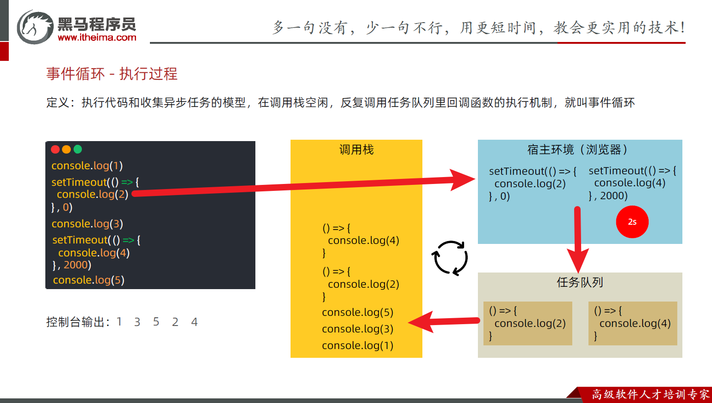


+ 调用栈空时，执行任务队列中的代码


宏任务微任务

ES6之后引入了 Promise 对象， 让 JS 引擎也可以发起异步任务
异步任务分为：

+ 宏任务：由 **浏览器** 环境执行的异步代码
+ 微任务：由 **JS 引擎** 环境执行的异步代码，执行时机是在主函数执行结束之后、当前宏任务结束之前

优先调度微任务队列


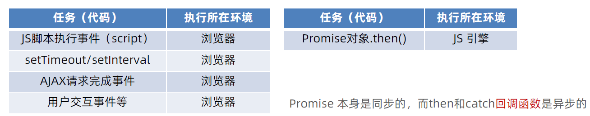


例：

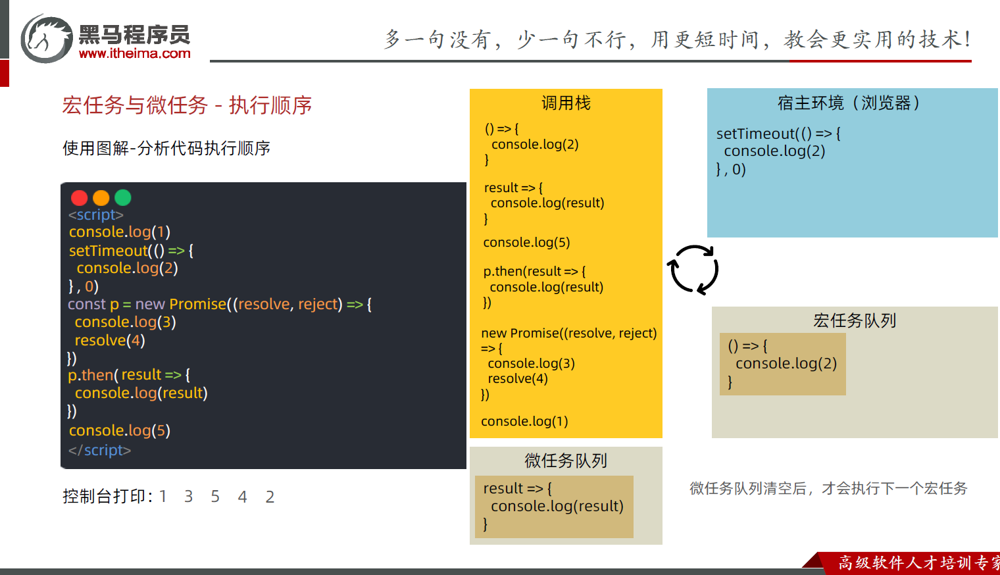


JavaScript内代码如何执行：

1. 执行第一个 script 脚本事件宏任务，里面 同步 代码
2. 遇到宏任务 微任务 交给宿主环境，有结果回调函数进入对应队列
3. 当执行栈空闲时，清空微任务队列，再执行下一个宏任务 ，从 1 再来


### Web API

#### 基础API

+ 修改类

  ```js
  const box = document.querySelector('.box')
  
  box.classList.add('active') //添加
  box.classList.remove('box') //删除
  box.classList.toggle('active') //替换
  box.classList.contains('active') //查询
  box.className=""   // class的字符串
  ```

+ ```js
  box.style.width
   可以当左值，也可以当右值
   需要用到驼峰格式
   只能操作内联的style
  ```

+ 自定义属性

  ```html
  <div data-id="1" data-spm="不知道">1</div>
  console.log(对象.dataset.id)
  console.log(对象.dataset.spm)
  对象.dataset()    //自定义属性的集合
  ```

+ 所有特性都可以通过使用以下方法进行访问（https://zh.javascript.info/dom-attributes-and-properties）：

  - `elem.hasAttribute(name)` —— 检查特性是否存在。
  - `elem.getAttribute(name)` —— 获取这个特性值。
  - `elem.setAttribute(name, value)` —— 设置这个特性值。
  - `elem.removeAttribute(name)` —— 移除这个特性。

+ 定时器-间歇函数

  ```js
  let n = setInterval(函数名，时间（毫秒）)        //返回定时器的编号
  clearIntterval(n)    //关闭定时器
  ```

+ 事件监听

  + 元素对象.addEventListener('事件类型'，要执行的函数)
  + 解绑：元素对象.removeEventListener(事件类型，事件处理函数，【事件捕获或者冒泡阶段】)

+ 事件类型

  + 鼠标事件（鼠标触发）     ：click鼠标点击，mouseenter鼠标经过，mouseleave鼠标离开
  + 焦点事件（表单获得光标）：focus获得焦点，blur失去焦点
  + 键盘事件（键盘触发）   ：keydown键盘按下触发，keyuo键盘抬起触发
  + 文本事件（表单输入触发）：input用户输入事件

+ 事件对象

  ```js
  // 添加
  元素.addEventListener('click', function(event){
      //event即为事件对象
  })
  
  // 解绑
  元素.removeEventListener('click', fn)
  // 匿名函数无法解绑
  ```

  + 事件对象的常用属性：
  + `type`：获取当前的事件类型
  + `cilentX/ cilentY`：获取光标相对于浏览器可见窗口左上角的位置
  + `offsetX/ offsetY`：获取光标相对于当前DOM元素左上角的位置
  + `key`：用户按下的前盘键的值
  + `e.target.tagName`真正触发的元素
  + `e.target.classList`可以获取事件的DOM对象

+ 特殊事件

  + `DOMContentLoaded`：HTML加载完成后触发，添加给`document`

    ```js
    document.addEventListener('DOMContentLoaded', ()=>{})
    ```

  + `load`：外部资源（图片、外联CSS和JavaScript）加载完毕触发的事件，可用于所有元素，一般用于`windows`

    ```js
    windows.addEventListener('load', ()=>{})
    ```

+ ```js
  document.documentElement.scrollTo
  ```

  获取整个HTML对象

  + `scrollTop / scrollLeft`获取/ 修改整个HTML页面被卷去的距离

+ 滚动相关

  + `window.scrollX`
  + `window.scrollY`
  + `window.scrollTo(X, Y)`

+ 函数对象`this`：指向调用者

+ 捕获和冒泡：默认`false`，冒泡

  + 大→小：捕获
  + 小→大：冒泡
  + 阻止事件流动传播（冒泡+捕获）：`事件对象.stopPropagation()`

+ 鼠标经过事件：

  + `mouseover`和`mouseout`会有冒泡效果
  + `mouseenter`和`mouseleave`没有冒泡效果（推荐）

+ 点击返回页面顶部

  ```js
  const backTop = document.querySelector('#backTop')
  backTop.addEventListener('click', function(){
      document.documentElement.scrollTop = 0
      //document.documentElement 用于获取html内容
  })
  ```

+ 获取宽高：

  + 不包含padding/border: `clientWidth`, `clientHeight`
  + 包含padding/border: `offsetWidth`, `offsetHeight`

+ 获取位置：

  + 元素距离自己定位父级元素的左、上距离: `offestLeft`, `offsetTop`

+ 获取位置的另一种：

  ```js
  element.getBoundingClientRect()
  // 返回元素的大小及其相对于视口的位置（x, y）
  ```

  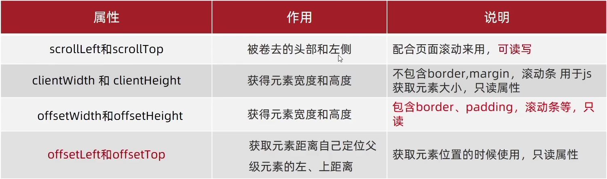

+ 日期对象

  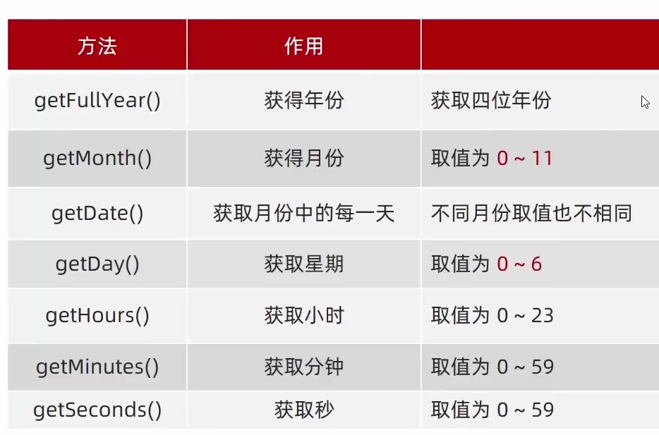

+ 获取时间戳（从1970年到现在的毫秒数）

  ```js
  const date=new Date()
  date.getTime()
  
  +new Date()
  
  new Date().toLocalString()
  ```

+ 内容：

  + `innerText`不修改子元素，不考虑隐藏元素
  + `textContent`修改子元素，考虑隐藏元素，忽略HTML格式
  + `innerHTML`以HTML形式解析


#### 节点操作

+ 查找结点

  + 父节点，返回最近一级的父结点，找不到返回NULL：

    ```js
    子元素.parentNode
    ```

    + 1. **`parentNode`**: 包括元素节点、文档节点、文档类型节点或者文档片段节点。

      2. **`parentElement`**: 父元素必须是一个元素节点。如果父节点不是元素节点（例如，如果父节点是文档节点或文档类型节点），那么 `parentElement` 会返回 `null`。

      下面是一个例子，说明了这两者之间的差异：

      ```javascript
      // 获取 html 元素
      let html = document.documentElement;
      
      console.log(html.parentNode); // 输出: #document
      console.log(html.parentElement); // 输出: null
      ```

      在这个例子中，html 元素的父节点是文档节点，所以 `parentNode` 返回文档节点，而 `parentElement` 返回 `null`。

  + 子节点

    + `childNodes`:获得所有子节点、包括文本节点（空格、换行）、注释节点等
    + `children`属性: 仅获得所有元素节点，返回一个伪数组

  + 兄弟节点

    + 下一个`previousElementSibling`
    + 上一个`nextElementSibling`

+ 创建节点

  ```js
  document.createElement('标签名')
  ```

+ 插入节点

  + 插入到这个父元素的最后

    ```js
    父元素.appendChild(要插入的元素)
    ```

  + 插入到父元素的某个子元素之前

    ```js
    父元素.insertBefore(要插入的元素，在哪个元素前面)
    ```

+ 克隆节点

  ```js
  元素.cloneNode(布尔值)
  // 布尔值决定是否克隆后代
  ```

+ 删除结点

  ```js
  父元素.removeChild(要删除的元素)
  元素.remove() // 删除自身
  ```

#### windows对象

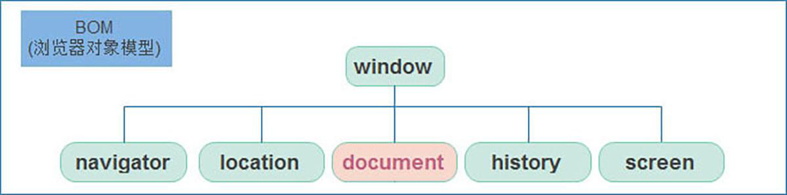

##### location对象

location 的数据类型是对象，它拆分并保存了 URL 地址的各个组成部分

**属性**：

+ `location.href`指定当前页面链接，可读写
+ `location.search`获取URL参数（`?`及其后面部分）
+ `location.hash`获取URL参数（`#`及其后面部分）

方法：

+ `location.load([true])`（ctrl + F5）（强制）刷新

##### navigator对象

记录了浏览器自身的相关信息

通过 userAgent 检测浏览器的版本及平台:

```js
!(function () {
const userAgent = navigator.userAgent
// 验证是否为Android或iPhone
const android = userAgent.match(/(Android);?[\s\/]+([\d.]+)?/)
const iphone = userAgent.match(/(iPhone\sOS)\s([\d_]+)/)
// 如果是Android或iPhone，则跳转至移动站点
if (android || iphone) {
location.href = 'http://m.itcast.cn'
}
})()
```

##### history对象

对象

+ `history.back()` 后退
+ `history.forward()`前进
+ `history.go(-1)`后退
+ `history.go(1)`前进

##### localStorage对象

手动清除才会消失

以键值对的形式把数据存储在本地，只能存储字符串，不能存储对象

+ `localStorage.setItem(key, value)`
+ `localStorage.getItem(key)`
+ `localStorage.removeItem('key')`

复杂数据类型存取：

+ `JSON.stringify(obj)`转换为字符串
+ `JSON.parse(json)`转换为对象

##### sessionStorage

+ 生命周期为关闭浏览器窗口，在同一个窗口下数据可以共享
+ 以键值对形式存放，用法与`localStorage`基本相同

### JS高阶

#### 深浅 / 拷贝

+ 浅拷贝：复制地址
+ 深拷贝：把值复制一份，拷贝值

实现：

+ 数组：`concat`，合并两个数组；`...`运算符
+ 对象：`Object.assign(dest, [src1, src2, src3...])`；`...`运算符 但只能深拷贝一层

进一步：

+ 递归

+ lodash/cloneDeep库

  ```js
  const newObj = _.cloneDeep(old);
  ```

+ 通过 JSON.stringify 实现（无法拷贝函数）

  ```js
  const o= JSON.parse(JSON.stringify(obj));
  ```

#### 异常处理

1. try 试试 catch 拦住 finally 最后
2. try...catch 用于捕获错误信息
3. 将预估可能发生错误的代码写在 try 代码段中
4. 如果 try 代码段中出现错误后，会执行 catch 代码段，并截获到 错误信息
5. finally 不管是否有错误，都会执行
6. `throw`会终止程序
   1. `throw new Error("出错了！")`
   2. `throw "出错了"`

#### this指向

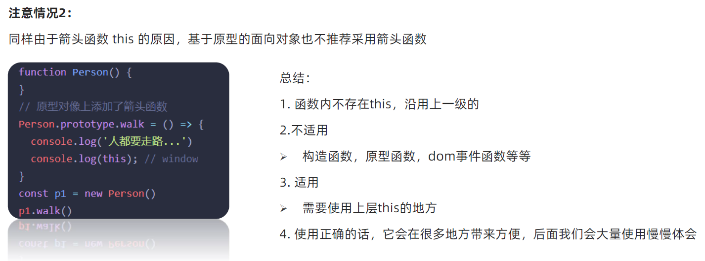

JavaScript
中还允许指定函数中 this 的指向，有 3 个方法可以动态指定普通函数中 this 的 指向

+ call()

+ apply()

+ bind()

1. call()

   call 方法调用函数，同时 指定被调用函数 中 this 的值

   语法：

   ```js
   fun.call(thisArg, arg1, arg2, ...)
   ```

   + fun.call(thisArg, arg1, arg2, ...)
   + thisArg ：在 fun 函数 运行时指定 的 this 值
   + arg1 arg2 ：传递 的其他参数
   + 返回 值就是函数的返回值，因为它就是调用 函数

2. apply 方法调用函数，同时 指定被调用函数 中 this 的 值

   语法：

   ```js
   fun.apply(thisArg, [argsArray])
   ```

   + thisArg ：在 fun 函数运行时指定的 this 值
   + argsArray ：传递的值，必须包含在 数组 里面
   + 返回 值就是函数的返回值，因为它就是调用 函数
   + 因此 apply 主要跟数组有关系，比如使用 Math.max() 求数组的最大 值

3. bind() 方法不会调用函数。但是能改变函数内部 this 指向
   语法：

```js
fun.bind(thisArg, arg1, arg2, ...)
```

+ thisArg ：在 fun 函数运行时指定的 this 值
+ arg1 arg2 ：传递的其他参数
+ 返回由指定的 this 值和初始化参数改造的 原函数拷贝 （新函数
+ 因此当我们只是想改变 this 指向，并且不想调用这个函数的时候，可以使用 bind 比如改变定时器内部的this 指向

#### 防抖&节流

##### 防抖

+ 防抖：如果在 n 秒内又触发了事件，则会重新计算函数执行时间

使用场景

+ 搜索框输入，设定每次输入完毕 n 秒后发送请求，如果期间还有输入，则重新计算时间

实现：

+ `lodash库`：设置函数的最短执行间隔

  ```js
  box.addEventListener('mousemove', _.debounce(mouseMove, 500))
  ```

  模拟：

  ```js
  // 无论晃动多少次，只在最后一次触发
  // 只是内层防抖了，外层仍然会高频率执行
  const box = document.querySelector(".box");
  let i = 0;
  function fn() {
      box.innerText = i++;
  }
  function debounce(fn, time) {
      let timer;
      return function () {
          if (timer) clearTimeout(timer);
          timer = setTimeout(function () {
              fn();
          }, time);
      };
  }
  box.addEventListener("mousemove", debounce(fn, 500));
  // 事件触发的效果：执行debounce(fn, 50)()这个函数
  ```

##### 节流

概念：

+ 就是指连续触发事件但是在 n 秒中只执行一次函数。比如可以利用节流实现 1s 之内 只能触发一次鼠标移动 事件

使用场景

+ 鼠标移动，页面尺寸发生变化，滚动条滚动等开销比较大的情况下

实现：

+ 使用`lodash库`

  ```js
  box.addEventListener('mousemove', _.throttle(mouseMove, 500))
  ```

+ 模拟：

  ```js
  const box = document.querySelector(".box");
  let i = 0;
  function fn() {
      box.innerText = i++;
  }
  function debounce(fn, time) {
      let timer=null;
      return function () {
          if (!timer) {
              timer = setTimeout(function () {
                  fn();
                  timer=null;
              }, time);
          }
      };
  }
  box.addEventListener("mousemove", debounce(fn, 500));
  ```

##### 记录播放位置案例

相关KPI：

+ `ontimeupdate` 事件 在视频 音频（ audio/video ）当前的播放位置发送改变时 触发

  这个函数在音视频播放位置改变时触发，可以给他绑定函数。

+ `onloadeddata` 事件在当前帧的数据加载完成且还没有足够的数据播放视频 音频（ audio/video ）的下一帧时 触发

+ `video.currentTime`：视频当前时间，可读可写

```js
const video = document.querySelector("video");
video.ontimeupdate = function () {
    localStorage.setItem("currentTime", video.currentTime);
};
video.onloadeddata = function () {
    video.currentTime = localStorage.getItem("currentTime") || 0;
};
```


#### 柯里化

https://zh.javascript.info/currying-partials

```js
const sum = (a, b, c) => {
    return a + b + c
}

function curry(func) {
    // 递归函数，返回func的柯里化
    return function curried(...args) {
        // func.length: JavaScript 中的函数对象有一个 length 属性。
        // 这个属性提供了一个函数期望接收的参数个数，也就是在函数定义中声明的参数数量

        // 参数已经足够了
        if (args.length >= func.length) {
            return func.apply(this, args);
        } else {
            // 参数还是不够，再构造一层函数
            return function (...args2) {
                return curried.apply(this, args.concat(args2));
            }
        }
    };
}
console.log([sum]);
console.log(curry(sum)(1, 2)(3))
const sumOne= curry(sum)(1)
console.log(sumOne(2,3));
```

柯里化：将 `sum(a, b, c)` 转换为 `sum(a)(b)(c)`

更高级的柯里化：

+ 支持部分调用，可以返回一部分函数


### 杂项

#### JSON

| 方法                                                         | 解释                                           |
| ------------------------------------------------------------ | ---------------------------------------------- |
| [JSON.parse()](https://www.runoob.com/js/javascript-json-parse.html) | 用于将一个 JSON 字符串转换为 JavaScript 对象。 |
| [JSON.stringify()](https://www.runoob.com/js/javascript-json-stringify.html) | 用于将 JavaScript 值转换为 JSON 字符串。       |

+ `JSON`的属性名必须加引号，对象的属性名不需要

#### Void

**#** 包含了一个位置信息，默认的锚是**#top** 也就是网页的上端。

而javascript:void(0), 仅仅表示一个死链接。

在页面很长的时候会使用 **#** 来定位页面的具体位置，格式为：**# + id**。

如果你要定义一个死链接请使用 javascript:void(0) 。

#### 正则表达式

构造：`/表达式/修饰符`

+ ```js
  let re = /ab+c/;
  ```

+ ```js
  let re = new RegExp("ab+c");
  ```

转义字符：`\`

特殊字符：

断言：表示一个匹配在某些条件下发生。断言包含先行断言、后行断言和条件表达式。

+ `x*` 前一项`x`出现零次或多次

+ `^` 匹配输入的开始

+ `$`匹配输入的结束

+ `\b` 匹配单词边界

+ `\B` 匹配非单词边界

+ 先行断言：`x(?=y)`  x 被 y 跟随时匹配 x

+ 先行否定断言：`x(?!y)`   x 没有被 y 紧随时匹配 x

+ 后行断言：`(?<=y)x`  x 跟随 y 的情况下匹配 x

+ 后行否定断言：`(?<!y)x`   x 不跟随 y 时匹配 x

+ 选择是正则表达式中的一个术语，实际上是一个简单的“或”。

  在正则表达式中，它用竖线 `|` 表示。

  例如，我们想要找出编程语言：HTML、PHP、Java 或 JavaScript。

  对应的正则表达式为：`html|php|java(script)?`。

字符类：区分不同类型的字符，例如区分字母和数字。 

+ `[xyz][a-c]`: 匹配包含在方括号中的任何字符。可以使用连字符指定字符范围
+ `[^xyz][^a-c]`: 一个否定或补充的字符类。也就是说，它匹配未包含在方括号中的任何字符
+ `.`: 匹配**除行终止符之外的任何单个字符**：`\n`, `\r`, `\u2028` or `\u2029`. 例如，`/.y/` 在“yes make my day”中匹配“my”和“ay”，而不是“yes”。 
+ `\d`: 数字   相当于 `[0-9]`
+ `\D`: 非数   相当于`[^0-9]`
+ `\w`:  字母 数字 下划线   相当于 `[A-Za-z0-9_]`
+ `\W`: 非`\w`
+ `\s`: 单个空白字符，包括空格、制表符、换页符、换行符和其他 Unicode 空格。相当于 `[\f\n\r\t\v\u0020\u00a0\u1680\u2000-\u200a\u2028\u2029\u202f\u205f\u3000\ufeff]`
+ `\S`

组和范围：表示表达式字符的分组和范围。

+ `(x)`:  **捕获组：**匹配 x 并记住匹配项。例如，/(foo)/匹配并记住“foo bar”中的“foo”
+ `(?:x)`:  仅分组，不记住 
+ `\n`:  其中 n 是一个正整数。对正则表达式中与 n 括号匹配的最后一个子字符串的反向引用 (计算左括号)

量词：表示匹配的字符或表达式的数量

+ `x+`:  `x`出现一次或多次
+ `x?`:  `x`出现一次或零次
+ `x{n}`:  `x`出现n次
+ `x{n,}`:  `x`至少出现n次
+ `x{n,m}`:  `x`出现n~m次

> 默认情况下，像 `* `和 `+ `这样的量词是“贪婪的”，这意味着它们试图匹配尽可能多的字符串。?量词后面的字符使量词“非贪婪”：意思是它一旦找到匹配就会停止。例如，给定一个字符串“some <foo> <bar> new </bar> </foo> thing”:
>
> - `/<.*>/` will match "<foo> <bar> new </bar> </foo>"
> - `/<.*?>/` will match "<foo>"

修饰符：

+ i    使用此修饰符后，搜索时不区分大小写：`A` 和 `a` 之间没有区别（请参见下面的示例）。
+ g    使用此修饰符后，搜索时会寻找所有的匹配项 —— 没有它，则仅返回第一个匹配项。
+ m   多行模式（详见 [锚点 ^ $ 的多行模式，修饰符 "m"](https://zh.javascript.info/regexp-multiline-mode)）。
+ s   启用 “dotall” 模式，允许点 `.` 匹配换行符 `\n`（在 [字符类](https://zh.javascript.info/regexp-character-classes) 中有详细介绍）。
+ u   开启完整的 Unicode 支持。该修饰符能够正确处理代理对。详见 [Unicode：修饰符 "u" 和类 \p{...}](https://zh.javascript.info/regexp-unicode)。
+ y   粘滞模式，在文本中的确切位置搜索（详见 [粘性修饰符 "y"，在位置处搜索](https://zh.javascript.info/regexp-sticky)）

方法：

+ 搜索：`str.match(regexp)` 方法在字符串 `str` 中寻找 `regexp` 的匹配项。

  + 搜索不到时返回`null`
  + 搜索全部还是贪婪，取决于参数

+ 替换：`str.replace(str|regexp, str|func)` 方法使用 `replacement` 替换在字符串 `str` 中找到的 `regexp` 的匹配项： 

  （如果带有修饰符 `g` 则替换所有匹配项，否则只替换第一个）。

  第二个参数是字符串 `replacement`。我们可以在其中使用特殊的字符组合来对匹配项进行插入：

  | 符号      | 在替换字符串中的行为                                         |
  | :-------- | :----------------------------------------------------------- |
  | `$&`      | 插入整个匹配项                                               |
  | `$`       | 插入字符串中匹配项之前的字符串部分                           |
  | `$'`      | 插入字符串中匹配项之后的字符串部分                           |
  | `$n`      | 如果 `n` 是一个 1-2 位的数字，则插入第 n 个分组的内容，详见 [捕获组](https://zh.javascript.info/regexp-groups) |
  | `$<name>` | 插入带有给定 `name` 的括号内的内容，详见 [捕获组](https://zh.javascript.info/regexp-groups) |
  | `$$`      | 插入字符 `$`                                                 |

+ 搜索：`str.search( /ink/i )`

  ```js
  let str = "A drop of Ink may make a million think";
  alert( str.search( /ink/i ) ); // 10（第一个匹配位置）
  ```

+ 测试:  `regexp.test(str)` 方法寻找至少一个匹配项，如果找到了，则返回 `true`，否则返回 `false`。

+ 检索：`regObj.exec(被检测字符串)`

  成功：返回一个匹配信息的数组；失败：返回null\

  + 如果没有修饰符`g`，则与`str.match(reg)`相同

  + 如果有修饰符`g`，第一次调用`reg.exec(str)`会返回第一个匹配项，

    + 并将紧随其后的位置保存在属性 `regexp.lastIndex` 中。

    + 下一次这样的调用会从位置 `regexp.lastIndex` 开始搜索，返回下一个匹配项，并将其后的位置保存在 `regexp.lastIndex` 中。

  + 

+ 


例：

+ `number.replace(/(\d{3})\d{4}(\d{4})/, '\$1****\$2')`手机号中间四位置为`*`
+ `/([01]\d|2[0-3]):[0-5]\d/g`  匹配 `hh:mm` 这样的时间


#### 模块

来源：https://es6.ruanyifeng.com/#docs/module

+ `export`:   规定模块的对外接口
+ `import`:   输入 其他模块提供的功能

##### export

别名

```js
export{
  原名1 as 别名1,
  原名2 as 别名2,
  原名2 as 别名3,
}
// 一个原名可以有多个别名
```

提供接口而不是值：

```js
let m = 1;
export m; // 报错
```

没有提供对外接口

```js
export let m = 1;

let m = 1;
export {m};

let n = 1;
export {n as m}; // 正确
```

在接口名与模块内部变量之间，建立了一一对应的关系

**`export`输出的接口，与对应的值是动态绑定的关系**

##### import

```js
import {接口名} from '其他模块'
```

接口名必须与其他被导入模块的对外接口名相同

接口的值不允许更改，只读

整体加载

```js
import * as circle from './circle'

console.log(circle.area(4));
console.log(circle.circumference(4));
```

##### export default

```js
export default function area(){}
// 相当于
export default=function area(){}

import anyName from 'area';
```

+ 不需要大括号
+ 不用和输出一致

正是因为`export default`命令其实只是输出一个叫做`default`的变量，所以它后面不能跟变量声明语句。

```javascript
// 正确
export var a = 1;

// 正确
var a = 1;
export default a;

// 错误
export default var a = 1;
```

上面代码中，`export default a`的含义是将变量`a`的值赋给变量`default`。所以，最后一种写法会报错。

同样地，因为`export default`命令的本质是将后面的值，赋给`default`变量，所以可以直接将一个值写在`export default`之后。

```javascript
// 正确
export default 42;

// 报错
export 42;
```

##### export 与 import 的复合写法

如果在一个模块之中，先输入后输出同一个模块，`import`语句可以与`export`语句写在一起。

```javascript
export { foo, bar } from 'my_module';

// 可以简单理解为
import { foo, bar } from 'my_module';
export { foo, bar };
```

#### 垃圾回收

1. 引用计数法

   + 思想：如果**内存不再使用**，则清除
   + 实现：看一个对象是否有指向它的引用，没有引用了就回收对象
   + 弊端：嵌套引用

2. 标志清除法

   + 思想：将“不再使用的对象”定义为“**无法达到的对象**”

   + 实现：就是从根部（在JS中就是全局对象）出发定时扫描内存中的对象。 凡是能从根部到达的对象，都是还需要使用的。

     那些无法由根部出发触及到的对象被标记为不再使用，稍后进行回收。

   + 

#### 解构赋值

1. 数组解构

   + 将数组的单元值快速批量赋值给一系列变量的简洁语法
   + **以位置为准**
   + `[a, b] = [b, a]`
   + 可以设置默认值  `[a, b, c=1] = [2,3]`，当右边为`undefined`时生效
   + 按需导入，忽略一些值：`[a, , b, c] = [1, 000000, 2, 3]`

2. 对象解构

   + 重命名：

     ```js
     const user = {
         name: '小明',
         age: 18,
     };
     const { name: uname, age } = user;
     uname // 小明
     age // 18
     ```

   + **以相同的属性名和变量名为准**


### TypeScript

字节青训营

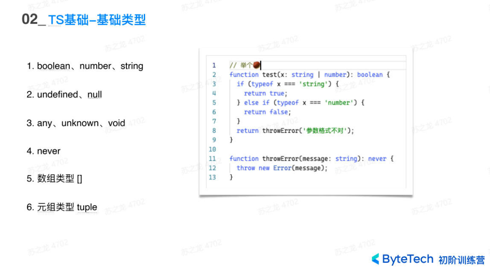

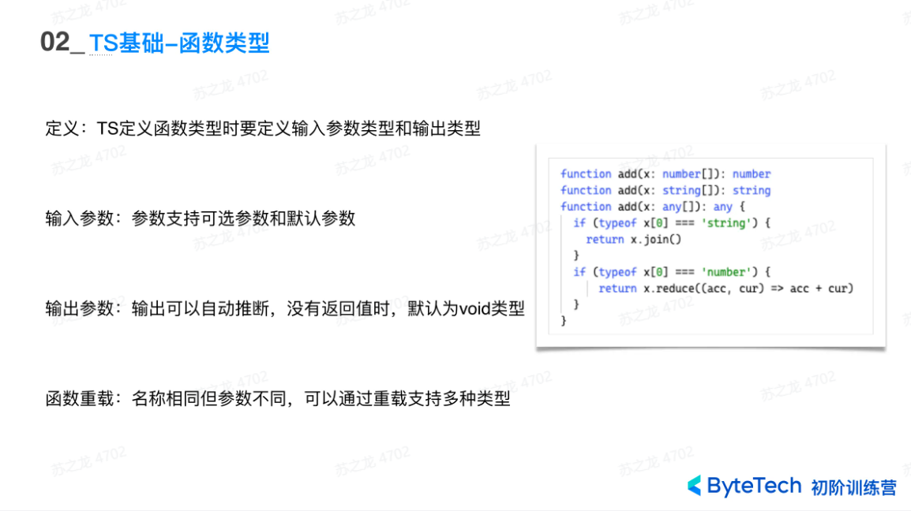

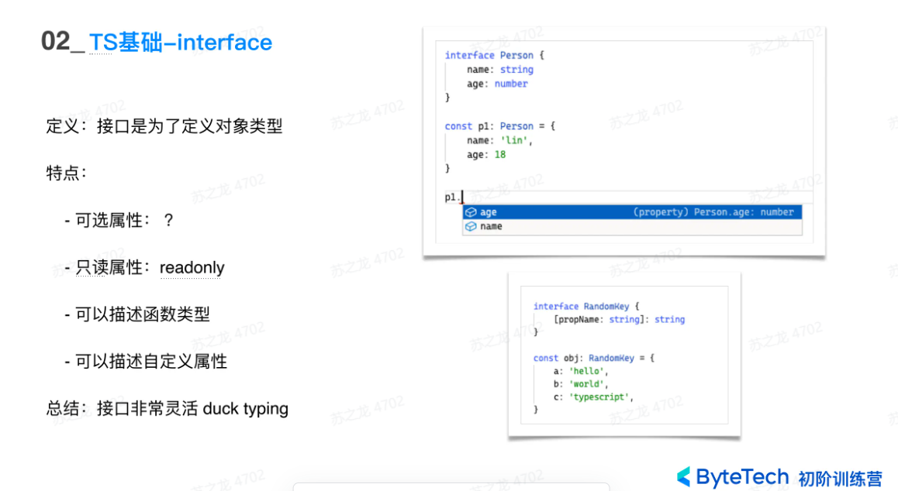

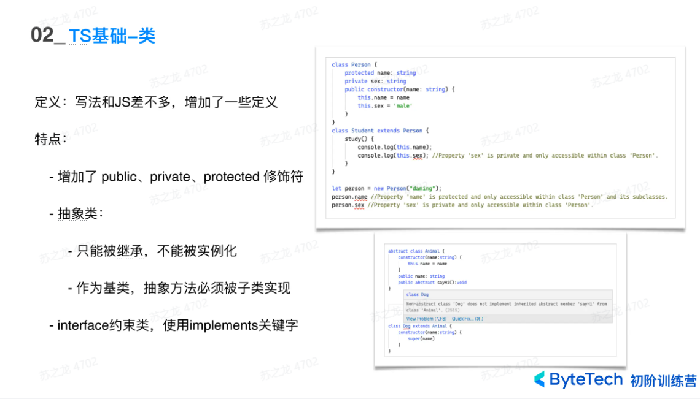

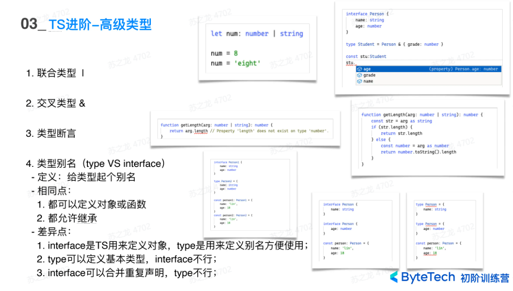

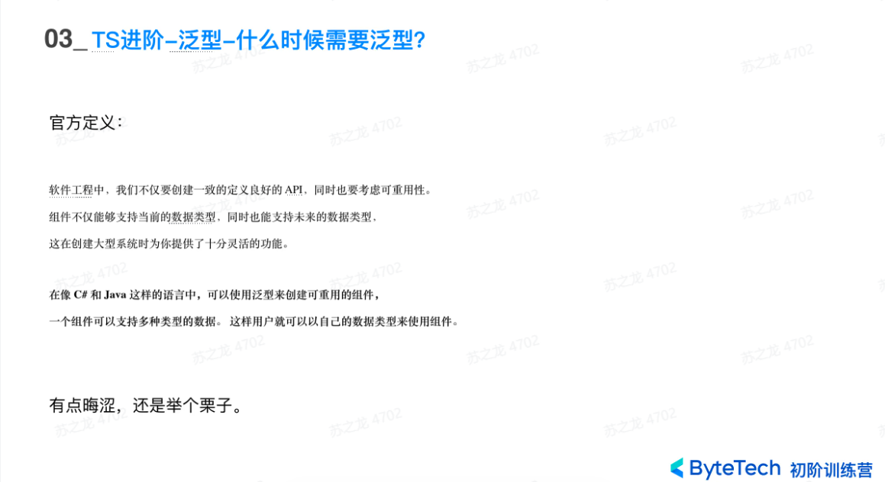

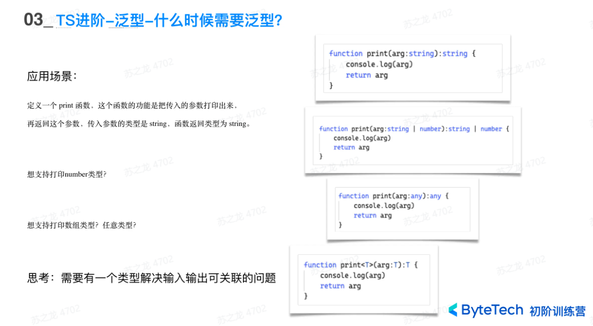

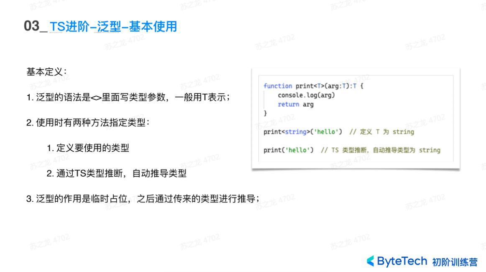

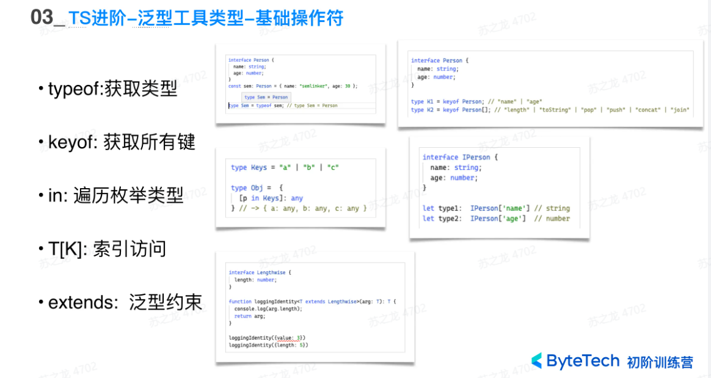

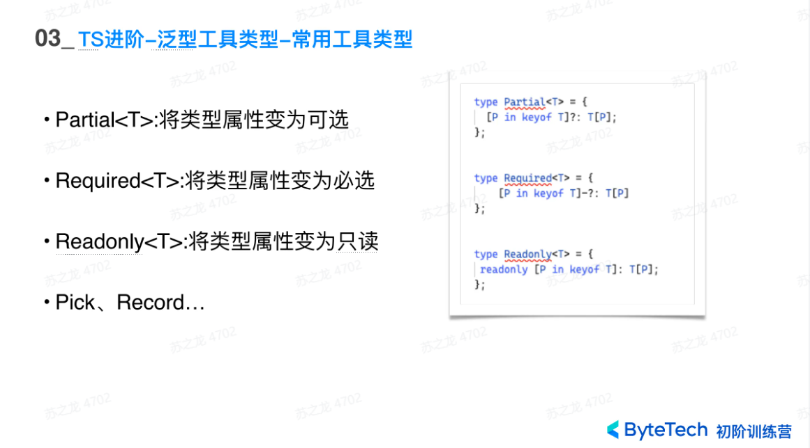

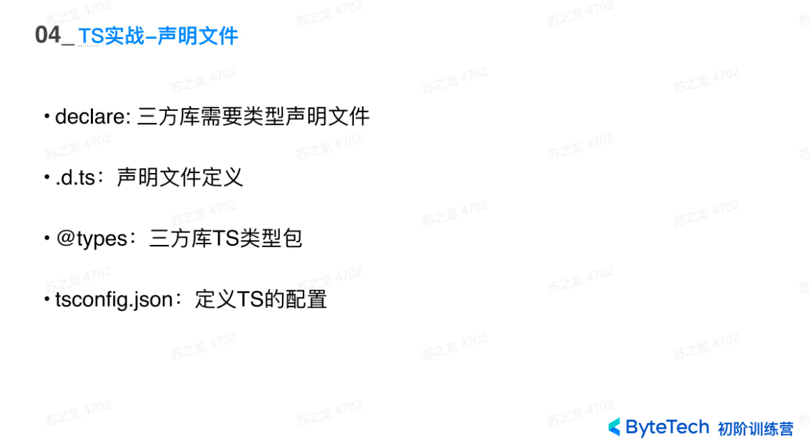

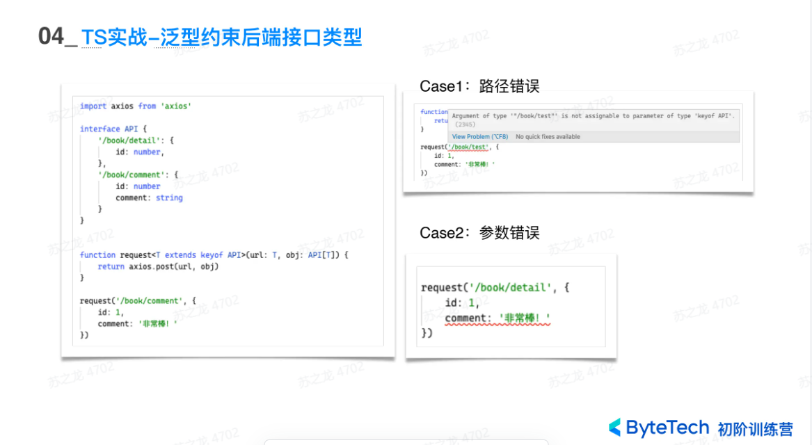

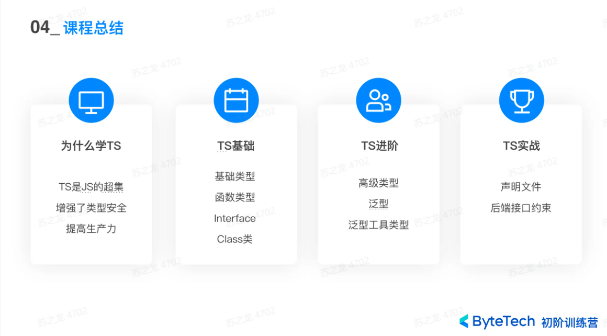

### jQuery

来自：https://www.liaoxuefeng.com/wiki/1022910821149312/1023022609723552

#### 基础语法

选择：

+ `$('选择器')`
+ 返回对象数组
+ 使用`$('选择器').find('选择器')`进行双层查找

1. 选择器：使用 `$` 符号和括号可以选择 `HTML` 元素，例如：

   ```javascript
   $(document) // 选择整个文档对象
   $('#myId') // 选择 id="myId" 的元素
   $('.myClass') // 选择 class="myClass" 的元素
   $('input[type=text]') // 选择所有 type="text" 的 input 元素
   ```

2. 事件：使用 `on()` 函数来为元素绑定事件处理程序，例如：

   ```javascript
   $('#myButton').on('click', function() {
     alert('Button clicked!');
   });
   ```

3. 操作元素：使用 `jQuery` 提供的函数可以对 `HTML` 元素进行操作，例如：

   ```javascript
   $('#myDiv').html('Hello world!'); // 修改元素内容
   $('#myInput').val('default value'); // 设置 input 元素的默认值
   $('#myImage').attr('src', 'newimage.jpg'); // 修改元素属性
   $('#myDiv').hide(); // 隐藏元素
   ```

#### 操作DOM

+ jQuery对象的`text()`和`html()`方法分别获取节点的文本和原始HTML文本

+ 一个jQuery对象可以包含0个或任意个DOM对象，它的方法实际上会作用在对应的每个DOM节点上。所以jQuery对象的另一个好处是我们可以执行一个操作，作用在对应的一组DOM节点上。即jQuery对象有==“批量操作”==的特点

+ jQuery对象有`css('name', 'value')`方法，并且所有jQuery对象的方法的返回值都为jQuery对象

  ```js
  var div = $('#test-div');
  div.css('color'); // '#000033', 获取CSS属性
  div.css('color', '#336699'); // 设置CSS属性
  div.css('color', ''); // 清除CSS属性
  ```

+ 修改class：

  ```js
  var div = $('#test-div');
  div.hasClass('highlight'); // false， class是否包含highlight
  div.addClass('highlight'); // 添加highlight这个class
  div.removeClass('highlight'); // 删除highlight这个class
  ```

+ 隐藏和显示DOM

  ```js
  var a = $('a[target=_blank]');
  a.hide(time); // 隐藏, time ms内逐渐消失
  a.show(); // 显示
  a.toggle() //方法则根据当前状态决定是show()还是hide()
  
  slideUp()和slideDown()则是在垂直方向逐渐展开或收缩的,slideToggle()则根据元素是否可见来决定下一步动作
  fadeIn()和fadeOut()的动画效果是淡入淡出, fadeToggle()则根据元素是否可见来决定下一步动作
  ```

+ `attr()`和`removeAttr()`方法用于操作DOM节点的属性：

  ```js
  // <div id="test-div" name="Test" start="1">...</div>
  var div = $('#test-div');
  div.attr('data'); // undefined, 属性不存在
  div.attr('name'); // 'Test'
  div.attr('name', 'Hello'); // div的name属性变为'Hello'
  div.removeAttr('name'); // 删除name属性
  ```

+ `attr()`和`prop()`对于属性`checked`处理有所不同:

  ```js
  var radio = $('#test-radio');
  radio.attr('checked'); // 'checked'
  radio.prop('checked'); // true
  radio.is(':checked'); // true
  ```

+ 对于表单元素，jQuery对象统一提供`val()`方法获取和设置对应的`value`属性,一个`val()`就统一了各种输入框的取值和赋值的问题

#### 修改DOM结构

+ 使用`append()`方法为DOM对象添加元素

+ 除了接受字符串，`append()`还可以传入原始的DOM对象，jQuery对象和函数对象：

```js
$('#id').text('阿巴阿巴')

// 创建DOM对象:
var ps = document.createElement('li');
ps.innerHTML = '<span>Pascal</span>';
更改元素内部文本 .text("文本内容")
替换元素内部内容 .html("<标签>内容<标签/>")
// 添加DOM对象:
ul.append(ps);

// 添加jQuery对象:
ul.append($('#scheme'));

// 添加函数对象:
ul.append(function (index, html) {
    return '<li><span>Language - ' + index + '</span></li>';
});
```

+ `append()`把DOM添加到最后，`prepend()`则把DOM添加到最前。

+ 同级节点可以用`after()`或者`before()`方法。

#### 事件

+ `on`方法用来绑定一个事件，我们需要传入事件名称和对应的处理函数。

  ```js
  var a = $('#test-link');
  a.on('click', function () {
      alert('Hello!');
  });
  ```

+ 另一种更简化的写法是直接调用`click()`方法：

  ```js
  a.click(function () {
      alert('Hello!');
  });
  ```

+ 一个已被绑定的事件可以解除绑定，通过`off('click', function)`实现：

  为了实现移除效果，可以使用`off('click')`一次性移除已绑定的`click`事件的所有处理函数。

  同理，无参数调用`off()`一次性移除已绑定的所有类型的事件处理函数。

  ```js
  // 绑定事件:
  a.click(function () {
      alert('hello!');
  });
  
  // 解除绑定:
  a.off('click', function () {
      alert('hello!');
  });
  ```

#### 动画

基本

+ hide(), show(), toggle()
+ slideUp(), slideDown(), slideToggle()
+ fadeIn(), fadeOut(), fadeToggle()

自定义动画

+ animate ( DOM元素最终的状态，时间，[动画结束时被调用的函数] )

  ```js
  var div = $('#test-animate');
  div.animate({
      opacity: 0.25,
      width: '256px',
      height: '256px'
  }, 3000); // 在3秒钟内CSS过渡到设定值
  ```

