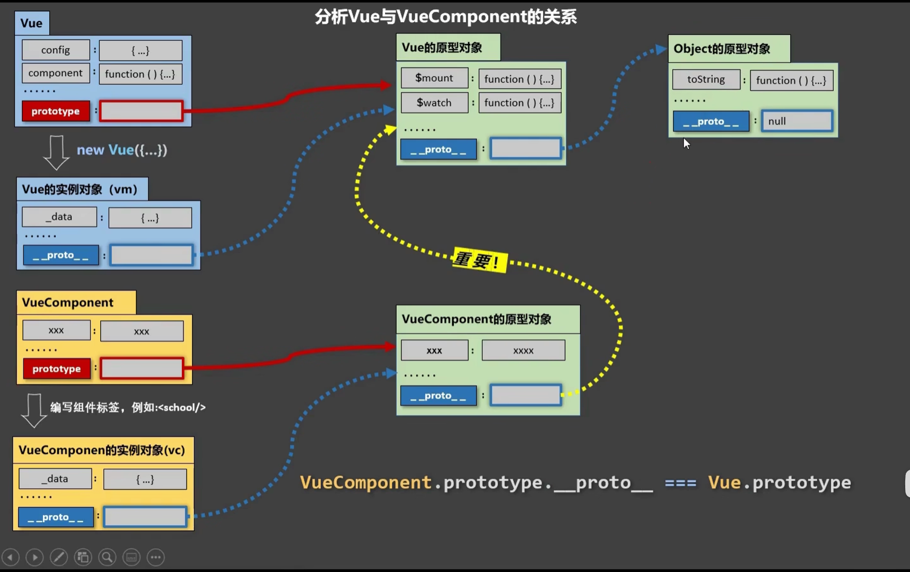
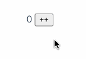
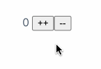
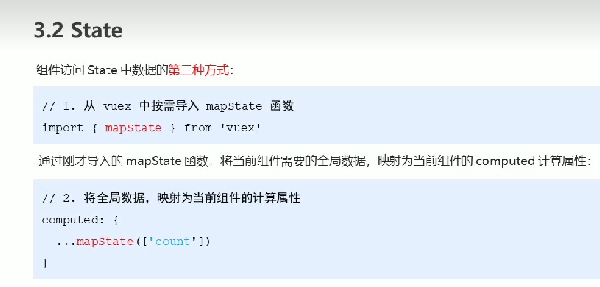
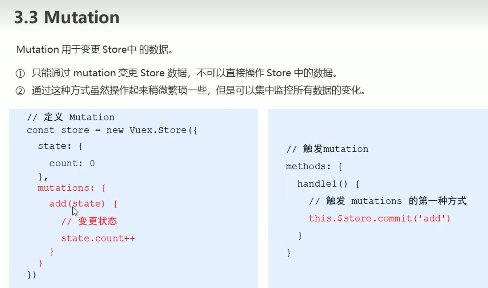
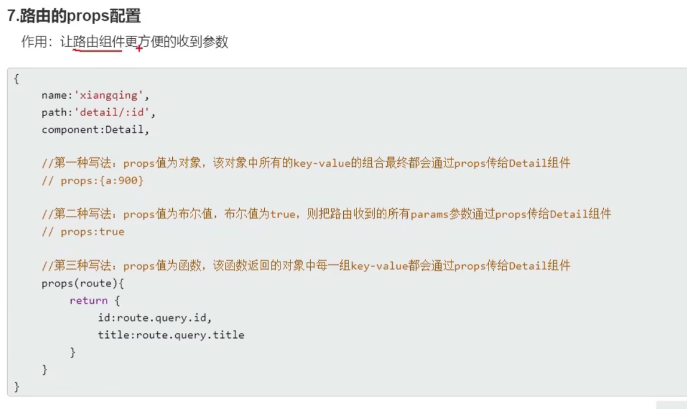
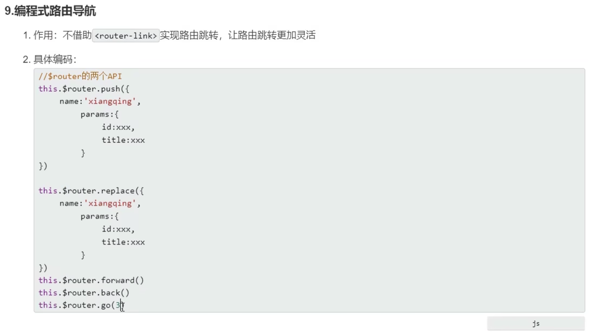
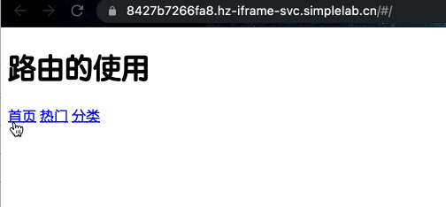

```sh
wget https://labfile.oss.aliyuncs.com/courses/1262/vue.min.js
```

### 工程化

#### 计算、侦听与过滤器、生命周期钩子

+ 计算属性

```html
<body>
    <div id="app">
        <p>我名字正着写：{{name}}</p>
        <!-- reverseName 计算属性  可以像绑定普通属性一样在模板中绑定计算属性-->
        <p>计算出我名字倒着写：{{reverseName}}</p>
    </div>
    <script>
        var app = new Vue({
            el: "#app",
            data: {
                goodsList: {,
                name: "实验楼",
            },
            computed: {
                // reverseName 是一个计算属性
                reverseName: function () {
                    return this.name.split("").reverse().join("");
                },
            },
            // 一个只在内面挂载完毕，才开始执行的函数
            mounted(){
                axios.get('goodsList.json').then(val => {
                this.goodsList = val.data;
            })
            }
        });
    </script>
</body>
```

生命周期函数是在特定时间点执行的函数，其中`this`的指向为`vm`或`组件`

当你的计算属性的依赖数据发生改变时，你的相关计算属性也会重新计算

set与get: 给`this.计算属性`赋值会自动调用`计算属性.set`

`set:`

```html
<body>
    <div id="app">
        <p>firstName:{{firstName}}</p>
        <p>lastName:{{lastName}}</p>
        <p>全名是:{{fullName}}</p>
        <button v-on:click="changeName">改姓</button>
    </div>
    <script>
        var app = new Vue({
            el: "#app",
            data: {
                firstName: "王",
                lastName: "花花",
            },
            methods: {
                // changeName 定义一个方法改变 计算属性 fullName 的值
                changeName: function () {
                    // 修改计算属性 fullName 等于李花花
                    this.fullName = "李花花";
                    // 上面一句等于触发了 fullName 属性的 setter
                },
            },
            computed: {
                fullName: {
                    // getter
                    get: function () {
                        return this.firstName + this.lastName;
                    },
                    // setter  直接改变计算属性 fullName 的值就可以触发 setter this.fullName='XX'
                    set: function (newName) {
                        var name = newName;
                        this.firstName = name.slice(0, 1); // 取新值的第一个字符
                        this.lastName = name.slice(1); // 从新值的第二个字符开始取值
                    },
                },
                // 不需要set时，可简写：
                fullname :function(){
                    return this.firstName + this.lastName;
                }
                // ES6中，如果属性值是函数，则可以省略`:function`, 如:
                fullname(){
                    return this.firstName + this.lastName;
                }
            },
        });
    </script>
</body>
```

+ 侦听属性

观察和响应 Vue 实例上的数据变动，侦听属性

监控`msg`，当`msg`改变是，调用对应的函数

```html
<body>
    <div id="app">
      <p>{{msg}}</p>
      <!-- v-on:click 简写为 @click -->
      <button @click="handleClick('hello syl')">改变msg</button>
    </div>

    <script>
      var app = new Vue({
        el: "#app",
        data: {
          msg: "hello",
        },
        methods: {
          // 改变 msg 的值
          handleClick: function (val) {
            this.msg = val;
          },
        },
        // watch 监听属性
        watch: {
          // 监听新旧值  监听属性有两个参数，第一个新值，第二个旧值
          msg: function (newVal, oldVal) {
            alert("新值" + newVal + "----" + "旧值" + oldVal);
          },
        },
      });
    </script>
  </body>
```

+ 过滤器

在 Vue 中我们有一个专门处理数据过滤的东西：过滤器。过滤器可以用在两个地方：**双花括号插值和 v-bind 表达式**

```html
<p>{{msg2|getString}}</p>
<p v-bind:class="msg2|getString"></p>
// 等价于：
<p v-bind:class="getstring(msg2)"></p>
```

```html
<body>
    <div id="app">
      <!-- toUpperCase   getString  为自定义的过滤器-->
      <p>小写转换大写：过滤前：{{msg}} 过滤后： {{msg|toUpperCase}}</p>
      <p>去除数字：过滤前：{{msg2}} 过滤后： {{msg2|getString}}</p>
    </div>
    <script>
      var app = new Vue({
        el: "#app",
        data: {
          msg: "hello",
          msg2: "1s2y3l",
        },
        // filters 过滤器选项
        filters: {
          // toUpperCase 定义一个字符串转大写的过滤器
          toUpperCase: function (val) {
            return val.toUpperCase();
          },
          // getString 定义一个获取去除数字的过滤器
          getString: function (val) {
            let newVal = "";
            val.split("").map(function (item) {
              if (9 >= item && item >= 0) {
                return;
              } else {
                return (newVal += item);
              }
            });
            return newVal;
          },
        },
      });
    </script>
  </body>
```

#### 组件

##### 简介

非单文件组件

```html
<div id="app">
    // 使用
    <xuexiao></xuexiao>
</div>

<script src="https://cdn.jsdelivr.net/npm/vue/dist/vue.js"></script>
<script type="text/javascript">
    // 创建
    // const school = Vue.extend(options) 可简写为 const school = options
    const school = Vue.extend({
        template: `
          <div>
            <h2>学生姓名：{{studentName}} </h2>
            <h2>学生年龄：{{age}} </h2>
          </div>
        `,// template会完全替换xuaxiao对象
        data() {
            return {
                studentName: "张三",
                age: 18,
            };
        },
    });

    const vm = new Vue({
        el: "#app",
        // (局部)注册
        components: {
            xuexiao: school,
            //xuesheng: student,
        },
    });
</script>
```

单文件组件

```vue
<tempalte>
    <div>

    </div>
</tempalte>

<script>
export default {
    name: '',
    data() {
        return {
            schoolName: '',
            address: ''
        }
    },
    methods: {
        showName() {
            alert(this.showName)
        }
    },
}
</script>

<style>
div{
    color: pink;
}
</style>


// main.js 入口文件
import App from './App'

new Vue({
    el:'#root',
    template: `<App></App>`,
    components: {App},
})
```

+ 全局组件：`Vue.component`

  ```html
  <syl></syl>
  Vue.component("syl", {
    template: "<h1>实验楼全局组件</h1>",
  });
  ```

+ 局部组件

  ```html
  <body>
      <div id="header">
        <syl-header></syl-header>
      </div>
      <div id="mid">
        <syl-mid></syl-mid>
      </div>
      <script>
        // 头部组件
        var childComponent = {
          template: "<h2>我是实验楼局部组件header，只有我们父级才能调用</h2>",
        };
        // 中间部分组件
        var childComponent2 = {
          template: "<h2>我是实验楼局部组件mid，只有我们父级才能调用</h2>",
        };
        // header vm
        var header = new Vue({
          el: "#header",
          // 子组件必须声明后使用，不然不能起效
          components: {
            "syl-header": childComponent,
          },
        });
        var mid = new Vue({
          el: "#mid",
          // 子组件必须声明后使用，不然不能起效
          components: {
            "syl-mid": childComponent2,
          },
        });
      </script>
  </body>
  ```

组件的优点就在于能够复用，一次代码编写，整个项目受用。

**注意：** 复用组件内的 data 必须是一个函数，如果是一个对象（引用类型），组件与组件间会相互影响，组件数据不能独立管理

```js
Vue.component("button-counter", {
    // data 必须是一个函数不然会影响其他组件
    data() {
        return {
            counter: 0,
        };
    },
    template: '<button @click="counter++">{{counter}}</button>',
});
var app = new Vue({
    el: "#app",
});
```

##### 通信

父子：`props`

```html
<body>
    <div id="app">
      <title-component post-title="syl1"></title-component>
      <title-component post-title="syl2"></title-component>
      <title-component post-title="syl3"></title-component>
    </div>
    <script>
      // 注册一个 title 组件，通过传入不同的 title 值，渲染不同的东西
      // 组件上 传递的 props 属性名为 kebab-case（短横线分隔命名）的要转换为驼峰命名
      Vue.component("title-component", {
        props: ["postTitle"], // post-title 转换为驼峰命名
        template: "<p>{{postTitle}}</p>",
      });
      var app = new Vue({
        el: "#app",
      });
    </script>
</body>
```

子父通信`this.$emit('自定义事件名'，参数)`

子组件向父组件数据传递套路：

第一步：子组件绑定事件。

第二步：子组件绑定事件触发，使用 $emit 创建自定义事件并传入需要传值给父组件的数据。

第三步：在子组件标签上 用 v-on 绑定自定义事件，在父组件中声明自定义事件处理的方法。

第四步：父组件方法，接受自定义事件传的参数，就完成了整个由下到上的数据流。

```html
<body>
    <div id="app">
      <child-component v-on:send-msg="getMsg"></child-component>
    </div>
    <script>
      // 定义一个子组件，template 绑定 click 事件
      // 当 click 事件触发就使用 emit 自定义一个事件 send-msg，传入参数 “我是子组件请求与你通信”
      // $emit('send-msg','我是子组件请求与你通信')
      // 子组件标签上绑定自定义事件 send-msg，并绑定上父级的方法 getMsg，即可完成了子父组件通信
      // <child-component v-on:send-msg="getMsg"></child-component>
      Vue.component("child-component", {
        template: `<button v-on:click="$emit('send-msg','我是子组件请求与你通信')">Click me</button>`,
      });
      var app = new Vue({
        el: "#app",
        methods: {
          getMsg: function (msg) {
            // 弹出子组件传递的信息
            alert(msg);
          },
        },
      });
    </script>
</body>
```

##### props类型检测

通常你希望每个 prop 都有指定的值类型。这时，你可以以对象形式列出 prop，这些属性的名称和值分别是 prop 各自的名称和类型

```html
<body>
    <div id="app">
      <child-component
        id="1"
        title="hello syl"
        content="you are welcom"
      ></child-component>
    </div>
    <script>
      // 注册一个子组件
      Vue.component("child-component", {
        // props 对象形式，传递属性值 进行类型检测，在脚手架环境中很有用
        props: {
          id: Number,
          title: String,
          content: String,
        },
        // 使用 es6 模板字符串书写格式更优美
        template: `<div><p>id:{{id}}</p><p>title:{{title}}</p><p>content:{{content}}</p></div>`,
      });
      var app = new Vue({
        el: "#app",
      });
    </script>
</body>
```

##### 动态组件、实例生命周期

### 本地应用

#### 示例

```js
<script src="https://cdn.jsdelivr.net/npm/vue/dist/vue.js"></script>

<script type="text/javascript">
    var vm = new Vue({
        el: '#vue_det',
        // 或 vm.$mount('#vue_det')
        // 对象式：
        data: {
            site: "菜鸟教程",
            url: "www.runoob.com",
            alexa: "10000"
        },
        //函数式：
        data(){
            return {
                site: "菜鸟教程",
            }
        }

        methods: {
            // 数据变化会触发Vue响应系统, 进而触发这个函数重新执行.
            details: function() {
                return  this.site + " - 学的不仅是技术，更是梦想！";
            }
        }
    })
</script>
```

+ 初始化：向Vue构造函数中传入一个集合
+ + `el`: 选择器，设置`Vue`实例挂载（管理）的元素

  + `data`:  插值数据

  + `method`:  方法
+ `vm.sute`可以这样用
+ `vm.$el`,  `vm.$data`  它们都有前缀 $，以便与用户定义的属性区分开来


### 模板语法

#### 插值

`{{ name }}`

> name 为Vue中data的元素

#### v-html、v-text

用于替换为`html`代码

```js
<div id="app2">
    <div v-html="message"></div>
</div>

let app2 = new Vue({
    el: '#app2',
    data: {
        message: '<h1>菜鸟教程</h1>'
    }
})     
```

#### v-on

+ 绑定事件

```js
<input v-on:click="doIt">
或：
<input @click="doIt(p1, p2)">  //自定义参数
或
<input @keyup.enter="sayHi">   //事件修饰符

let vm=Vue({
    data:{
        food: "西蓝花",
    }
    methods:{
        doIt: function(p1, p2){
            this.food
        }
    }
})
```

+ 动态的事件：

  ```js
  @[event]='doIt'
  
  event='click'
  ```

+ 默认有冒泡，vue添加`.prevent`可以阻止冒泡（阻止默认事件）

  ```js
  @click.p
  ```

+ 六种事件修饰符：stop、prevent、capture、self、once和passive

键盘事件：

在监听键盘事件时，我们经常需要检查详细的按键。Vue 允许为 `v-on` 在监听键盘事件时添加按键修饰符

+ `keyup.enter`

+ `click.ctrl`同时鼠标左击和按 ctrl 弹出提示 

+ `.exact` 精确按键修饰符，允许你控制由精确的系统修饰符组合触发的事件。

  + `click.ctrl`即使 Alt 或 Shift 被一同按下时也会触发
  + `click.ctrl.exact`有且只有 ctrl 键 + 鼠标左键 被按下的时候才触发

+ 这些修饰符会限制处理函数仅响应特定的鼠标按钮。

  - `.left`

  - `.right`

  - `.middle`

+ 

#### v-show、v-if

根据表达式的真假，切换元素的显示和隐藏

```js
v-show="isShow"
v-show="age>=18"

data:{
    isShow: false,
    age: 16
}
```

`v-if`:  同上，但操作dom元素（转换为注释节点），性能差

#### v-bind

单向数据绑定：`v-bind`

双向数据绑定：`v-model`

==属性变量化==

设置元素的属性(src,  title,  class)

可以多个

```js
v-bind:src="imgSrc"

data:{
    imgSrc="   "
}
```

```js
v-bind: class="isActive ? 'active' : '' "
v-bind: class="{'active': isActive, 'red-bg': isRed}"
// active为构建好的类
data:{
    isActive: true;
}
```

```vue
<div class='c' :class="['a', 'b']">
</div>
```

+ `bind`可以是数组

+ 可以同时有动态否认和静态的`class`

`v-bind`可以省略，如：

`:src="imgSrc"`

元素style绑定：

```html
<body>
    <div id="app">
      <p v-bind:style="{fontSize:size,backgroundColor:bgColor}">你好，实验楼</p>
    </div>
    <script>
      var app = new Vue({
        el: "#app",
        data: {
          size: "26px",
          bgColor: "pink",
        },
      });
    </script>
</body>
```

#### v-for

```js
<ul id="app">
    <li v-for="(item, index) in arr"> 
        {{index}}  {{ item }} 
    </li>
</ul>

<script src="https://cdn.jsdelivr.net/npm/vue/dist/vue.js"></script>
<script>
    var app=new Vue({
        el:"#app",
        data:{
            arr:[1,2,3,4,5],
            objArr:[
                {name: 'jack'},
                {name: 'rose'},
            ]
        }
    })
</script>
```

+ `v-for`一般和`:key=''`搭配使用

还是由于 JavaScript 的限制，Vue 不能检测对象属性的添加或删除，直接进行 `app.userInfo.height='180cm'` 这样操作是不会构成响应式，不会触发视图更新。必须使用 `Vue.set(object, key, value)` 方法向嵌套对象添加响应式属性

eg.

```js
Vue.set(app.objArr, 'name', 'andy');
```

#### v-once

内容只渲染一次，不会改变

#### v-memo

```js
<script setup lang="ts">
const arr:number[] = [1,2,3,4,5,6,7,8,9,10];
</script>

<template>
<div v-for="item in arr" v-mome="[item == 2]">
{{ item }}
</div>
</template>

<style scoped>
</style>
```

+ 当`item!=2`时，重新渲染


##### v-cloak

当vue初始化完成时，这个属性会直接消失

用例：

```css
[v-cloak]{
    display: none;
}
```


### 官方文档

#### 组件基础

##### 监听事件

子组件可以用`$emit`来抛出事件

```vue
<template>
<div class="blog-post">
    <h4>{{ title }}</h4>
    <span>{{ content }}</span>
    <button @click="$emit('enlarge-text')">Rnlarge text</button>
</div>
</template>

<script setup lang='ts'>
defineProps(['title', 'content'])
defineEmits(['enlarge-text'])
</script>

<style scoped>

</style>
```

```vue
<template>
<div :style="{fontSize: postFontSize + 'em'}">
    <BlogPost 
        v-for="post in posts"
        :key="post.id"
        :title="post.title"
        @enlarge-text="postFontSize+=0.1">
    </BlogPost>
</div>
</template>

<script setup lang='ts'>
import { ref } from 'vue';
import BlogPost from './components/BlogPost.vue';
const posts = ref([
  { id: 1, title: 'My journey with Vue' },
  { id: 2, title: 'Blogging with Vue' },
  { id: 3, title: 'Why Vue is so fun' }
])
const postFontSize=ref(1)
</script>

<style scoped>

</style>
```

描述：

1. 子组件中，可以以`@click="$emit('enlarge-text')"`这样的形式，把点击事件绑定到`enlarge-text`函数上（官方描述：*子组件可以通过调用内置的 `$emit`方法，通过传入事件名称来抛出一个事件*。父组件有`@enlarge-text`监听，会完成这一事件的效果）
2. 在子组件中，需要使用`defineEmits`宏来声明需要抛出的事件


#### 深入组件

##### 注册

###### 全局注册

```js
import {createApp} from 'vue'

const app=createApp({})
app.component(
    'MyComponent',
    {
        // 实现
    }
)
```

注册导入的单文件组件

```js
import MyComponent from './App.vue'

app.component('MyComponent', MyComponent)
```

使用：

```html
<!-- 这在当前应用的任意组件中都可用 -->
<ComponentA/>
<ComponentB/>
<ComponentC/>
```


###### 局部注册

+ 在使用 `<script setup>` 的单文件组件中，导入的组件可以直接在模板中使用，无需注册

+ 如果没有使用 `<script setup>`，则需要使用 `components` 选项来显式注册：

  ```js
  import ComponentA from './ComponentA.js'
  
  export default {
    components: {
      ComponentA
    },
    setup() {
      // ...
    }
  }
  ```

  

关于VueComponent：

1.school组件本质是一个名为VueComponent的构造函数，且不是程序员定义的，是Vue.extend生成的。*


2.我们只需要写<school/>或<school></school>，Vue解析时会帮我们创建school组件的实例对象，

  即Vue帮我们执行的：new VueComponent(options)。


3.特别注意：每次调用Vue.extend，返回的都是一个全新的VueComponent！！！！


4.关于this指向：

  (1).组件配置中：

​        data函数、methods中的函数、watch中的函数、computed中的函数 它们的this均是【VueComponent实例对象】。

  (2).new Vue(options)配置中：

​        data函数、methods中的函数、watch中的函数、computed中的函数 它们的this均是【Vue实例对象】。


5.VueComponent的实例对象，以后简称vc（也可称之为：组件实例对象）。

  Vue的实例对象，以后简称vm。*





```js
类.prototype === 对象.__proto__
```

他们指向同一个东西


### 尚硅谷

文档：https://v2.cn.vuejs.org/v2/guide/

个人笔记：

+ https://www.yuque.com/cessstudy/kak11d

+ https://wekenw.gitee.io/vuedoc/


#### 核心

挂载

```html
<script>
	new vue({
        el: '#root',
        data:{
            name: '尚硅谷'
        },
        methods: {
            func(){
                // 这里this的指向是vm或者组件实例对象
            }
        },
    })
</script>
```

或者：

```html
<script>
    let vm = new Vue({
        data() {
            return { name: "atguigu" };
        },
    });
    vm.$mount("#root");
</script>
```

可以直接通过`vm`访问`data`的属性，这是因为`data`的所有属性都通过`Object.defineProperty方法`进行了*数据代理*，代理到了`vm`上


Object.defineProperty方法

```html
<script type="text/javascript" >
    let number = 18
    let person = {
        name:'张三',
        sex:'男',
    }

    Object.defineProperty(person,'age',{
        // value:18,
        // enumerable:true, //控制属性是否可以枚举，默认值是false
        // writable:true, //控制属性是否可以被修改，默认值是false
        // configurable:true //控制属性是否可以被删除，默认值是false

        //当有人读取person的age属性时，get函数(getter)就会被调用，且返回值就是age的值
        get(){
            console.log('有人读取age属性了')
            return number
        },

        //当有人修改person的age属性时，set函数(setter)就会被调用，且会收到修改的具体值
        set(value){
            console.log('有人修改了age属性，且值是',value)
            number = value
        }

    })
<script/>
```


##### 计算属性

```html
<script type="text/javascript">
    Vue.config.productionTip = false //阻止 vue 在启动时生成生产提示。

    const vm = new Vue({
        el:'#root',
        data:{
            firstName:'张',
            lastName:'三',
            x:'你好'
        },
        computed:{
            fullName:{
                //get有什么作用？当有人读取fullName时，get就会被调用，且返回值就作为fullName的值
                //get什么时候调用？1.初次读取fullName时。2.所依赖的数据发生变化时。
                get(){
                    console.log('get被调用了')
                    // console.log(this) //此处的this是vm
                    return this.firstName + '-' + this.lastName
                },
                // //set什么时候调用? 当fullName被修改时。
                set(value){
                    console.log('set',value)
                    const arr = value.split('-')
                    this.firstName = arr[0]
                    this.lastName = arr[1]
                }
            }
        }
    })
</script>
```

+ `setter`：这个函数会在`fullName`被修改的时候执行。如果计算属性要被修改，那必须写set函数去响应修改，且set中要引起计算时依赖的数据发生改变（如修改`firstName`和`lastName`）。
+ `getter`：`fullName`以来的数据发生变化时被调用


计算属性可以只写`getter`：

```js
computed:{
	fullName2() {
        return this.firstName + "-" + this.lastName;
    },
}
```

##### 监视属性

首先指定要监视的值，当这个值放生改变时，会自动执行指定的函数

```html
<!DOCTYPE html>
<html lang="en">
  <head>
    <meta charset="UTF-8" />
    <meta name="viewport" content="width=device-width, initial-scale=1.0" />
    <title>Document</title>
  </head>
  <body>
    <div id="app">
      <div>今天天气{{ val }}</div>
      <button @click="change">change</button>
    </div>
    <script src="../js/vue.js"></script>
    <script>
      const vm = new Vue({
        el: "#app",
        data: {
          flag: true,
        },
        computed: {
          val() {
            return this.flag ? "炎热" : "凉爽";
          },
        },
        methods: {
          change() {
            this.flag = !this.flag;
          },
        },
        watch: {
          flag: {
            immediate: true,
            deep: true,
            handler(newVal, oldVal) {
              console.log("修改了!");
            },
          },
        },
      });
    </script>
  </body>
</html>
```

简写：

```js
watch: {
    flag(newVal, oldVal) {
        console.log("修改了!");
    },
},
```

有的功能，`watch`可以完成，但`computed`不一定能完成

1. 所被Vue管理的函数，最好写成普通函数，这样this的指向才是vm 或 组件实例对象。

2. 所有不被Vue所管理的函数（定时器的回调函数、ajax的回调函数等、Promise的回调函数），最好写成箭头函数，这样this的指向才是vm 或 组件实例对象。


##### 添加一个属性

```js
Vue.set(this.student, 'sex', '男')
```


##### 过滤属性

要用到管道运算符

```html
<html>
    <div> {{111111 | timeFormater}} </div>
</html>
<script>
    new Vue({
        filters: {
             timeFormater(time) {
             return time / 1000;
        },
      },
    })
</script>
```

##### 自定义指令

函数式：

```html
<!DOCTYPE html>
<html lang="en">
  <head>
    <meta charset="UTF-8" />
    <meta name="viewport" content="width=device-width, initial-scale=1.0" />
    <title>Document</title>
  </head>
  <body>
    <div id="app">
      大大大：
      <span v-big="n"></span>
    </div>
  </body>
  <script src="../js/vue.js"></script>
  <script>
    new Vue({
      el: "#app",
      data: {
        n: 99,
      },
      directives: {
        big(element, binding) {
          element.innerText=binding.value *10
        },
      },
    });
  </script>
</html>
```

`big` 函数调用时机：

1. 指令与元素成功绑定时（一上来）
2. 指令所在的模块被重新解析时


对象式：

```js
directives:{
    fbind:{
        //指令与元素成功绑定时（一上来）
        bind(element,binding){
            element.value = binding.value
        },
		//指令所在元素被插入页面时
        inserted(element,binding){
	        element.focus()
        },
        //指令所在的模板被重新解析时
		update(element,binding){
            element.value = binding.value
		}
    }
}
```


全局指令：

```js
Vue.directive('fbind',{
    //指令与元素成功绑定时（一上来）
    bind(element,binding){
        element.value = binding.value
    },
    //指令所在元素被插入页面时
    inserted(element,binding){
        element.focus()
    },
    //指令所在的模板被重新解析时
    update(element,binding){
        element.value = binding.value
    }
})
```


#### 组件基础

##### 创建组件

```html
<!DOCTYPE html>
<html lang="en">
<head>
    <meta charset="UTF-8">
    <meta name="viewport" content="width=device-width, initial-scale=1.0">
    <title>Document</title>
</head>
<body>
    <div id="root">
        <school></school>
        <hr>
        <stu></stu>
    </div>
</body>
<script src="../js/vue.js"></script>
<script>
    const school = Vue.extend({
        template:`
            <div>
                <div>姓名：{{name}}</div>
                <div>地址：{{address}}</div>
            </div>
        `,
        data(){
            return {
                name: '阿巴阿巴',
                address: '唐宁街一号',
            }
        }
    })
    const stu = Vue.extend({
        template:`
            <div>
                <div>姓名：{{name}}</div>
                <div>性别：{{sex}}</div>
            </div>
        `,
        data(){
            return {
                name: '张三',
                sex: '男',
            }
        }
    })
    const vm = new Vue({
        el:'#root',
        // 局部注册
        components:{
            school,
            stu
        }
    })
</script>
</html>
```


组件需要复用，故`data`应写成函数，并把数据包裹在返回值中


全局组件

```js
const hello = Vue.extend({
	name: '我是hello', // 指定在开发者工具中的名字
    template:`<div>{{ hello }}</div>`,
    data(){
        return {
            hello: 'hello'
        }
    }
})
Vue.component('hello', hello)
```

`const hello = Vue.extend({})`可以简写为：`const hello = {}`

##### props

父组件：

```vue
<template>
  <div>
    <StudentCom name="张三" sex="男" age="18"></StudentCom>
  </div>
</template>

<script>
import StudentCom from './components/StudentCom.vue'

export default {
  name: 'App',
  components: {
    StudentCom
  }
}
</script>

<style>

</style>
```

子组件

```vue
<template>
    <div>
        <h1>{{ msg }}</h1>
        <h2>学生姓名：{{ name }}</h2>
        <h2>学生性别：{{ sex }}</h2>
        <h2>学生年龄：{{ age }}</h2>
    </div>
</template>

<script>
export default {
    name: 'StudentCom',
    data() {
        return {
            msg:'我是一个普通的学生'
        }
    },
    props: ['name', 'age', 'sex']
}
</script>

<style>

</style>
```

上面父组件的传参写法中，传出的只能是字符串，

```html
<StudentCom :name="张三" :sex="男" :age="18"></StudentCom>
```

这样，传出去的是表达式

对于子组件，这些数据是**只读**的


##### mixin

```vue
<template>
    <div>
        <h1>{{ msg }}</h1>
        <h2>学生姓名：{{ name }}</h2>
        <h2>学生性别：{{ sex }}</h2>
        <h2>学生年龄：{{ age }}</h2>
        <button @click="showName">点击展示姓名</button>
    </div>
</template>

<script>
import {hunhe} from '../minin.js'
export default {
    name: 'StudentCom',
    data() {
        return {
            msg:'我是一个普通的学生'
        }
    },
    mixins:[hunhe],
}
</script>

<style>

</style>
```

```js
// mixin.js
export const hunhe = {
    methods: {
        showName() {
            alert(this.msg)
        }
    },
    mounted(){
        console.log('泥嚎呀')
    }
}
```

完成属性的复用


全局混合：

```js
// main.js
Vue.mixin(hunhe)
```

##### 插件

定义：

```js
// src/plugins.js
export default {
	install(Vue,x,y,z){
		console.log(x,y,z)
		//全局过滤器
		Vue.filter('mySlice',function(value){
			return value.slice(0,4)
		})

		//定义全局指令
		Vue.directive('fbind',{
			//指令与元素成功绑定时（一上来）
			bind(element,binding){
				element.value = binding.value
			},
			//指令所在元素被插入页面时
			inserted(element,binding){
				element.focus()
			},
			//指令所在的模板被重新解析时
			update(element,binding){
				element.value = binding.value
			}
		})

		//定义混入
		Vue.mixin({
			data() {
				return {
					x:100,
					y:200
				}
			},
		})

		//给Vue原型上添加一个方法（vm和vc就都能用了）
		Vue.prototype.hello = ()=>{alert('你好啊')}
	}
}
```

使用：

```js
import plugins from './plugins'
Vue.use(plugins, 1, 2, 3)
```


##### 传参

父：

```vue
<template>
  <div id="root">
    <div class="todo-container">
      <div class="todo-wrap">
        <MyHeader :addTodo="addTodo" />
        <MyList :todos="todos" :deleteTodo="deleteTodo" :checkTodo="checkTodo" />
        <MyFooter :todos="todos" :changeDone="changeDone" :clearAll="clearAll"/>
      </div>
    </div>
  </div>
</template>

<script>
import MyHeader from './components/MyHeader.vue';
import MyList from "./components/MyList.vue";
import MyFooter from './components/MyFooter.vue';

export default {
  name: 'App',
  data() {
    return {
      todos: [
        { id: '001', title: '抽烟', done: true },
        { id: '002', title: '喝酒', done: false },
        { id: '003', title: '烫头', done: true },
      ],
    }
  },
  methods: {
    addTodo(todo) {
      this.todos.unshift(todo)
    },
    checkTodo(id) {
      this.todos.forEach((obj) => {
        if (obj.id === id) obj.done = !obj.done
      })
    },
    deleteTodo(id) {
      // this.todos.splice(this.todos.forEach(todo => todo.id === id), 1)
      this.todos = this.todos.filter(obj => obj.id !== id)
    },
    changeDone(done) {
      this.todos.forEach(obj => { obj.done = done })
    },
    clearAll() {
      this.todos = this.todos.filter(obj => !obj.done)
    }
  },
  components: {
    MyHeader,
    MyList,
    MyFooter,
  }
}
</script>
```

子：

```vue
<template>
  <div class="todo-footer" v-show="numTodo">
    <label>
      <input type="checkbox" v-model="isAll"/>
    </label>
    <span>
      <span>已完成{{ doneTodo }} </span> / 全部{{ numTodo }}
    </span>
    <button class="btn btn-danger" @click="claerAllDone">清除已完成任务</button>
  </div>
</template>

<script>
export default {
  name: 'MyFooter',
  props: ['todos', 'changeDone', 'clearAll'],
  methods: {
    claerAllDone() {
      this.clearAll()
    }
  },
  computed: {
    isAll: {
      get() {
        return this.doneTodo === this.numTodo && this.numTodo
      },
      set(value) {
        this.changeDone(value)
      }
    },
    numTodo() {
      return this.todos.length
    },
    doneTodo() {
      // return this.todos.filter(obj=>obj.done).length
      // console.log(this.todos.reduce((pre, now) => {  pre + (now.done ? 1 : 0) }, 1));
      return this.todos.reduce((pre, now) => pre + (now.done ? 1 : 0), 0)
    },
  }
}
</script>
```

##### $emit传参

自定义事件

父`App.vue`

```vue
<template>
<aSchool @atguigu="demo"/>
</template>

<script>
import aSchool from './components/aSchool.vue'
export default {
  name: 'App',
  data(){
    return{
      msg:'泥嚎',
    }
  },
  methods: {
    demo(name) {
      console.log('传过来了: ', name);
    }
  },
  components: {
    aSchool,
  }
}
</script>

<style>

</style>
```

子：`aSchool.vue`

```vue
<template>
    <div>
        <div>学校名称{{ name }}</div>
        <div>学校地址{{ address }}</div>
        <button @click="send">发送</button>
        <button @click="revoke">取消</button>
    </div>
</template>

<script>

export default {
    name: 'aSchool',
    data() {
        return {
            name: '张飒',
            address:'纽约'
        }
    },
    methods: {
        send() {
            this.$emit('atguigu', this.name)
        },
        // 解绑
        revoke() {
            this.$off('atguigu')
        }
    }
}
</script>

<style></style>
```

##### 总线

适用于任意组件之间通信

1. 安装：

   ```js
   // main.js
   new Vue({
       beforeCreate(){
           Vue.prototype.$bus=this
       },
       ......
   })
   ```

2. 使用：

   1. 接收数据

      ```js
      methods(){
          demo(data){......}
      }
          
      mounted(){
          this.$bus.$on('xxx', this.demo)
      }
      ```

   2. 提供数据：`this.$bus.$emit('xxx', 数据)`

 3. 销毁：在`beforeDestroy`中用`$off`解绑当前组件所用到的事件

##### 消息订阅与发布

使用`pubsub-js`库

任意组件之间调用函数

```vue
<template>
    <div>
        <div>学校名称{{ name }}</div>
        <div>学校地址{{ address }}</div>
        <button @click="send">发送</button>
        <button @click="revoke">取消</button>
    </div>
</template>

<script>
import pubsub from 'pubsub-js'
export default {
    name: 'aSchool',
    data() {
        return {
            name: '张飒',
            address:'纽约'
        }
    },
    methods: {
        send() {
            this.$emit('atguigu', this.name)
        },
        // 解绑
        revoke() {
            this.$off('atguigu')
        }
    },
    mounted() {
        this.pubId= pubsub.subscribe('hello', function (num,a) {
            console.log('发出了订阅请求', num,a);
        })
    },
    beforeDestroy() {
        pubsub.unsubscribe(this.pubId)
    }
}
</script>

<style></style>
```


```vue
<template>
    <div>
        <div>学校名称{{ name }}</div>
        <div>学校地址{{ address }}</div>
        <button @click="send">发送</button>
        <button @click="revoke">取消</button>
        <button @click="sendPub">发布</button>
    </div>
</template>

<script>
import pubsub from 'pubsub-js'
export default {
    name: 'aSchool',
    data() {
        return {
            name: '张飒',
            address:'纽约'
        }
    },
    methods: {
        send() {
            this.$emit('atguigu', this.name)
        },
        // 解绑
        revoke() {
            this.$off('atguigu')
        },
        sendPub() {
            pubsub.publish('hello', 666)
        }
    },
}
</script>

<style></style>
```

##### $nextTick

1. 语法：`this.$nextTick(回调函数)`
2. 作用：在下一次DOM更新结束后执行其指定的回调
3. 什么时候用：当改变数据后，要基于更新后的新DOM进行某些操作时，要在`nextTick`所指定的回调函数中执行

```js
this.$nextTick(function(){
    this.$refs.inputT
})
```

##### 动画

###### 1

```vue
<template>
	<div>
		<button @click="isShow = !isShow">显示/隐藏</button>
		<transition name="hello" appear>
			<h1 v-show="isShow">你好啊！</h1>
		</transition>
	</div>
</template>

<script>
	export default {
		name:'MyTest',
		data() {
			return {
				isShow:true
			}
		},
	}
</script>

<style scoped>
	h1{
		background-color: orange;
	}

	.hello-enter-active{
		animation: atguigu 0.5s linear;
	}

	.hello-leave-active{
		animation: atguigu 0.5s linear reverse;
	}

	@keyframes atguigu {
		from{
			transform: translateX(-100%);
		}
		to{
			transform: translateX(0px);
		}
	}
</style>
```

###### 2

```vue
<template>
	<div>
		<button @click="isShow = !isShow">显示/隐藏</button>
		<transition-group name="hello" appear>
			<h1 v-show="!isShow" key="1">你好啊！</h1>
			<h1 v-show="isShow" key="2">尚硅谷！</h1>
		</transition-group>
	</div>
</template>

<script>
	export default {
		name:'MyTest',
		data() {
			return {
				isShow:true
			}
		},
	}
</script>

<style scoped>
	h1{
		background-color: orange;
	}
	/* 进入的起点、离开的终点 */
	.hello-enter,.hello-leave-to{
		transform: translateX(-100%);
	}
	.hello-enter-active,.hello-leave-active{
		transition: 0.5s linear;
	}
	/* 进入的终点、离开的起点 */
	.hello-enter-to,.hello-leave{
		transform: translateX(0);
	}

</style>
```

+ 离开时触发：

  `v-leave`, `v-leave-active`, `v-leave-to`

+ 进入时触发：

  `v-enter`, `v-enter-active`, `v-enter-to`


#### Vuex

https://vuex.vuejs.org/zh/

##### 基础

`./src/store/index.js`

```js
import Vue from "vue";
import Vuex from "vuex";
Vue.use(Vuex);

const actions = {
  //   add(context, value) {
  //     context.commit("ADD", value);
  //   },
  //   subtract(context, value) {
  //     context.commit("SUBTRACT", value);
  //   },
  addOdd(context, value) {
    console.log("context: ", context);
    if (context.state.sum % 2) context.commit("ADD", value);
  },
  addWait(context, value) {
    setTimeout(() => {
      context.commit("ADD", value);
    }, 500);
  },
};

const mutations = {
  ADD(state, value) {
    state.sum += value;
  },
  SUBTRACT(state, value) {
    state.sum -= value;
  },
};
const state = {
  sum: 0,
};

const getters = {
  bigSum(state) {
    return state.sum * 10;
  },
};

export default new Vuex.Store({
  actions,
  mutations,
  state,
  getters,
});
```

`./src/main.js`

```js
import Vue from 'vue'
import App from './App.vue'

Vue.config.productionTip = false

import store from './store';

new Vue({
  render: h => h(App),
  store,
}).$mount('#app')
```

`./src/App.vue`

```vue
<template>
  <div>
    <MyCount></MyCount>
  </div>
</template>

<script>
import MyCount from './components/MyCount.vue';

export default {
  name: 'App',

  components: {
    MyCount,
  }
}
</script>

<style>
button {
  margin-left: 10px;
}
</style>
```

`./src/components/MyCount.vue`

```vue
<template>
    <div>
        <h1>当前求和为：{{ $store.state.sum }}</h1>
        <h2>他的十倍为：{{ $store.getters.bigSum }}</h2>
        <select v-model.number="n">
            <option value="1">1</option>
            <option value="2">2</option>
            <option value="3">3</option>
        </select>
        <button @click="increment">+</button>
        <button @click="decrement">-</button>
        <button @click="incrementOdd">当前求和为奇数再加</button>
        <button @click="incrementWait">等一等再加</button>
    </div>
</template>

<script>

export default {
    name: 'MyCount',
    data() {
        return {
            n: 1,
        }
    },
    methods: {
        increment() {
            console.log("this: ", this);
            this.$store.commit('ADD', this.n)
        },
        decrement() {
            this.$store.commit('SUBTRACT', this.n)
        },
        incrementOdd() {
            this.$store.dispatch('addOdd', this.n)
        },
        incrementWait() {
            this.$store.dispatch('addWait', this.n)
        },
    }
}
</script>

<style></style>
```


一个更轻松的写法，定义别名：

```vue
<template>
    <div>
        <h1>当前求和为：{{ $store.state.sum }}</h1>
        <h2>他的十倍为：{{ $store.getters.bigSum }}</h2>
        <select v-model.number="n">
            <option value="1">1</option>
            <option value="2">2</option>
            <option value="3">3</option>
        </select>
        <button @click="increment">+</button>
        <button @click="decrement">-</button>
        <button @click="incrementOdd">当前求和为奇数再加</button>
        <button @click="incrementWait">等一等再加</button>
        <hr>
        <div>{{ he }}, {{ xuexiao }}, {{ kemu }}, {{ shibei }}</div>
        <div>{{ sum}}, {{ school }}, {{ subject }}, {{ bigSum }}</div>
    </div>
</template>

<script>
import {mapState, mapGetters} from 'vuex'
export default {
    name: 'MyCount',
    data() {
        return {
            n: 1,
        }
    },
    computed: {
        ...mapState({ he: 'sum', xuexiao: 'school', kemu: 'subject' }),
        ...mapState(['sum', 'school', 'subject']),
        ...mapGetters({shibei:'bigSum'}),
        ...mapGetters(['shibei']),
    },
    methods: {
        increment() {
            console.log("this: ", this);
            this.$store.commit('ADD', this.n)
        },
        decrement() {
            this.$store.commit('SUBTRACT', this.n)
        },
        incrementOdd() {
            this.$store.dispatch('addOdd', this.n)
        },
        incrementWait() {
            this.$store.dispatch('addWait', this.n)
        },
    }
}
</script>

<style></style>
```

`Mutations`和`Actions`也可以映射：

```vue
<template>
    <div>
        <h1>当前求和为：{{ $store.state.sum }}</h1>
        <h2>他的十倍为：{{ $store.getters.bigSum }}</h2>
        <select v-model.number="n">
            <option value="1">1</option>
            <option value="2">2</option>
            <option value="3">3</option>
        </select>
        <button @click="increment(n)">+</button>
        <button @click="decrement(n)">-</button>
        <button @click="incrementOdd(n)">当前求和为奇数再加</button>
        <button @click="incrementWait(n)">等一等再加</button>
        <hr>
        <div>{{ he }}, {{ xuexiao }}, {{ kemu }}, {{ shibei }}</div>
        <div>{{ sum}}, {{ school }}, {{ subject }}, {{ bigSum }}</div>
    </div>
</template>

<script>
import {mapState, mapGetters, mapActions, mapMutations} from 'vuex'
export default {
    name: 'MyCount',
    data() {
        return {
            n: 1,
        }
    },
    computed: {
        ...mapState({ he: 'sum', xuexiao: 'school', kemu: 'subject' }),
        ...mapState(['sum', 'school', 'subject']),
        ...mapGetters({shibei:'bigSum'}),
        ...mapGetters(['bigSum']),
    },
    methods: {
        ...mapMutations({increment:'ADD', decrement:'SUBTRACT'}),
        ...mapActions({ incrementOdd: 'addOdd', incrementWait: 'addWait' })
        // increment() {
        //     console.log("this: ", this);
        //     this.$store.commit('ADD', this.n)
        // },
        // decrement() {
        //     this.$store.commit('SUBTRACT', this.n)
        // },
        // incrementOdd() {
        //     this.$store.dispatch('addOdd', this.n)
        // },
        // incrementWait() {
        //     this.$store.dispatch('addWait', this.n)
        // },
    }
}
</script>

<style></style>
```

##### 蓝桥

引入：

```html
<script src="https://unpkg.com/vuex"></script>
<script>
// 导入Vuex包
import Vuex from 'vuex'
Vue.use(Vuex)

//创建store对象
const store = new Vuex.Store({
    // store中存放的就是全局共享的数据
    state: {count: 0},
})

new Vue({
    el:'#app',
    render: h=>h(app),//渲染app和组件
    router,//挂载路由
    // 将创建的共享数据对象，挂载到Vue实例中
    // 所有的组件，就可以直接总store中获取全局的数据
    store
})
</script>
```

在一个模块化的打包系统中，我们必须显式地通过 `Vue.use()` 来安装 Vuex：

```js
import Vue from "vue";
import Vuex from "vuex";

Vue.use(Vuex);
```

Vuex 中有五个核心概念，它们分别是 [State](https://v3.vuex.vuejs.org/zh/guide/state.html)、[Getters](https://v3.vuex.vuejs.org/zh/guide/getters.html)、[Mutations](https://v3.vuex.vuejs.org/zh/guide/mutations.html)、[Actions](https://v3.vuex.vuejs.org/zh/guide/actions.html) 和 [Modules](https://v3.vuex.vuejs.org/zh/guide/modules.html)。

首先，在 `main.js` 文件中写入以下代码：

```js
import Vue from "vue";
import App from "./App.vue";
import Vuex from "vuex"; // 导入 Vuex

Vue.use(Vuex); // 使用 Vuex，让 Vuex 可以访问到 Vue
Vue.config.productionTip = false;

// 创建 Store 实例
const store = new Vuex.Store({
  state: {
    count: 0, // 计数器的初始值
  },
});

new Vue({
  store, // 注入 Store
  render: (h) => h(App),
}).$mount("#app");
```

有同学可能会问：为啥不叫 vuex 而是 store 呢？🤔

这是因为，Vuex 应用的核心就是 store（仓库）。它是一个用于存储组件共享状态（state）的容器，就像一个小型的数据仓库。它所有的功能和操作都是用于处理这个仓库中的状态而存在的，所以我们在创建 Vuex 配置的时候都是以 store 命名。

接下来，我们在 `App.vue` 中将计数器的状态展示出来，在文件中写入以下代码。

```html
<template>
  <div id="app">{{count}}</div>
</template>

<script>
  export default {
    name: "App",
    // 通过计算属性来访问 count
    computed: {
      count() {
        return this.$store.state.count;
      },
    },
  };
</script>
```

来这里我们就可以在页面上访问到 count 的数据了，当前页面会显示 0。

接下来，我们要实现点击按钮计数的功能，每点一次按钮数据 +1。

在 `App.vue` 文件中定义一个按钮，新增代码如下：

```html
<!--绑定一个点击事件，用 increment 来执行 count++ 的逻辑-->
<button @click="$store.commit('increment')">++</button>
```

我们在 `main.js` 文件中增加 `mutations`，代码如下：

```js
const store = new Vuex.Store({
  // 此处省略 ...
  mutations: {
    increment(state) {
      state.count++; // 执行 count++ 的操作
    },
  },
});
```

计数器的功能就实现啦～ 🎉 效果如下：



到此我们已经实现了一个最简单的 Vuex 状态管理，从上面的使用我们可以看出 `state` 就是用来存储和初始化状态。

通过上面简单的示例，我们知道了 Vuex 主要是用来存储并管理组件共享状态的。

有时候我们需要向后台发出一些异步请求，我们不能直接在 `mutations` 里进行操作，这时就可以在 `actions` 中定义一些异步操作。

下面我们来模拟一下异步操作，在页面上新增一个按钮，触发 `count--` 的操作。在 `App.vue` 中新增以下代码：

```html
<button @click="$store.dispatch('decrement')">--</button>
```

> 注意哦！！！ Actions 是通过 `store.dispatch` 方法来触发 `actions` 更新 `state` 状态。

在 `main.js` 文件中新增以下内容。

```js
const store = new Vuex.Store({
  mutations: {
    decrement(state) {
      state.count--;
    },
  },
  actions: {
    decrement({ commit }) {
      setTimeout(() => {
        // 通过 commit 交给 mutations 去处理
        commit("decrement");
      }, 500);
    },
  },
});
```

到这里我们 `count--` 的功能也实现了，效果如下：



==actions 与 mutations 的区别==

`actions` 类似于 `mutations`，不同的是：

- `actions` 中的更新函数最终仍是通过调用 `mutations` 中的函数来更新状态的，不能通过它直接变更状态。
- 与 `mutations` 不同，`actions` 中可以包含任意异步操作。

关于 `mutations`、`actions` 等的用法还有其它形式，这些在官网上都有详细的 API，大家可以根据[官网 API](https://next.vuex.vuejs.org/zh/guide/actions.html) 对它们进行更多更深入的了解，这里就不再一一细说了。

`getters` 可以帮助我们缓存数据。

我们增加一个每次计数增加两倍的功能，在 `main.js` 中新增以下代码：

```js
getters: {
    doubleCount(state) {
      return state.count * 2
    }
}
```

然后在页面上获取数据，在 `App` 文件中新增以下代码：

```html
{{$store.getters.doubleCount}}
```

这样，当点击 ++ 按钮时，计数会以乘 2 的形式增加。效果如下：

<a src="https://vuex.vuejs.org/zh/guide/">Vuex官方文档</a>

你不能直接改变 store 中的状态。改变 store 中的状态的唯一途径就是显式地**提交 (commit) mutation**

```js
import { createApp } from 'vue'
import { createStore } from 'vuex'

// 创建一个新的 store 实例
const store = createStore({
  state () {
    return {
      count: 0
    }
  },
  mutations: {
    increment (state) {
      state.count++
    }
  }
})

const app = createApp({ /* 根组件 */ })

// 将 store 实例作为插件安装
app.use(store)
```

现在，你可以通过 `store.state` 来获取状态对象，并通过 `store.commit` 方法触发状态变更：

```js
store.commit('increment')

console.log(store.state.count) // -> 1
```

在 Vue 组件中， 可以通过 `this.$store` 访问store实例。现在我们可以从组件的方法提交一个变更：

```js
methods: {
  increment() {
    this.$store.commit('increment')
    console.log(this.$store.state.count)
  }
}
```

组件之间共享数据的方式

+ 父向子传值：`v-bind`属性绑定
+ 子向父传值：`v-on`事件绑定
+ 兄弟组件之间共享数据：`EventBus`
  + `$on`接收数据的那个组件
  + `$emit`发送数据的按个组件

###### State

State提供唯一的数据源，所有的共享数据都要放到state中

```js
const store = new Vuex.Store({
    state: {count: 0,},
})
```

组件访问state中数据：

+ `this.$store.state.全局数据名称`  template实例中可以省掉`this`
+ 




#### 路由

##### 基础

普通跳转：

```html
<li><a href="javascript:;" @click="$router.push('/login')">请先登录</a></li>
```

`./src/router/index.js`

```js
// 该文件专门用于创建整个应用的路由器
import VueRouter from "vue-router";
//引入组件
import MyAbout from "../pages/MyAbout";
import MyHome from "../pages/MyHome";
import MyNews from "../pages/MyNews.vue";
import MyMessage from "../pages/MyMessage.vue";

//创建并暴露一个路由器
export default new VueRouter({
  routes: [
    {
      bane:'guanyu'
      path: "/about",
      component: MyAbout,
    },
    {
      path: "/home",
      component: MyHome,
      children: [
        {
          path: "news",
          component: MyNews,
        },
        {
          path: "message",
          component: MyMessage,
        },
      ],
    },
  ],
});
```

`./src/main.js`

```js
import Vue from 'vue'
import App from './App.vue'
import router from "./router";
import VueRouter from 'vue-router';

Vue.config.productionTip = false
Vue.use(VueRouter)

new Vue({
  render: (h) => h(App),
  router: router,
}).$mount("#app");
```

`./src/pages/Myhome.vue`

```vue
<template>
	<div>
		<h2>Home组件内容</h2>
		<div>
			<ul class="nav nav-tabs">
				<li>
					<router-link class="list-group-item" active-class="active" to="/home/news">News</router-link>
				</li>
				<li>
					<router-link class="list-group-item" active-class="active" to="/home/message">Message</router-link>
				</li>
			</ul>
			<ul>
				<router-view></router-view>
			</ul>
		</div>
	</div>
</template>

<script>
import { RouterView } from 'vue-router';

export default {
    name: 'MyHome',
    components: { RouterView }
}
</script>
```

+ `router-view`用于渲染url匹配的子组件
+ `router-link`可以当做`a`标签，其中的`to`指明了跳转目标


只有在`setup`语法糖中才能使用`useRouter()`，其他地方可以这样：

```js
import router from '@/router';
```

`router/index.js`中：

```js
const router = createRouter({......})
export default router
```


这与下面的效果相同：

```vue
<script setup>
import { useRouter } from 'vue-router'
const router = useRouter()
</script>
```


##### query参数

发送：

```html
<router-link :to="{
	path:'/home/message/detail',
	query:{
		id:m.id,
        title:m.title
    }
}"></router-link>
```

接收：

```vue
<template>
    <ul>
        <li>消息编号：{{ $route.query.id }}</li>
        <li>消息标题：{{ $route.query.title }}</li>
    </ul>
</template>

<script>
export default {
    name: 'MyDetail',
    mounted() {
        console.log(this.$route)
    },
}
</script>
```

##### params参数

`router/index.js`

```js
{
    name: "xiangxi",
	path: "detail/:id/:title",
    component: MyDetail,
},
```

使用：

```html
<router-link :to="{
	// path:'/home/message/detail',
	name: 'xiangxi',
	params: {
	id: m.id,
	title: m.title
	}
}">{{ m.title }}</router-link>
```

读取：

`{{ $route.params.id }}`







1. `$route` 是 Vue.js 中一个特殊的变量，它代表当前的路由状态
2. this.$router.push(path): 相当于点击路由链接(可以返回到当前路由界面)
3. this.$router.replace(path): 用新路由替换当前路由(不可以返回到当前路由界面)
4. this.$router.back(): 请求(返回)上一个记录路由
5. this.$router.go(-1): 请求(返回)上一个记录路由
6. this.$router.go(1): 请求下一个记录路由

##### 缓存: keep-alive

```html
<keep-alive :include="['MyNews', 'MyMessage']">
    <router-view></router-view>
</keep-alive>
```

新的生命周期：

```js
activated() {
	console.log('News组件被激活了')
	this.timer = setInterval(() => {
		console.log('@')
		this.opacity -= 0.01
		if(this.opacity <= 0) this.opacity = 1
	},16)
},
deactivated() {
	console.log('News组件失活了')
	clearInterval(this.timer)
},
```


##### 路由守卫

对路由进行权限控制

###### 全局守卫

```js
// 全局前置守卫：初始化时、每次路由切换前执行
router.beforeEach((to,from,next) => {
	console.log('beforeEach',to,from)
	if(to.meta.isAuth){ // 判断当前路由是否需要进行权限控制
		if(localStorage.getItem('school') === 'atguigu'){ // 权限控制的具体规则
			next()	// 放行
		}else{
			alert('暂无权限查看')
		}
	}else{
		next()	// 放行
	}
})

// 全局后置守卫：初始化时、每次路由切换后执行
router.afterEach((to,from) => {
	console.log('afterEach',to,from)
	if(to.meta.title){ 
		document.title = to.meta.title //修改网页的title
	}else{
		document.title = 'vue_test'
	}
})
```

###### 独享守卫

```js
beforeEnter(to,from,next){
	console.log('beforeEnter',to,from)
    if(localStorage.getItem('school') === 'atguigu'){
        next()
    }else{
        alert('暂无权限查看')
    }
}
```

###### 组件内守卫

使用带有参数的路由时需要注意的是，当用户从/users/johnny导航到/users/jolyne时，**相同的组件实例将被重复使用**

因为两个路由都渲染同个组件，比起销毁再创建，复用则显得更加高效。不过，这也意味着**组件的生命周期钩子不会被调用**。

```js
//进入守卫：通过路由规则，进入该组件时被调用
beforeRouteEnter (to, from, next) {... next()},

//离开守卫：通过路由规则，离开该组件时被调用
beforeRouteLeave (to, from, next) {... next()},
```


##### 蓝桥


引入：

```sh
https://unpkg.com/vue-router@2.0.0/dist/vue-router.js
```

我们通过一个单页面应用来看看 Vue-Router 的使用，其基本步骤如下所示：

- 使用 `router-link` 组件来导航，其通过 `to` 属性来指定跳转链接（这相当于 HTML 中的 a 标签）。
- 使用 `router-view` 组件定义路由出口，路由匹配到的组件将会渲染到此处。
- 使用 `const routes = [{ path, component }]` 来定义路由（路径和组件名）。
- 使用 `const router = new VueRouter({})` 来创建路由实例，在其中传入上一步定义的路由配置 `routes`。
- 创建和挂载根实例，在 `new Vue` 中挂载上一步创建的路由实例 `router`。

步骤清楚了，我们来举个例子吧～

使用以下命令获取 Vue 和 Vue-Router 文件。

```bash
wget https://labfile.oss.aliyuncs.com/courses/10532/vue-router.js
```

新建一个 `index.html` 文件，在文件中写入以下内容：

```html
<!DOCTYPE html>
<html lang="en">
  <head>
    <meta charset="UTF-8" />
    <meta http-equiv="X-UA-Compatible" content="IE=edge" />
    <meta name="viewport" content="width=device-width, initial-scale=1.0" />
    <title>Document</title>
    <script src="vue.min.js"></script>
    <script src="vue-router.js"></script>
  </head>

  <body>
    <div id="app">
      <h1>路由的使用</h1>
      <p>
        <!-- 使用 router-link 组件来导航 -->
        <router-link to="/home">首页</router-link>
        <router-link to="/hot">热门</router-link>
        <router-link to="/class">分类</router-link>
      </p>
      <!-- 路由出口 -->
      <!-- 路由匹配到的组件将渲染在这里 -->
      <router-view></router-view>
    </div>
    <script>
      const Home = { template: "<div>首页</div>" };
      const Hot = { template: "<div>热门</div>" };
      const Class = { template: "<div>分类</div>" };

      // 定义路由
      const routes = [
        { path: "/home", component: Home },
        { path: "/hot", component: Hot },
        { path: "/class", component: Class },
      ];

      // 创建 router 实例，然后传 routes 配置
      const router = new VueRouter({
        routes,
      });

      // 创建和挂载根实例
      const app = new Vue({
        router,
      }).$mount("#app");
    </script>
  </body>
</html>
```

效果如下所示：




