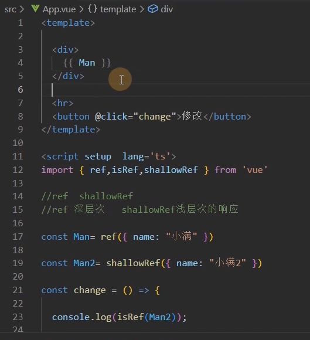
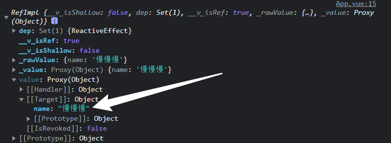
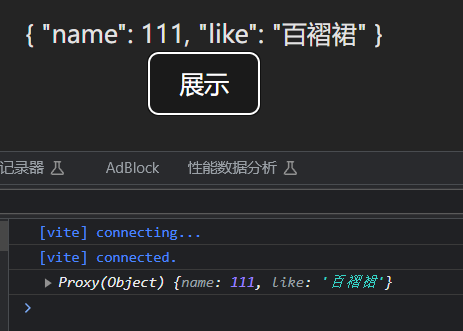
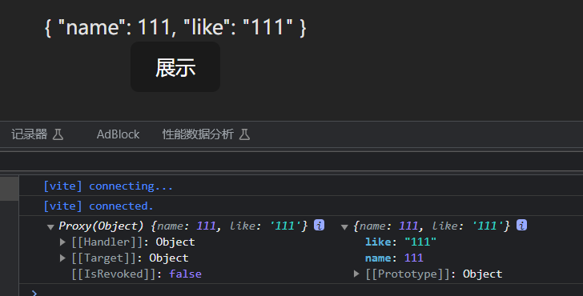
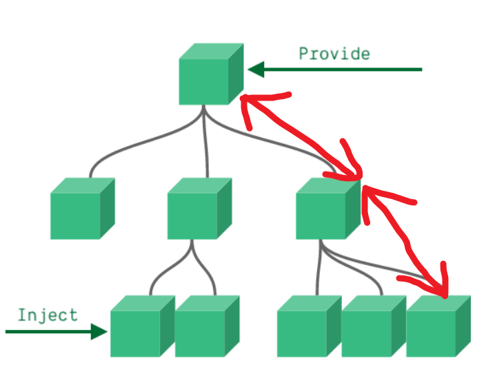
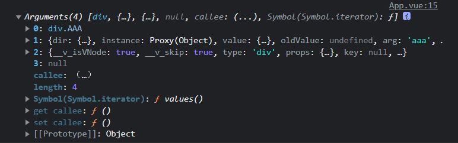
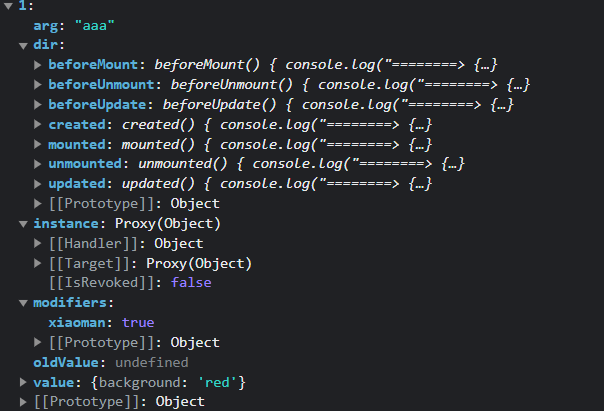

### Vue3


#### 数组更新检测

一些操作数组的方法，编译会检测，从而会促使视图更新。

+ 变异方法

- `push()`
- `pop()`
- `shift()`  删除并返回第一个
- `unshift()`  向开头添加多个元素，返回新长度
- `splice()`   删除 / 删除并添加
- `sort()`
- `reverse()`

上面这些数组操作方法，会直接改变原始数组称为变异方法，会促使视图自动更新。

+ 替换数组

学了 JavaScript 标准对象库，都知道有些数组方法是不直接改变原数组的，这里称它们为非变异方法，例如：filter()、slice()、concat()，它们都是返回一个新数组，那么，在 Vue 中使用到这些方法，怎么样才能促使视图更新呢？我们就必须使用数组替换法，将非变异方法返回的新数组直接赋值给的旧数组。

```js
this.nav = this.nav.slice(1, 4);
```

+ 注意

由于 JavaScript 的限制，Vue 不能检测以下变动的数组：

1. 当你利用索引直接设置一个项时，例如：`vm.items[indexOfItem] = newValue`。
2. 当你修改数组的长度时，例如：`vm.items.length = newLength`。

例子：

```js
var app = new Vue({
  data: {
    items: ["a", "b", "c"],
  },
});
app.items[1] = "x"; // 不是响应性的
app.items.length = 2; // 不是响应性的
```

上去直接这样改值操作是没有问题的，但是不是响应式的，并不能触发视图更新，需要用其他方法代替。

例如这样的操作 `app.items[indexOfItem] = newValue` ，可以用以下两种代替。

```js
// Vue.set
Vue.set(vm.items, indexOfItem, newValue);
// Array.prototype.splice
vm.items.splice(indexOfItem, 1, newValue);
```

```html
// 不加括号
<span v-for="number in oddNumber">{{number}}</span>
computed: {
          // 计算 numberArray 中为奇数的 oddNumber 奇数数组
          oddNumber: function () {
            return this.numberArray.filter(function (number) {
              return number % 2 === 1;
            });
          }
//加括号
<span v-for="number in getOddNumber()">{{number}}</span>
methods: {
          // 定一个一个获取数组内奇数的方法 filter 数组对象的过滤方法
          getOddNumber: function () {
            return this.numberArray.filter(function (number) {
              return number % 2 === 1;
            });
          },
        }
```

#### 表单处理

https://cn.vuejs.org/examples/#form-bindings

##### v-module

+ 只适用于input标签
+ 便捷地设置和获取表单元素的值
+ 绑定的数据会和表单元素值相关联
+ 绑定的数据 <--> 表单元素的值：双向绑定

```js
<div id="app">
    import {ref} from 'vue'
    <input type="text" v-model="message" />
</div>

let app=new Vue({
    el: '#app',
    data: {
        message: "黑馬程序員"
    }
})
```

##### 常用表单元素

| 元素          |            |
| ------------- | ---------- |
| input[type=*] | 文本输入框 |
| textarea      | 多行文本   |
| radio         | 单选按钮   |
| checkbox      | 复选框     |
| select        | 选择框     |

==注意==

**注意一**：`v-model` 会忽略所有表单元素的  `value`、`checked`、`selected` 特性的初始值而总是将 Vue 实例的数据作为数据来源。直接给元素 value 赋值不会生效的，你应该通过 JavaScript 在组件的 `data` 选项中声明初始值。

**注意二**：`v-model` 在内部使用不同的属性为不同的输入元素并抛出不同的事件，具体体现我们在表单 **修饰符小节**，给大家说明：

- text 和 textarea 元素使用 `value` 属性和 `input` 事件（内部监听 input 事件）；

- checkbox 和 radio 使用 `checked` 属性和 `change` 事件（内部监听 change 事件）；

- select 字段将 `value` 作为 prop 并将 `change` 作为事件（内部监听 change 事件）。

  **说明：** change 和 input 区别就是，input 实时更新数据，change 不是实时更新

##### 单选按钮

将单选按钮绑定到同一个 picked，即可完成数据绑定

当第一个单选被选中 picked 的值为第一个单选按钮的 value，

同样当第二个单选被选中 picked 的值为第二个单选按钮的 value。

```html
<body>
    <div id="app">
      <!-- 将单选按钮绑定到同一个 picked -->
      <input type="radio" id="one" value="One" v-model="picked" />
      <label for="one">One</label>
      <br />
      <input type="radio" id="two" value="Two" v-model="picked" />
      <label for="two">Two</label>
      <br />
      <span>Picked: {{ picked }}</span>
    </div>
    <script>
      var vue = new Vue({
        el: "#app",
        data() {
          return {
            picked: "",
          };
        },
      });
    </script>
</body>
```

##### 复选框

复选框绑定的是一个布尔值（true or false），同样在复选框元素上使用 `v-model` 指令，在实例 data 中声明 checked，即可完成复选框数据的双向绑定。

```html
<body>
    <div id="app">
      <input type="checkbox" id="checkbox" v-model="checked" />
      <label for="checkbox">{{ checked }}</label>
    </div>
    <script>
      // 绑定布尔值
      var vue = new Vue({
        el: "#app",
        data:{
            checked: false,
        },
      });
    </script>
</body>
```

`v-module='check'`表示

+ 当选中时，把`check = value`绑定

+ 如果不存在`value`，则`check`为布尔值

##### 修饰符

==lazy==

开始介绍表单处理时，我们说了几点注意，不同的元素，使用的值不同，抛出的事件也不同。

可能开发中，我们不需要数据实时更新，那么，我们怎么将 input 事件与 change 事件替换，

可以使用 **.lazy** 修饰符，可以将抛出事件由 input 改为 change，使表单元素惰性更新，不实时更新。

```html
<body>
    <div id="app">
      <!--使用 .lazy 修饰符将文本框 抛出的事件改为 change 事件，不再实时更新，只有文本框失去焦点才更新数据 惰性更新 -->
      <input v-model.lazy="msg" />
      <p>{{msg}}</p>
    </div>
    <script>
      var vue = new Vue({
        el: "#app",
        data: {
          msg: "hello",
        },
      });
    </script>
</body>
```

**只有文本框失去焦点才更新数据**

==number==

自动将用户的输入值转为数值类型

即使在  `type="number"` 时，HTML 输入元素的值也会返回字符串（默认）

==trim==

过滤首尾空格

#### 响应式修改



#### Ref全家桶

##### ref

```vue
<script  lang='ts'>
export default {
  data(){
    return{
      age:18
    }
  }
}
</script>
```

以前，只有`age:18`这样的才是响应式对象

```vue
<template>
<div>{{ Man }}</div>
<button @click="change"></button>
</template>

<script setup lang='ts'>
import { ref } from 'vue'
type M = {
  name:string
}
const Man = ref<M>({ name: '小满' })

function change() {
  Man.value.name = '慢慢慢'
  console.log(Man);
}
</script>

<style scoped>

</style>
```

可以这样

+ `ref()`构造函数返回的对象有一个`value`属性，指向他的内部值

  

##### isRef

`isRef(Man)`：判断一个对象是不是`ref`对象

- isRef: 检查一个值是否为一个 ref 对象
- isReactive: 检查一个对象是否是由 `reactive` 创建的响应式代理
- isReadonly: 检查一个对象是否是由 `readonly` 创建的只读代理
- isProxy: 检查一个对象是否是由 `reactive` 或者 `readonly` 方法创建的代理

##### shallowRef

```vue
<script setup lang='ts'>
import { shallowRef } from 'vue'
const Man = shallowRef({ name: '小满' })

function change() {
  Man.value = {
    name:'慢慢慢'
  }
  console.log(Man);
}
</script>
```

`shallowRef`是浅层的响应式，属性需要直接挂载到`Man.value`上，它的响应式只到`.value`上

（内部会更新，但不会响应式地渲染到页面上）

**注意：**`ref`和`shallowRef`不可以混写，否则会影响`shallowRef`，造成视图的更新

```vue
<script setup lang='ts'>
import { ref, shallowRef } from 'vue'
const Man = ref({ name: '小满' })
const Man2 = shallowRef({ name: '小满' })

function change() {
  Man.value.name = '慢慢慢';
  Man2.value = '慢慢慢';
  console.log(Man);
  console.log(Man2);
}
</script>
```

##### triggerRef

```vue
<script setup lang='ts'>
import { ref, shallowRef, triggerRef } from 'vue'
const Man2 = shallowRef({ name: '小满' })

function change() {
  triggerRef(Man2);
  Man2.value.name = '慢慢慢';
  console.log(Man2);
}
</script>
```

`triggerRef`会强制更新`shallowRef`对象

##### customRef

+ 自定义ref 

+ customRef 是个工厂函数要求我们返回一个对象 并且实现 get 和 set 适合去做防抖之类的

```vue
<script setup lang='ts'>
import { ref, reactive, onMounted, shallowRef, customRef } from 'vue'

function myRef<T = any>(value: T) {
  let timer:any;
  return customRef((track, trigger) => {
    return {
      get() {
        track()
        return value
      },
      set(newVal) {
        clearTimeout(timer)
        timer =  setTimeout(() => {
          console.log('触发了set')
          value = newVal
          trigger()
        },500)
      }
    }
  })
}

const name = myRef<string>('小满')
const change = () => {
  name.value = '大满'
}
</script>
```

##### 模版引用

`ref`可以获取dom属性

```vue
<template>
  <div ref="div">小满Ref</div>
  <hr>
  <div ref="dom">我是dom</div>
  <hr>
  <button @click="change">修改 customRef</button>
</template>

<script setup lang='ts'>
import { ref, reactive, onMounted, shallowRef, customRef } from 'vue'
const dom = ref<HTMLDivElement>()

const change = () => {
  console.log(dom.value?.innerHTML);
}

</script>
<style scoped>
</style>
```

`ref='name'`和`name=ref()`的name要求一致

#### reactive全家桶

##### reactive

+ `ref`支持所有类型，`reactive`只支持引用类型
+ `ref`取值赋值都需要通过`.value`，`reactive`不需要

```js
<template>
<div>
  <form>
    <ul>
      <li v-for="item in list">{{ item }}</li>
    </ul>
    <button @click.prevent="add">添加</button>
  </form>
</div>
</template>

<script setup lang='ts'>
import {reactive} from 'vue'
let list = reactive<string[]>([])

const add = () => [
  setTimeout(() => {
    let res = ["EDG", 'REW'];
    list = res;
    console.log(list);
  }, 2000)
]
</script>
<style scoped>
</style>
```

这样并不能把res的内容渲染到list里面。因为`list`是`reactive proxy`值，不能直接复制，否则会破坏响应式对象

但是可以`push`：

```js
list.push(..res)
```

##### readonly

```vue
<script setup lang='ts'>
import {reactive, readonly} from 'vue'
let obj = reactive({ name: '小满' });
const read = readonly(obj)
// read.name='sss'  // 无法为“name”赋值，因为它是只读属性。
</script>
```

这样可以改变`readonly`对象的属性

```vue
<script setup lang='ts'>
import {reactive, readonly} from 'vue'
let obj = reactive({ name: '小满' });
const read = readonly(obj)
// read.name='sss'

const show = () => {
  obj.name = 'sss';
  console.log(obj, read);
}
</script>
```

##### shallowReactive

浅层的`Reactive`：

```vue
<template>
<div>
  <form>
    <div>{{ obj }}</div>
    <button @click.prevent="show">展示</button>
  </form>
</div>
</template>

<script setup lang='ts'>
import {reactive, readonly, shallowReactive} from 'vue'
let obj = shallowReactive({
  name: {
    value: {
      key: 1
    }
  }
})
const show = () => {
  obj.name.value.key = 1111;
  console.log(obj);
}
</script>
<style scoped>
</style>
```

`shallowReactive`也会被`Reactive`修改

#### to系列全家桶

##### toRef

```vue
<template>
<div>
  <form>
    <div>{{ obj }}</div>
    <button @click.prevent="change">展示</button>
  </form>
</div>
</template>

<script setup lang='ts'>
import {reactive, readonly, shallowReactive} from 'vue'
let obj = {name:111}
const change = () => {
  obj.name = 12334;
  console.log(obj);
}
</script>
<style scoped>
</style>
```

这样只能修改值，修改不了视图，**不是响应式的**

```vue
<script setup lang='ts'>
import {reactive, readonly, shallowReactive, toRef} from 'vue'
let obj = { name: 111, like:'JK' }
let like = toRef(obj, 'like'); // toRef应该这样使用
const change = () => {
  like.value = '百褶裙'; // 要加value才能访问属性
  console.log(obj);
}
</script>
```

这样也不行，因为`toRef`只能用给响应式对象：


这样是正确的

```vue
<script setup lang='ts'>
import {reactive, readonly, shallowReactive, toRef} from 'vue'
let obj = reactive({ name: 111, like: 'JK' });
let like = toRef(obj, 'like');
const change = () => {
  like.value = '百褶裙';
  console.log(obj);
}
</script>
```



##### toRefs

对每个属性都调用一遍`toRef`

手动实现：

```vue
const toRefs = <T extends object>(object: T) => {
  const map: any = {};
  for (let key in object) {
    map[key]=toRef(object, key)
  }
  return map;
}
```

##### toRaw

脱去代理

```js
console.log(obj, toRaw(obj));
```



#### 计算属性

计算属性就是当依赖的属性的值发生变化的时候，才会触发他的更改，如果依赖的值，不发生变化的时候，使用的是缓存中的属性值。

在`script`中访问时要加上`.value`

1. 函数形式（常用，只设置setter）

   ```js
   import { computed, reactive, ref } from 'vue'
   let price = ref(0)//$0
   
   let m = computed<string>(()=>{
      return `$` + price.value
   })
   
   price.value = 500
   ```

2. 对象形式

   ```vue
   <template>
      <div>{{ mul }}</div>
      <div @click="mul = 100">click</div>
   </template>
   
   <script setup lang="ts">
   import { computed, ref } from 'vue'
   let price = ref<number | string>(1)//$0
   let mul = computed({
      get: () => {
         return price.value
      },
      set: (value) => {
         price.value = 'set' + value
      }
   })
   </script>
   
   <style>
   </style>
   ```

#### 侦听属性

##### watch

`watch` 需要侦听特定的数据源，并在单独的回调函数中执行副作用

1. watch第一个参数监听源

2. watch第二个参数回调函数cb（newVal,oldVal）

3. watch第三个参数一个options配置项是一个对象：

   ```js
   {
       immediate:true //是否立即调用一次
       deep:true //是否开启深度监听
   }
   ```

+ 默认是浅层监听


实例：

###### 监听一个

```js
import { ref, watch } from 'vue'

let message = ref({
    nav:{
        bar:{
            name:""
        }
    }
})

watch(message, (newVal, oldVal) => {
    console.log('新的值----', newVal);
    console.log('旧的值----', oldVal);
},{
    immediate:true,
    deep:true
})
```

###### 监听多个：

```js
import { ref, watch ,reactive} from 'vue'

let message = ref('')
let message2 = ref('')

watch([message,message2], (newVal, oldVal) => {
    console.log('新的值----', newVal);
    console.log('旧的值----', oldVal);
})
```

###### 监听Reactive

使用reactive监听深层对象开启和不开启deep 效果一样

```js
import { ref, watch ,reactive} from 'vue'

let message = reactive({
    nav:{
        bar:{
            name:""
        }
    }
})
watch(message, (newVal, oldVal) => {
    console.log('新的值----', newVal);
    console.log('旧的值----', oldVal);
})
```

###### 只监听reactive的一个值

需要是一个函数的返回值

```js
import { ref, watch ,reactive} from 'vue'

let message = reactive({
    name:"",
    name2:""
})
watch(()=>message.name, (newVal, oldVal) => {
    console.log('新的值----', newVal);
    console.log('旧的值----', oldVal);
})
```

##### watchEffect

详见：[小满vue-watchEffect](https://xiaoman.blog.csdn.net/article/details/122802130)

（页面加载的时候会立即执行一次）

立即执行传入的一个函数，同时响应式追踪其依赖，并在其依赖变更时重新运行该函数。

如果用到message 就只会监听message 就是用到几个监听几个 而且是非惰性 会默认调用一次

```js
let message = ref<string>('')
let message2 = ref<string>('')
 watchEffect(() => {
    //console.log('message', message.value);
    console.log('message2', message2.value);
})
```

#### 组件&生命周期

引入：

```js
import A form './components/aaa.vue'
```

`A`可以为任意名称

使用：

```vue
<template>
    <A></A>
    <A></A>
</template>
```

生命周期：

1. 在setup语法糖模式下，没有`before`、`created`这两个生命周期，可以用`setup`代替

2. onBeforeMount()
   在组件DOM实际渲染安装之前调用。在这一步中，根元素还不存在。

3. onMounted()
   在组件的第一次渲染后调用，该元素现在可用，允许直接DOM访问
   `v-if`会触发这两个，但`v-show`不会

4. onBeforeUpdate()
   数据更新时调用，发生在虚拟 DOM 打补丁之前。

5. onUpdated()
   DOM更新后，updated的方法即会调用。

6. onBeforeUnmount()
   在卸载组件实例之前调用。在这个阶段，实例仍然是完全正常的。

7. onUnmounted()
   卸载组件实例后调用。调用此钩子时，组件实例的所有指令都被解除绑定，所有事件侦听器都被移除，所有子组件实例被卸载。

##### 实操组件和认识less sass 和 scoped

bem架构：

他是一种css架构 **oocss 实现的一种 （面向对象css） ，**`BEM`实际上是`block`、`element`、`modifier`的缩写，分别为块层、元素层、修饰符层，element UI 也使用的是这种架构

BEM 命名约定的模式是：

```css
.block {}

.block__element {}

.block--modifier {}
```

使用sass 最小单元复刻一个bem 架构（写在`./src/bem.scss`中）：

```scss
$block-sel: "-" !default;
$element-sel: "__" !default;
$modifier-sel: "--" !default;
$namespace:'xm' !default;
@mixin bfc {
    height: 100%;
    overflow: hidden;
}

//混入
@mixin b($block) {
   $B: $namespace + $block-sel + $block; //变量
   .#{$B}{ //插值语法#{}
     @content; //内容替换
   }
}

@mixin flex {
    display: flex;
}

@mixin e($element) {
    $selector:&;
    @at-root {
        #{$selector + $element-sel + $element} {
            @content;
        }
    }
}

@mixin m($modifier) {
    $selector:&;
    @at-root {
        #{$selector + $modifier-sel + $modifier} {
            @content;
        }
    }
}
```

全局扩充scss，（在`./vite/config.ts`文件中）：

```typescript
import { defineConfig } from 'vite'
import vue from '@vitejs/plugin-vue'

// https://vitejs.dev/config/
export default defineConfig({
    plugins: [vue()],
    css: {
        preprocessorOptions: {
            scss: {
                additionalData: "@import './src/bem.scss';"
            }
        }
    }
})
```

#### 父子组件传参

##### 父传子

+ 父组件用`v-bind`也就是`:`，把这个写在template中子组件的标签上

+ 子组件用`defineProps`接收，有三种写法。

  `defineProps` 接收与 `props` 选项相同的值，`defineEmits` 接收与 `emits` 选项相同的值。

  ```js
  // 非setup
  
  // 第一种数组方式
  props: [xxx, xxx, xxx]
  // 第二种对象方式
  props: { xxx: Number, xxx: String}
  // 第三种对象嵌套对象方式
  props: {
      xxx: {
          //类型不匹配会警告
          type: Number,
          default: 0,
          required: true,
          // 返回值不是 true,会警告
          validator(val) { return val === 10}
      }
  }
  ```

  


父组件发送：

直接使用`v-bind:`

```vue
<template>
<waterFall :title="name"> </waterFall>
</template>

<script setup lang='ts'>
import waterFall from "./components/water-fall.vue";
let name='小满'
</script>

<style scoped></style>
```

子组件接收：

```vue
<template>
<div>子集</div>
<div>值：{{ title }}</div>
</template>

<script setup lang="ts">
import { ref, reactive } from 'vue';
const props = defineProps({
  title: {
    type: String,
    default: "默认值"
  },
    // 对象或数组的默认值，须从一个工厂函数返回。
    // 该函数接收组件所接收到的原始 prop 作为参数
  imageList:{
      type:Array,
      default:()=>[]
  }

})
console.log(props.title);
</script>

<style scoped lang="scss">
</style>
```

可以在`template`中直接使用，但在`script`中使用时，要加上`props.`

使用ts写法：

```js
import { ref, reactive } from 'vue';
withDefaults(defineProps<{
  title: string,
  arr:number[]
}>(), {
    arr: ()=>[666]
})
```

##### 子传父

+ 传递**事件**
+ 父组件使用`@`给子组件绑定事件
+ 子组件使用`defineEmits`接收一个事件数组
+ 结果：子组件可以调用父组件的函数

子：

```vue
<template>
<div>子集</div>
<button @click="send">给父组件传值</button>
</template>


<script setup lang="ts">
const emit=defineEmits(['on-click'])
const send = () => {
    emit('on-click', '小满')
}
</script>


<style scoped lang="scss">

</style>    
```

使用ts：

```js
const emit = defineEmits<{
    (e:'on-click', name:string):void
}>()
const send = () => {
    emit('on-click', '小满')
}
```

父：

```vue
<template>
<waterFall @on-click="getName"> </waterFall>
</template>

<script setup lang='ts'>
import waterFall from "./components/water-fall.vue";
const getName = (name: string) => {
  console.log(name, '========>我是父组件');
}
</script>


<style scoped>

</style>
```

##### 子组件变量暴露给父组件

父组件：

```vue
<template>
<waterFallVue ref="waterFall"> </waterFallVue>
</template>

<script setup lang='ts'>
import { ref } from "vue";
import waterFallVue from "./components/water-fall.vue";
const waterFall = ref<InstanceType<typeof waterFallVue>>() // 获取dom
console.log(waterFall.value?.list);
</script>


<style scoped>

</style>
```

子组件：

```vue
<template>
<div>子集</div>
</template>


<script setup lang="ts">
import { reactive } from 'vue';

const list = reactive<number[]>([4, 5, 6])
defineExpose({
    list
})
</script>


<style scoped lang="scss">

</style>
```

#### 全局组件，局部组件，递归组件

[小满](https://xiaoman.blog.csdn.net/article/details/122862736)

##### 注册全局组件：

```typescript
// ./src/main.ts
import { createApp } from 'vue'
import './style.css'
import App from './App.vue'

import waterFull from "./components/water-fall.vue";
export const app = createApp(App);
app.component('water-full',waterFull);
app.mount('#app');
```

小兔鲜：

`components/index.js`

```js
import ImageView from './ImageView/index.vue'
import Sku from './XtxSku/index.vue';

export const componentPlugin={
    install(app){
        app.component('XtxImageView', ImageView)
        app.component('XtxSku', Sku)
    }
}
```

`main.js`

```js
import { componentPlugin } from "@/components/index";
app.use(componentPlugin)
```


注册完毕后，可以在其他地方使用，无需引入

##### 递归组件

```vue
<template>
    <div class="tree" v-for="item in data">
        <input type="checkbox"> <span>{{ item.name }}</span>
        <Tree v-if="item?.children?.length" :data="item.children"></Tree>
    </div>
</template>
```

`Tree`可以是当前文件名

#### 动态组件

```vue
<template>
    <div style="display: flex;">
        <div @click="switchCom(item, index)" :class="{'active': active==index}" class="tabs" v-for="(item, index) in data">
            <div>{{ item.name }}</div>
        </div>
    </div>
</template>

<script setup lang='ts'>
import { ref, reactive } from 'vue';
import AVue from './components/HelloWorld.vue';
import BVue from './components/HelloWorld.vue';
import CVue from './components/HelloWorld.vue';

const comId = ref(AVue);
const active = ref(0);
const data = reactive([
    {
        name: 'A组件',
        com:AVue
    },
    {
        name: 'B组件',
        com:BVue
    },
    {
        name: 'C组件',
        com:CVue
    },
]);
const switchCom = (item, index) => {
    comId.value = item.com;
    active.value = index;
}
</script>


<style scoped>

</style>
```

性能优化

```typescript
const tab = reactive<Com[]>([{
    name: "A组件",
    comName: markRaw(A)
}, {
    name: "B组件",
    comName: markRaw(B)
}])
```

#### 插槽slot

##### 匿名插槽

在子组件放置一个插槽

```vue
<template>
    <div>
       <slot></slot>
    </div>
</template>
```

父组件使用插槽

在父组件给这个插槽填充内容

```vue
<Dialog>
    <template v-slot>
        <div>2132</div>
    </template>
</Dialog>
```

##### 具名插槽

具名插槽其实就是给插槽取个名字。一个子组件可以放多个插槽，而且可以放在不同的地方，而父组件填充内容时，可以根据这个名字把内容填充到对应插槽中

+ 匿名插槽的名字是`default`

```vue
<div>
    <slot name="header"></slot>
    <slot></slot>

    <slot name="footer"></slot>
</div>
```

父组件使用需对应名称

```vue
<Dialog>
    <template v-slot:header>
        <div>1</div>
    </template>

    <template v-slot>
        <div>2</div>
    </template>

    <template v-slot:footer>
        <div>3</div>
    </template>
</Dialog>
```

##### 作用域插槽

+ 普通插槽只能使用父组件的数据
+ 我们让子组件在渲染时将一部分数据提供给插槽，作用域插槽可以使用子组件的数据

在子组件动态绑定参数 派发给父组件的slot去使用

```vue
<div>
    <slot name="header"></slot>
    <div>
        <div v-for="item in 100">
            <slot :data="item"></slot> // ":data"是传给父组件的参数
        </div>
    </div>

    <slot name="footer"></slot>
</div>
```

通过解构方式取值

(v-slot有对应的简写: #)

```vue
<Dialog>
    <template #header>
        <div>1</div>
    </template>
    <template #default="{ data }">
        <div>{{ data }}</div>
    </template>
    <template #footer>
        <div>3</div>
    </template>
</Dialog>
```

*简写：*

```vue
<Dialog>
    <template #header>
        <div>1</div>
    </template>
    <template #default>
        <div>2</div>
    </template>
    <template #footer>
        <div>3</div>
    </template>
</Dialog>
```

##### 动态插槽

插槽可以是一个变量名

```vue
<template>
    <Dialog>
        <template #[name]>
            <div>23</div>
        </template>
    </Dialog>
</template>

<script>
const name = ref('header')
</script>
```

#### 内置组件

##### Teleport传送组件

[小满(https://xiaoman.blog.csdn.net/article/details/122916261)

Teleport 是一种能够将我们的模板渲染至指定DOM节点，不受父级style、v-show等属性影响，但data、prop数据依旧能够共用的技术；类似于 React 的 Portal。

主要解决的问题 因为Teleport节点挂载在其他指定的DOM节点下，完全不受父级style样式影响使用方法

通过to 属性 插入指定元素位置 to="body" 便可以将`Teleport` 内容传送到指定位置

也可以自定义传送位置 支持 class id等 选择器

##### keep-alive缓存组件

```vue
 <keep-alive :include="['A', 'B']" :exclude="['C', 'D']" :max=""></keep-alive>
```

+ `include`：要缓存的组件
+ `exclude`：不缓存的组件
+ `max`：缓存组件的最大数量，`LRU`算法

生命周期

```js
onMounted(() => {
    console.log('初始化'); //只做一次
})
onActivated(() => {
    console.log('keep-alive初始化'); //每次切换时和第一次注册时都做
})
onDeactivated(() => {
    console.log('keep-alive卸载'); //每次切换时都做
})
onUnmounted(() => {
    console.log('卸载'); //不做
})
```

##### transition 过渡组件

Vue 提供了 transition 的封装组件，在下列情形中，可以给任何元素和组件添加进入/离开过渡:

+ 条件渲染 (使用 v-if)
+ 条件展示 (使用 v-show)
+ 动态组件
+ 组件根节点

自定义 transition 过度效果，你需要对transition组件的name属性自定义。并在css中写入对应的样式

在进入/离开的过渡中，会有 6 个 class 切换，下面的`v`代表`template`中`name`的值

1. v-enter-from：定义进入过渡的开始状态。在元素被插入之前生效，在元素被插入之后的下一帧移除。
2. v-enter-active：定义进入过渡生效时的状态。在整个进入过渡的阶段中应用，在元素被插入之前生效，在过渡/动画完成之后移除。这个类可以被用来定义进入过渡的过程时间，延迟和曲线函数。
3. v-enter-to：定义进入过渡的结束状态。在元素被插入之后下一帧生效 (与此同时 v-enter-from 被移除)，在过渡/动画完成之后移除。
4. v-leave-from：定义离开过渡的开始状态。在离开过渡被触发时立刻生效，下一帧被移除。
5. v-leave-active：定义离开过渡生效时的状态。在整个离开过渡的阶段中应用，在离开过渡被触发时立刻生效，在过渡/动画完成之后移除。这个类可以被用来定义离开过渡的过程时间，延迟和曲线函数。
6. v-leave-to：离开过渡的结束状态。在离开过渡被触发之后下一帧生效 (与此同时 v-leave-from 被移除)，在过渡/动画完成之后移除。

示例：

```css
//开始过度
.fade-enter-from{
   background:red;
   width:0px;
   height:0px;
   transform:rotate(360deg)
}
//开始过度了
.fade-enter-active{
  transition: all 2.5s linear;
}
//过度完成
.fade-enter-to{
   background:yellow;
   width:200px;
   height:200px;
}
//离开的过度
.fade-leave-from{
  width:200px;
  height:200px;
  transform:rotate(360deg)
}
//离开中过度
.fade-leave-active{
  transition: all 1s linear;
}
//离开完成
.fade-leave-to{
  width:0px;
   height:0px;
}
```

#### 依赖注入Provide / Inject

+ 注册一个变量，可以全局使用
+ 顶层组件向任意的底层组件传递数据和方法，实现跨层组件通信
+ 顶层组件：`provide('key',value)`
+ 底层组件：`const message=inject('key')`



```vue
<template>
<h1>app.vue</h1>
<label>
    <input v-model="colorVal" value='red' name="color" type="radio"> 红色
</label>
<label>
    <input v-model="colorVal" value='pink' name="color" type="radio"> 粉色
</label>
<label>
    <input v-model="colorVal" value='green' name="color" type="radio"> 绿色
</label>
<div class="box"></div>
<hr>
<vueA></vueA>
</template>

<script setup lang='ts'>
import { provide, ref } from 'vue';
import vueA from './components/providea.vue'

const colorVal=ref<string>('red')
provide('color', colorVal)

</script>

<style scoped>
.box{
    width: 100px;
    height: 100px;
    background-color: v-bind(colorVal);
}
</style>
```

```vue
<template>
<div></div>
<hr>
<vueB></vueB>
</template>

<script setup lang='ts'>
import type{Ref} from 'vue'
import { inject} from 'vue'
import vueB from './provideb.vue'
const color = inject<Ref<string>>('color')
</script>

<style scoped>
div{
    width: 100px;
    height: 100px;
    background-color: v-bind(color);
}
</style>
```

```vue
<template>
<div></div>
<button @click="change(111)">绿！</button>
</template>

<script setup lang='ts'>
import { inject } from "vue";
import type { Ref } from 'vue';
const color=inject<Ref<string>>('color')
const change = (num: number)=>{
    console.log(num);
    color!.value='green'
}
</script>

<style scoped>
div{
    width: 100px;
    height: 100px;
    background-color: v-bind(color);
}
</style>
```

#### 兄弟组件传参和bus

##### 借助父组件

```vue
<template>
    <div>
        <A @on-click="getFalg"></A>
        <B :flag="Flag"></B>
    </div>
</template>

<script setup lang='ts'>
import A from './components/A.vue'
import B from './components/B.vue'
import { ref } from 'vue'
let Flag = ref<boolean>(false)
const getFalg = (flag: boolean) => {
   Flag.value = flag;
}
</script>

<style>
</style>
```

A 组件派发事件通过App.vue 接受A组件派发的事件然后在Props 传给B组件 也是可以实现的

缺点就是比较麻烦 ，无法直接通信，只能充当桥梁

##### Event Bus

我们在Vue2可以使用 \$emit 传递 $on监听 emit传递过来的事件

这个原理其实是运用了JS设计模式之发布订阅模式

我写了一个简易版

```typescript
 type BusClass<T> = {
    emit: (name: T) => void
    on: (name: T, callback: Function) => void
}
type BusParams = string | number | symbol 
type List = {
    [key: BusParams]: Array<Function>
}
class Bus<T extends BusParams> implements BusClass<T> {
    list: List
    constructor() {
        this.list = {}
    }
    emit(name: T, ...args: Array<any>) {
        let eventName: Array<Function> = this.list[name]
        eventName.forEach(ev => {
            ev.apply(this, args)
        })
    }
    on(name: T, callback: Function) {
        let fn: Array<Function> = this.list[name] || [];
        fn.push(callback)
        this.list[name] = fn
    }
}

export default new Bus<number>()
```

##### mitt库

https://xiaoman.blog.csdn.net/article/details/125453908

1. 安装

```sh
npm install mitt -S
```

2. main.ts 初始化
   全局总线，vue 入口文件 main.js 中挂载全局属性

```typescript
import { createApp } from 'vue'
import App from './App.vue'
import mitt from 'mitt'

const Mit = mitt()

//TypeScript注册
// 由于必须要拓展ComponentCustomProperties类型才能获得类型提示
declare module "vue" {
    export interface ComponentCustomProperties {
        $Bus: typeof Mit
    }
}

const app = createApp(App)

//Vue3挂载全局API
app.config.globalProperties.$Bus = Mit

app.mount('#app')
```


#### TSX

https://xiaoman.blog.csdn.net/article/details/123172735

JSX本身是一种JavaScript的语法扩展，用于在JavaScript代码中编写类似于HTML的结构。它通常与React一起使用，用于构建用户界面。

TSX是指"TypeScript JSX"，是一种使用TypeScript编写的JavaScript的扩展语法。


`vite.config.ts`配置：

```typescript
import { defineConfig } from 'vite'
import vue from '@vitejs/plugin-vue'
import vueJsx from '@vitejs/plugin-vue-jsx'
// https://vitejs.dev/config/
export default defineConfig({
    plugins: [vue(), vueJsx()],
    css: {
        preprocessorOptions: {
            scss: {
                additionalData: "@import './src/bem.scss';"
            }
        }
    }
})
```

`App.vue:`

```vue
<template>
<div>
    <xiaoman></xiaoman>
</div>
</template>

<script setup lang='ts'>
import xiaoman from './App.tsx'
</script>

<style scoped>

</style>
```

`App.tsx`第一种写法：

```tsx
// App.tsx
export default function () {
    return (<div>小满</div>)
}
```

另一种：

```tsx
// 返回一个渲染函数
import { defineComponent } from "vue"
export default defineComponent({
    data() {
        return {
            age: 23
        } 
    },
    render() { 
        return (<div>{ this.age }</div>)
    }
})
```

第三种：

```tsx
// 返回一个渲染函数
// optionsAPI

import { defineComponent } from "vue"
export default defineComponent({
    setup() {
        return () => <div>hello</div>
    },
})
```


TIPS tsx不会自动解包，使用ref也要加.vlaue ! ! !

+ tsx支持 `v-model` 和 `v-show`的使用

+ `v-if`不支持

+ `v-for`不支持（可以用.map() 模拟）

  ```tsx
  import { ref } from 'vue'
   
  let arr = [1,2,3,4,5]
   
  const renderDom = () => {
      return (
          <>
              {
                arr.map(v=>{
                    return <div>${v}</div>
                })
              }
          </>
      )
  }
   
  export default renderDom
  ```

+ `v-bind`使用：

  直接赋值即可

  ```tsx
  import { ref } from 'vue'
   
  let arr = [1, 2, 3, 4, 5]
   
  const renderDom = () => {
      return (
          <>
              <div data-arr={arr}>1</div>
          </>
      )
  }
   
  export default renderDom
  ```

+ v-on绑定事件 所有的事件都按照react风格来

  1. 所有事件有on开头
  2. 所有事件名称首字母大写

  ```cobol
   
  const renderDom = () => {
      return (
          <>
              <button onClick={clickTap}>点击</button>
          </>
      )
  }
   
  const clickTap = () => {
      console.log('click');
  }
   
  export default renderDom
  ```


#### directive自定义指令

##### js图片懒加载

`main.js`

```js
import { createApp } from 'vue'
import { createPinia } from 'pinia'
import App from './App.vue'
import router from './router'
import '@/styles/common.scss';
import { useIntersectionObserver } from '@vueuse/core'

const app = createApp(App)
app.use(createPinia())
app.use(router)
app.mount('#app')

app.directive('img-lazy', {
    mounted(el, binding) {
        // console.log(el, binding.value);
        useIntersectionObserver(el, ([{ isIntersecting }]) => {
            if (isIntersecting) {
                el.src = binding.value
                console.log(11111);
            }
        })
    }
})
```

需要在`main.js`中注册：

```js
import { lazyPlugin } from '@/directives';
app.use(lazyPlugin)
```


`App.vue`

```vue

// binding.value=item.picture
```

+ `v-img-lazy`就是自定义的指令
+ 这个指令有生命周期钩子
+ 生命周期钩子接收两个参数
  + `el`是dom对象
  + `bing.value`是等于号后面绑定的表达式的值图片url

插件化：

`directive/index.js`

```js
import { useIntersectionObserver } from '@vueuse/core'
export const lazyPlugin = {
    install(app) {
        app.directive('img-lazy', {
            mounted(el, binding) {
                // console.log(el, binding.value);
                useIntersectionObserver(el, ([{ isIntersecting }]) => {
                    if (isIntersecting) {
                        el.src = binding.value
                        console.log(11111);
                        stop() // 由于useIntersectionObserver的特性，加上这个才会只请求一次
                    }
                })
            }
        })
    }
}
```

`main.js`

```js
import { createApp } from 'vue'
import { createPinia } from 'pinia'
import App from './App.vue'
import router from './router'
import '@/styles/common.scss';
import { lazyPlugin } from '@/directives';
const app = createApp(App)

app.use(createPinia())
app.use(router)
app.use(lazyPlugin)

app.mount('#app')
```


ts:

##### 样例简介

```vue
<template>
<div>
    <button>切换</button>
    <A v-move:aaa.xiaoman="{background: 'red'}"></A>
</div>
</template>

<script setup lang='ts'>
import A from './components/A.vue'
import { ref, Directive, DirectiveBinding } from 'vue'
let flag = ref<boolean>(true)
const vMove: Directive = {
    created() {
        console.log('========> created');
        console.log(arguments);
    },
    beforeMount() {
        console.log('========> created');
        console.log(arguments);
    },
    mounted() {
        console.log('========> created');
        console.log(arguments);
    },
    beforeUpdate() {
        console.log('========> created');
        console.log(arguments);
    },
    updated() {
        console.log('========> created');
        console.log(arguments);
    },
    beforeUnmount() {
        console.log('========> created');
        console.log(arguments);
    },
    unmounted() {
        console.log('========> created');
        console.log(arguments);
    },
} 
</script>

<style scoped>

</style>
```


`A.vue`

```vue
<template>
<div class="AAA"></div>
</template>

<script setup lang='ts'>

</script>

<style scoped>
div{
    width: 100px;
    height: 100px;
    background-color: #888;
}
</style>
```


输出：



0. `div.AAA`是子组件的选择器`el`，类型：`HTMLElement`

1. 

   类型：`DirectiveBinding`，传过来的参数:

   + instance：使用指令的组件实例。
   + value：传递给指令的值。例如，在 v-my-directive="1 + 1" 中，该值为 2。
   + oldValue：先前的值，仅在 beforeUpdate 和 updated 中可用。无论值是否有更改都可用。
   + arg：传递给指令的参数(如果有的话)。例如在 v-my-directive:foo 中，arg 为 "foo"。
   + modifiers：包含修饰符(如果有的话) 的对象。例如在 v-my-directive.foo.bar 中，修饰符对象为 {foo: true，bar: true}。
   + dir：一个对象，在注册指令时作为参数传递。例如，在以下指令中

2. 当前组件的`v-node`，虚拟dom

3. `prevode`，上一个虚拟dom

##### 函数简写

可能想在 `mounted` 和 `updated` 时触发相同行为，而不关心其他的钩子函数。那么你可以通过将这个函数模式实现

```vue
<template>
   <div class="btns">
       <button v-has-show="'shop:create'">创建</button>
 
       <button v-has-show="'shop:edit'">编辑</button>
 
       <button v-has-show="'shop:delete'">删除</button>
   </div>
</template>
 
<script setup lang='ts'>
import { ref, reactive,  } from 'vue'
import type {Directive} from 'vue'
//permission
localStorage.setItem('userId','xiaoman-zs')
 
//mock后台返回的数据
const permission = [
    'xiaoman-zs:shop:edit',
    'xiaoman-zs:shop:create',
    'xiaoman-zs:shop:delete'
]
const userId = localStorage.getItem('userId') as string
const vHasShow:Directive<HTMLElement,string> = (el,bingding) => {
   if(!permission.includes(userId+':'+ bingding.value)){
       el.style.display = 'none'
   }
}
 
</script>
 
<style scoped lang='less'>
.btns{
    button{
        margin: 10px;
    }
}
</style>
```

##### 图片懒加载

```vue
<template>
    <div>
        <div v-for="item in arr">
            
        </div>
    </div>
</template>
 
<script setup lang='ts'>
import { ref, reactive } from 'vue'
import type { Directive } from 'vue'
const images: Record<string, { default: string }> = import.meta.globEager('./assets/images/*.*')
let arr = Object.values(images).map(v => v.default)
 
let vLazy: Directive<HTMLImageElement, string> = async (el, binding) => {
    let url = await import('./assets/vue.svg')
    el.src = url.default;
    let observer = new IntersectionObserver((entries) => {
        console.log(entries[0], el)
        if (entries[0].intersectionRatio > 0 && entries[0].isIntersecting) {
            setTimeout(() => {
                el.src = binding.value;
                observer.unobserve(el)
            }, 2000)
        }
    })
    observer.observe(el)
}
 
</script>
 
<style scoped lang='less'></style>
```


#### 自定义attrs / hooks

https://xiaoman.blog.csdn.net/article/details/123271189

主要用来处理复用代码逻辑的一些封装

这个在vue2 就已经有一个东西是**Mixins**

mixins就是将这些多个相同的逻辑抽离出来，各个组件只需要引入mixins，就能实现一次写代码，多组件受益的效果。

弊端就是 会涉及到覆盖的问题

组件的data、methods、filters会覆盖mixins里的同名data、methods、filters。


##### 自定义attrs

```vue
<template>
<A a="111" b.ccc="cscacsa"></A>
</template>

<script setup lang='ts'>
import A from './components/A.vue'

</script>

<style scoped>

</style>
```

```vue
<template>
</template>

<script setup lang='ts'>
import {useAttrs} from 'vue';
let attr = useAttrs()
console.log(attr.a);

</script>

<style scoped>

</style>
```

##### 自定义hooks

图片转base64

```typescript
import { onMounted } from 'vue'
 
 
type Options = {
    el: string
}
 
type Return = {
    Baseurl: string | null
}
export default function (option: Options): Promise<Return> {
 
    return new Promise((resolve) => {
        onMounted(() => {
            const file: HTMLImageElement = document.querySelector(option.el) as HTMLImageElement;
            file.onload = ():void => {
                resolve({
                    Baseurl: toBase64(file)
                })
            }
        })
        const toBase64 = (el: HTMLImageElement): string => {
            const canvas: HTMLCanvasElement = document.createElement('canvas')
            const ctx = canvas.getContext('2d') as CanvasRenderingContext2D
            canvas.width = el.width
            canvas.height = el.height
            ctx.drawImage(el, 0, 0, canvas.width,canvas.height)
            console.log(el.width);
            return canvas.toDataURL('image/png')
        }
    })
}
```


#### 全局函数和变量

`App.vue`

```vue
<template>
<div>{{ $env }}</div>
<div>{{ $filters.format('的飞机') }}</div>
</template>

<script setup lang='ts'>
import { ref, reactive, getCurrentInstance } from 'vue';
const app = getCurrentInstance()
console.log(app?.proxy.$env);

</script>

<style scoped>

</style>
```

`main.ts`

```typescript
import { createApp } from 'vue'
import App from './App.vue'

export const app = createApp(App)
app.config.globalProperties.$env = 'dev';

app.config.globalProperties.$filters = {
    format<T>(str: T) {
        return `小满-${str}`
    }
}
app.mount('#app')
```

##### 消除报错版

```typescript
import { createApp } from 'vue'
import App from './App.vue'

export const app = createApp(App)
app.config.globalProperties.$env = 'dev';

app.config.globalProperties.$filters = {
    format<T>(str: T) {
        return `小满-${str}`
    }
}

type Filter = {
    format<T>(str: T): string
}
 
// 声明要扩充@vue/runtime-core包的声明.
// 这里扩充"ComponentCustomProperties"接口, 因为他是vue3中实例的属性的类型.
declare module 'vue' {
    export interface ComponentCustomProperties {
        $filters: Filter,
        $env: string
    }
}

app.mount('#app')
```


#### 新的组件

##### 1.Fragment

- 在Vue2中: 组件必须有一个根标签
- 在Vue3中: 组件可以没有根标签, 内部会将多个标签包含在一个Fragment虚拟元素中
- 好处: 减少标签层级, 减小内存占用

##### 2.Teleport

- 什么是Teleport？—— `Teleport` 是一种能够将我们的<strong style="color:#DD5145">组件html结构</strong>移动到指定位置的技术。

  ```vue
  <teleport to="移动位置">
  	<div v-if="isShow" class="mask">
  		<div class="dialog">
  			<h3>我是一个弹窗</h3>
  			<button @click="isShow = false">关闭弹窗</button>
  		</div>
  	</div>
  </teleport>
  ```

##### 3.Suspense

- 等待异步组件时渲染一些额外内容，让应用有更好的用户体验

- 使用步骤：

  - 异步引入组件

    ```js
    import {defineAsyncComponent} from 'vue'
    const Child = defineAsyncComponent(()=>import('./components/Child.vue'))
    ```

  - 使用```Suspense```包裹组件，并配置好```default``` 与 ```fallback```

    ```vue
    <template>
    	<div class="app">
    		<h3>我是App组件</h3>
    		<Suspense>
    			<template v-slot:default>
    				<Child/>
    			</template>
    			<template v-slot:fallback>
    				<h3>加载中.....</h3>
    			</template>
    		</Suspense>
    	</div>
    </template>
    ```

#### 其他vue3新特性

##### 1.全局API的转移

- Vue 2.x 有许多全局 API 和配置。

  - 例如：注册全局组件、注册全局指令等。

    ```js
    //注册全局组件
    Vue.component('MyButton', {
      data: () => ({
        count: 0
      }),
      template: '<button @click="count++">Clicked {{ count }} times.</button>'
    })
    
    //注册全局指令
    Vue.directive('focus', {
      inserted: el => el.focus()
    }
    ```

- Vue3.0中对这些API做出了调整：

  - 将全局的API，即：```Vue.xxx```调整到应用实例（```app```）上

    | 2.x 全局 API（```Vue```） | 3.x 实例 API (`app`)                        |
    | ------------------------- | ------------------------------------------- |
    | Vue.config.xxxx           | app.config.xxxx                             |
    | Vue.config.productionTip  | <strong style="color:#DD5145">移除</strong> |
    | Vue.component             | app.component                               |
    | Vue.directive             | app.directive                               |
    | Vue.mixin                 | app.mixin                                   |
    | Vue.use                   | app.use                                     |
    | Vue.prototype             | app.config.globalProperties                 |

##### 2.其他改变

- data选项应始终被声明为一个函数。

- 过度类名的更改：

  - Vue2.x写法

    ```css
    .v-enter,
    .v-leave-to {
      opacity: 0;
    }
    .v-leave,
    .v-enter-to {
      opacity: 1;
    }
    ```

  - Vue3.x写法

    ```css
    .v-enter-from,
    .v-leave-to {
      opacity: 0;
    }
    
    .v-leave-from,
    .v-enter-to {
      opacity: 1;
    }
    ```

- <strong style="color:#DD5145">移除</strong>keyCode作为 v-on 的修饰符，同时也不再支持```config.keyCodes```

- <strong style="color:#DD5145">移除</strong>```v-on.native```修饰符

  - 父组件中绑定事件

    ```vue
    <my-component
      v-on:close="handleComponentEvent"
      v-on:click="handleNativeClickEvent"
    />
    ```

  - 子组件中声明自定义事件

    ```vue
    <script>
      export default {
        emits: ['close']
      }
    </script>
    ```

- <strong style="color:#DD5145">移除</strong>过滤器（filter）

  > 过滤器虽然这看起来很方便，但它需要一个自定义语法，打破大括号内表达式是 “只是 JavaScript” 的假设，这不仅有学习成本，而且有实现成本！建议用方法调用或计算属性去替换过滤器。

- ......


#### CSS特性

##### 插槽选择器：

A.vue

```vue
<template>
    <div>
        我是插槽
        <slot></slot>
    </div>
</template>

<script setup lang='ts'>

</script>

<style scoped>
:slot(.a){
    color: pink;
}
</style>
```

App.vue

```vue
<template>
    <div>
        <A>
            <div class="a">私人定制div</div>
        </A>
    </div>
</template>

<script setup lang='ts'>
import A from "@/components/A.vue";

</script>

<style scoped></style>
```

##### 全局选择器

```vue
<style>
 div{
     color:red
 }
</style>
 
<style lang="less" scoped>
 
</style>


<style lang="less" scoped>
:global(div){
    color:red
}
</style>
```


动态选择器

```vue
<template>
    <div class="div">
       小满是个弟弟
    </div>
</template>
 
<script lang="ts" setup>
import { ref } from 'vue'
const red = ref<string>('red')
</script>
 
<style lang="less" scoped>
.div{
   color:v-bind(red)
}
 
</style>
```

如果是对象 v-bind 请加引号

```vue
 <template>
    <div class="div">
        小满是个弟弟
    </div>
</template>
 
<script lang="ts" setup>
import { ref } from "vue"
const red = ref({
    color:'pink'
})
</script>
 
    <style lang="less" scoped>
.div {
    color: v-bind('red.color');
}
</style>
```

##### css module

`<style module>` 标签会被编译为 CSS Modules 并且将生成的 CSS 类作为 $style 对象的键暴露给组件


```vue
<template>
    <div :class="$style.red">
        小满是个弟弟
    </div>
</template>
 
<style module>
.red {
    color: red;
    font-size: 20px;
}
</style>
```

自定义注入名称（多个可以用数组）

你可以通过给 module attribute 一个值来自定义注入的类对象的 property 键

```vue
<template>
    <div :class="[zs.red,zs.border]">
        小满是个弟弟
    </div>
</template>

<style module="zs">
.red {
    color: red;
    font-size: 20px;
}
.border{
    border: 1px solid #ccc;
}
</style>
```

与组合式 API 一同使用

注入的类可以通过 useCssModule API 在 setup() 和 `<script setup>` 中使用。对于使用了自定义注入名称的 `<style module>` 模块，useCssModule 接收一个对应的 module attribute 值作为第一个参数

```vue
<template>
    <div :class="[zs.red,zs.border]">
        小满是个弟弟
    </div>
</template>
 

<script setup lang="ts">
import { useCssModule } from 'vue'
const css = useCssModule('zs')
</script>

<style module="zs">
.red {
    color: red;
    font-size: 20px;
}
.border{
    border: 1px solid #ccc;
}
</style>
```

使用场景一般用于TSX  和 render  函数 居多


#### event loop

同步任务

代码从上到下按顺序执行


异步任务

1. 宏任务
   script(整体代码)、setTimeout、setInterval、UI交互事件、postMessage、Ajax

2. 微任务
   Promise.then catch finally、MutaionObserver、process.nextTick(Node.js 环境)


运行机制

所有的同步任务都是在主进程执行的形成一个执行栈，主线程之外，还存在一个"任务队列"，异步任务执行队列中先执行宏任务，然后清空当次宏任务中的所有微任务，然后进行下一个tick如此形成循环。

nextTick 就是创建一个异步任务，那么它自然要等到同步任务执行完成后才执行。


### pinia

#### Setup Store

初始化：

`main.js`

```js
import { createApp } from 'vue'
import { createPinia } from 'pinia'
import App from './App.vue'

const pinia = createPinia()
const app = createApp(App)

app.use(pinia)
app.mount('#app')

// createApp(App).use(pinia).mount('#app')
```

`stroes/counter.js`

```js
import { defineStore } from 'pinia';
import { computed, ref } from 'vue';
import axios from 'axios';

const API_URL = 'http://geek.itheima.net/v1_0/channels'

export const useCounterStore = defineStore('counter', () => {
    const count = ref(0)
    const increment = () => {
        count.value++
    }
    const doubleCount = computed(() => count.value * 2)
    const list = ref([])
    const getList = async () => {
        const res = await axios(API_URL)
        list.value = res.data.data.channels
    }

    return {
        count, increment, doubleCount, list, getList
    }
})
```

`App.vue`

```vue
<script setup>
import { useCounterStore } from '@/stores/counter';
import { onMounted } from 'vue';
import { storeToRefs } from 'pinia';
// console.dir(useCounterStore);

const counterStore = useCounterStore()
console.log(counterStore);

onMounted(() => {
    counterStore.getList()
})
// 数据要这样才不会丢失响应式：
const {count, doubleCount} = storeToRefs(counterStore)
</script>
  
<template>
<button @click="counterStore.increment">{{ counterStore.count  }} || {{ counterStore.doubleCount }}</button> 

<ul>
    <li v-for="item in counterStore.list" :key="item.id"> {{ item.name }}</li>
</ul>
</template>

<style scoped></style>
```


数据持久化插件：`pinia-plugin-persistedstate`

- `ref()` 就是 `state` 属性
- `computed()` 就是 `getters`
- `function()` 就是 `actions`

注意，要让 pinia 正确识别 `state`，你**必须**在 setup store 中返回 **`state` 的所有属性**。


#### Option Store

```js
export const useCounterStore = defineStore('counter', {
  state: () => ({ count: 0 }),
  getters: {
    double: (state) => state.count * 2,
    trible: (state) => this.double + state.double
  },
  actions: {
    increment() {
      this.count++
    },
  },
})
```

+ `state` 是 store 的数据 (`data`)，
+ `getters` 是 store 的计算属性 (`computed`)，读取state时要加上`state`前缀，参数加上`state`，读取getters时加上`this`
+ `actions` 则是方法 (`methods`)。读取state时要加上`this`前缀

使用 选项式API 时，你可以通过调用 store 的 `$reset()` 方法将 state 重置为初始值。

```js
const store = useStore()
store.$reset()
```


