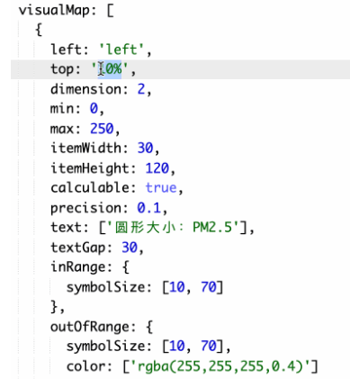
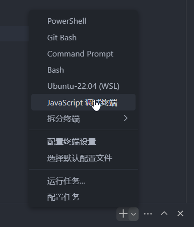
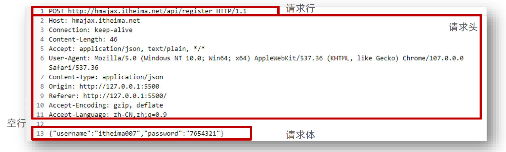

## Echarts

### 样例

```html
<!DOCTYPE html>
<html lang="en">
<head>
    <script src="echarts.js"></script>
    <style>
        *{
            margin: 0;
            padding: 0;
        }
        #main{
            margin: 20px;
            background-color: rgb(228, 255, 192);
        }
    </style>
</head>
<body>
    <div id="main" style="width: 600px; height: 400px;"></div>
    <script>
        let chartDom = document.querySelector("#main");
        let myChart = echarts.init(chartDom)
        let option={
            xAxis: {
                type: "category",
                data: ["Mon", "Tue", "Thu", "Fri", "Sat", "Sun"],
            },
            yAxis: {
                type: "value",
            },
            series: [
                {
                    data: [150, 230, 224, 218, 135, 147, 260],
                    type: 'line',
                },
            ],
        };
        myChart.setOption(option);
    </script>
</body>
</html>
```

### series系列

```js
series: [{
    data: [数据],
    type: '图表类型',
    name: '名字',
    stack: '数据堆叠'
    // 同个类目轴上系列配置相同的 stack 值后，
    // 后一个系列的值会在前一个系列的值上相加
}]
```

`type`:

+ line（折线图）
+ bar（柱状图）
+ pie（饼图）
+ scatter（散点图）
+ graph（关系图）
+ tree（树图）

`tooltip`: 提示

### dataset


对象数组格式：

```js
dataset: {
    // 用 dimensions 指定了维度的顺序。直角坐标系中，
    // 默认把第一个维度映射到 X 轴上，第二个维度映射到 Y 轴上。
    // 如果不指定 dimensions，也可以通过指定 series.encode
    // 完成映射，参见后文。
    dimensions: ['product', '2015', '2016', '2017'],
        source: [
            {product: 'Matcha Latte', '2015': 43.3, '2016': 85.8, '2017': 93.7},
            {product: 'Milk Tea', '2015': 83.1, '2016': 73.4, '2017': 55.1},
            {product: 'Cheese Cocoa', '2015': 86.4, '2016': 65.2, '2017': 82.5},
            {product: 'Walnut Brownie', '2015': 72.4, '2016': 53.9, '2017': 39.1}
        ]
},
```


### 轴

type是坐标轴类型，其类型有以下几种：

- `value` 是数值轴，适用于连续数据。
- `category` 是类目轴，适用于离散的类目数据。
- `time` 是时间轴，适用于连续的时序数据，与数值轴相比时间轴带有时间的格式化，在刻度计算上也有所不同。
- `log` 是对数轴。适用于对数数据。

### 多列柱状图


```js
option = {
  tooltip: {
    trigger: "axis",
    axisPointer: {
      // 坐标轴指示器配置项
      type: "cross",
      crossStyle: {
        color: "red",
      },
    },
  },
  toolbox: {
    feature: {
      dataView: { show: true, readOnly: false },
      saveAsImage: { show: true }, // 保存图片
    },
  },
  legend: {
    data: ["男", "女"], // 图例的数据数组
  },
  xAxis: [
    {
      type: "category",
      data: ["中国", "美国", "古巴", "印度", "巴西", "不丹", "德国"],
      axisPointer: {
        type: "shadow",
      },
    },
  ],
  yAxis: [
    {
      type: "value",
      name: "人口数量",
      min: 0,
      max: 8000,
      interval: 1000,
      axisLabel: {
        formatter: "{value} 万",
      },
    },
  ],
  series: [
    {
      name: "男",
      type: "bar",
      data: [7113, 1619, 2340, 6987, 1046, 3783, 4145],
    },
    {
      name: "女",
      type: "bar",
      data: [6787, 1660, 2049, 6545, 1080, 4260, 3989],
    },
  ],
};
```

- [tooltip.axisPointer](https://echarts.apache.org/zh/option.html#tooltip.axisPointer) 是配置坐标轴指示器的全局公用设置，也就是说里面包含的属性都是与坐标轴的设置相关。

- [tooltip.axisPointer.type](https://echarts.apache.org/zh/option.html#tooltip.axisPointer.type) 是指示器类型，包含 `line`（直线指示器）、`shadow`（阴影指示器）、`none`（无指示器）、`cross`（十字准星指示器）这四种类型。

- [tooltip.axisPointer.crossStyle.color](https://echarts.apache.org/zh/option.html#tooltip.axisPointer.crossStyle) 用于设置线的颜色。

- [legend.data](https://echarts.apache.org/zh/option.html#legend.data) 是图例的数据数组。

- [xAxis.axisPointer.type](https://echarts.apache.org/zh/option.html#xAxis.axisPointer.type) 是指示器类型，包含 `line`（直线指示器）、`shadow`（阴影指示器）、`none`（无指示器）这三种类型。

- + [yAxis.min](https://echarts.apache.org/zh/option.html#yAxis.min) 用于设置 y 轴的最小值。

  + [yAxis.max](https://echarts.apache.org/zh/option.html#yAxis.max) 用于设置 y 轴的最大值。

  + [yAxis.axisLabel.formatter](https://echarts.apache.org/zh/option.html#yAxis.axisLabel.formatter) 是刻度标签的内容格式器。

- [yAxis.inverse](https://echarts.apache.org/zh/option.html#yAxis.inverse) 设置是否反向坐标轴。

- [series.barWidth](https://echarts.apache.org/zh/option.html#series-bar.barWidth) 设置条柱的宽度。

### 饼图


+ [series.radius](https://echarts.apache.org/zh/option.html#series-pie.radius) 设置饼形的半径
+ [series.center](https://echarts.apache.org/zh/option.html#series-pie.center) 设置饼图的中心（圆心）坐标，数组的第一项是横坐标，第二项是纵坐标。
+ [series.roseType](https://echarts.apache.org/zh/option.html#series-pie.roseType) 设置是否展示成南丁格尔图，通过半径区分数据大小，有两种模式：
  - `radius` 区圆心角展现数据的百分比，半径展现数据的大小。
  - `area` 所有扇区圆心角相同，仅通过半径展现数据大小。
+ [series.itemStyle.borderRadius](https://echarts.apache.org/zh/option.html#series-pie.itemStyle.borderRadius) 用于指定饼图扇形区块的内外圆角半径。
+ [legend.itemWidth](https://echarts.apache.org/zh/option.html#legend.itemWidth) 和 [legend.itemHeight](https://echarts.apache.org/zh/option.html#legend.itemHeight) 分别是图例标记的图表宽度和高度，也就是最下方小图标的宽高。
+ [series-pie.labelLine.length](https://echarts.apache.org/zh/option.html#series-pie.labelLine.length) 是视觉引导线第一段的长度。
+ [series-pie.labelLine.length2](https://echarts.apache.org/zh/option.html#series-pie.labelLine.length2) 是视觉引导项第二段的长度。

### 散点图



+ [xAxis.nameGap](https://echarts.apache.org/zh/option.html#xAxis.nameGap) 用于设置坐标轴名称与轴线之间的距离，默认值为 15。
+ [xAxis.nameTextStyle.fontsize](https://echarts.apache.org/zh/option.html#xAxis.nameTextStyle.fontSize) 是用来设置坐标轴名称文字的字体大小，默认值为 12。
+ [xAxis.nameLocation](https://echarts.apache.org/zh/option.html#xAxis.nameLocation) 是用来设置坐标轴名称显示位置，可选值有 `start`（开头）、`middle` 或 `center`（居中）、`end`（末尾）。
+ [visualMap](https://echarts.apache.org/zh/option.html#visualMap) 是视觉映射组件。
  + [visualMap.left](https://echarts.apache.org/zh/option.html#visualMap-continuous.left) 和 [visualMap.top](https://echarts.apache.org/zh/option.html#visualMap-continuous.top) 设置 visualMap 组件离容器左侧和顶部的距离。
  + [visualMap.dimension](https://echarts.apache.org/zh/option.html#visualMap-continuous.dimension) 用来指定数据的哪个维度映射到视觉元素上。
  + [visualMap.min](https://echarts.apache.org/zh/option.html#visualMap-continuous.min) 和 [visualMap.max](https://echarts.apache.org/zh/option.html#visualMap-continuous.max) 用来设置 visualMap 组件允许的最小值和最大值。
  + [visualMap.itemWidth](https://echarts.apache.org/zh/option.html#visualMap-continuous.itemWidth) 和 [visualMap.itemHeight](https://echarts.apache.org/zh/option.html#visualMap-continuous.itemHeight) 设置 visualMap 组件图表的宽度和高度。
  + [visualMap.calculable](https://echarts.apache.org/zh/option.html#visualMap-continuous.calculable) 设置是否显示拖拽用的手柄（手柄能拖拽调整选中范围）。
  + [visualMap.precision](https://echarts.apache.org/zh/option.html#visualMap-continuous.precision) 是设置数据展示的小数精度，默认为 0，无小数点。
  + [visualMap.text](https://echarts.apache.org/zh/option.html#visualMap-continuous.text) 和 [visualMap.textGap](https://echarts.apache.org/zh/option.html#visualMap-continuous.textGap) 用来设置 visualMap 组件图表上两端的文字和设置文字与图表之间的距离。
  + [visualMap.inRange.symbolSize](https://echarts.apache.org/zh/option.html#visualMap-continuous.inRange) 设置选中范围内散点的大小。
  + [visualMap.outOfRange.symbolSize](https://echarts.apache.org/zh/option.html#visualMap-continuous.outOfRange) 设置选中范围外散点的大小。
  + [visualMap.outOfRange.color](https://echarts.apache.org/zh/option.html#visualMap-piecewise.color) 设置选中范围外散点的颜色
  + [visualMap.controller](https://echarts.apache.org/zh/option.html#visualMap-continuous.controller) 是 visualMap 组件中，控制器的 inRange、outOfRange 设置。

### 事件

​	


## 杂项

### 调试

#### 仅调试js

https://blog.csdn.net/qq_43067585/article/details/125178534



然后使用node直接执行js文件即可

或者打开auto attach，然后使用命令`node --inspect index.js`就进入了调试


#### 问题解决方案


##### 浏览器控制台打印DOM详细信息

当我们使用console打印一个dom的时候，通常会出现打印出一个标签，此时有三种解决方法

> 使用数组包起来 [dom]

> 使用对象的一个key指向dom,然后打印这个dom

> 直接使用__proto__属性


##### forEach能否修改

在 JavaScript 中，`Array.prototype.forEach()` 方法确实可以修改数组中的元素，但这主要取决于你修改的是原始数据类型（如数字、字符串、布尔值）还是对象。

如果你想修改的是数组中的对象，那么你可以直接修改这些对象的属性，因为对象在 JavaScript 中是通过引用传递的。这意味着当你获取一个对象并修改它的属性时，你实际上是在修改原始对象。以下是一个例子：

```javascript
let arr = [{id: 1, name: 'John'}, {id: 2, name: 'Jane'}];

arr.forEach((item) => {
    item.name = 'Updated';
});

console.log(arr);  // 输出：[ { id: 1, name: 'Updated' }, { id: 2, name: 'Updated' } ]
```

然而，如果你试图直接修改 `forEach` 的回调函数中的参数（这是一个对象），如你在第一段代码中所做的，那么这将不会影响原始数组。因为这个参数只是原始对象的一个副本，修改它并不会影响原始对象。以下是一个例子：

```javascript
let arr = [{id: 1, name: 'John'}, {id: 2, name: 'Jane'}];

arr.forEach((item) => {
    item = {id: 3, name: 'Updated'};
});

console.log(arr);  // 输出：[ { id: 1, name: 'John' }, { id: 2, name: 'Jane' } ]
```

在这个例子中，尽管我们试图将新的对象赋值给 `item`，但这并没有影响原始数组。

如果你想在 `forEach` 中修改数组的元素，你需要直接修改元素的属性（如果元素是对象），或者使用数组的索引来修改元素（如果元素是原始数据类型）。

总结：**可以修改属性，不能整个赋值修改**


### 网络


#### 跨域

##### jsonp

+ 原理：通过script 的 src不受同源策略的限制，可以跨域请求数据，但是只能发送get请求
+ 缺点：只能发送get请求，不安全，不容易维护
+ 后端返回的是一个函数，但是这个函数是在前端定义的他会把值注入到这个函数的参数里面

例：[segmentfault](https://segmentfault.com/a/1190000041946934)


客户端

```js
const jsonp = (name) => {
    let script = document.createElement("script");
    script.src = "http://localhost:3000/api/jsonp?callback=" + name;
    document.body.appendChild(script);
    // "http://localhost:3000/api/jsonp?callback=" + name; 的内容会开始加载
    // 根据服务端第6行，这个脚本的内容是callback1701803297('hello jsonp')，会执行这个函数
    // 这个函数在下面定义了：
    return new Promise((resolve) => {
        window[name] = (data) => {
            resolve(data);
        };
        // 定义了一个全局函数叫做callback1701803297，加载了script脚本后就会开始执行
        // 它的作用就是把data传给res，在下面的回调中再打印出来
    });
};
jsonp(`callback${new Date().getTime()}`).then((res) => {
    console.log(res);
});
```

服务端

```js
let express = require('express');

const app = express();
app.get('/api/jsonp', (req, res) => {
    const { callback } = req.query;
    res.send(`${callback}('hello jsonp')`);
})

app.listen(3000, () => {
    console.log('servver is running');
})  
```


##### 使用构建工具

使用webpack、vite等工具在前端解决

只在生产环境有效，上线时需要配置Nginx


##### 后端

添加：

```js
res.setHeader('Access-Control-Allow-Origin', 'http://127.0.0.1:5500')
```

或者：最简单的就是使用 [expressjs/cors](https://link.segmentfault.com/?enc=V0zZ00LzpweBIhpy%2FWErPg%3D%3D.CEynrWQPNCa574xqAMsV3%2F1flYC3qrto8f2eNroNLBkj7VFTMn3YRsPJ%2FTNDgkiG)

1. 安装 `npm install cors --save`
2. 引入 `var cors = require('cors');`
3. 使用 `app.use(cors());`


// TODO https://www.bilibili.com/video/BV1rL411a7UN?p=6


#### Ajax

https://juejin.cn/post/7238072027637186617

使用 `XMLHttpRequest` 可以通过 JavaScript 发起HTTP请求，接收来自服务器的响应，并动态地更新网页中的内容。

这种异步通信方式不会阻塞用户界面，有利于增强用户体验。


**特性**

+ `xhr.onreadystatechange()`，给它赋一个函数。这个函数会在状态改变时执行
+ `xhr.abort()`，终止请求
+ `xhr.timeout`，超时时间。达到这个时间后会触发`timeout`事件，然后`abort`
+ **事件**
  + `abort`：请求终止时触发
  + `timeout`：请求超时时触发
  + `progress`：请求到数据时触发（只要请求到了数据就会持续触发）
  + `load`：加载好后，触发


onreadystatechange 一个回调函数，在每次状态发生变化时被调用。

- readyState 0：未初始化，XMLHttpRequest 对象已经创建，但未调用 open 方法。
- readyState 1：已打开，open 方法已经被调用，但 send 方法未被调用。
- readyState 2：已发送，send 方法已经被调用，请求已经被服务器接收。
- readyState 3：正在接收，服务器正在处理请求并返回数据。
- readyState 4：完成，服务器已经完成了数据传输。


以`get`请求为例

```html
<!DOCTYPE html>
<html lang="en">
  <head>
    <meta charset="UTF-8" />
    <meta name="viewport" content="width=device-width, initial-scale=1.0" />
    <title>Document</title>
  </head>
  <body>
    <button id="ajax">Ajax请求</button>
    <span id="progress"></span>
    <script>
      btn = document.getElementById("ajax");

      btn.addEventListener("click", () => {
        sendAjax();
      });

      const sendAjax = () => {
        const xhr = new XMLHttpRequest();
        xhr.open("get", "http://localhost:5400/api/txt?name=szl", true);

        // 超时时间，会中断请求
        xhr.timeout = 30000;
        xhr.addEventListener("timeout", () => {
          console.log("超时");
        });

        // 打印进度
        xhr.addEventListener("progress", (event) => {
          const progress = document.getElementById("progress");
          progress.innerText = `${((event.loaded / event.total) * 100).toFixed(
            2
          )}%`;
          // console.log(event.loaded, event.total);
        });

        xhr.onreadystatechange = () => {
          if (xhr.readyState === 4 && xhr.status === 200) {
            console.log(xhr.responseText);
          }
          console.log(111);
        };

        //中断请求只需要调用 xhr.abort(); 并且会有一个中断的回调;
        xhr.addEventListener("abort", function (event) {
          console.log("我被中断了");
        });

        xhr.send(1234);
      };
    </script>
  </body>
</html>
```


#### http

报文格式

1. 请求行：请求方法，URL ，协议
2. 请求头：以键值对的格式携带的附加信息，比如： Content Type
3. 空行：分隔请求头，空行之后的是发送给服务器的资源
4. 请求体：发送的资源




状态码

| 1xx  |    信息    |
| :--: | :--------: |
| 2xx  |    成功    |
| 3xx  | 重定向消息 |
| 4xx  | 客户端错误 |
| 5xx  | 服务端错误 |


服务端样例：

简单：

```js
var http = require('http');
var app = http.createServer();
app.on('request', (req, res) => {
    res.end('hello world')
});
app.listen(8080)
```


```js
/**
 * 请完成下面的 TODO 部分，其他代码请勿改动
 */
const fs = require("fs");
const http = require("http");
const path = require("path");
const dataUrl = path.resolve(__dirname, "../data.json");
const loggerUrl = path.resolve(__dirname, "../logger.json");
// 获取唯一的id
function getLoggerId() {
    return (
        Buffer.from(Date.now().toString()).toString("base64") +
        Math.random().toString(36).substring(2)
    );
}

/**
 * 该方法统一了服务器返回的消息格式，并返回给客户端
 * @param {*} res 响应 response
 * @param {*} code 状态码，默认为 0 代表没有错误，如果有错误固定为 404
 * @param {*} msg 错误消息，固定为空字符串即可 ''
 * @param {*} data 响应体，为 js 对象，若 data 为 utf-8 编码时需要使用 eval(data) 处理
 */
function send(res, code, msg, data) {
    const responseObj = {
        code,
        msg,
        data,
    };
    const da = JSON.stringify(responseObj);
    res.setHeader("Content-Type", "application/json;charset=utf-8");
    res.write(da);
    res.end();
}

function handleStatic(res, pathName, part) {
    const content = fs.readFileSync(path.resolve(__dirname, pathName));
    let contentType = "text/html";
    switch (part) {
        case "css":
            contentType = "text/css";
            break;
        case "js":
            contentType = "text/js";
            break;
    }
    res.writeHead(200, "Content-Type", contentType);
    res.write(content);
    res.end();
}

const server = http.createServer((req, res) => {
    res.setHeader("Access-Control-Allow-Origin", "*");
    if (req.url === "/") {
        handleStatic(res, "../index.html", "");
    } else if (req.url === "/css/index.css") {
        handleStatic(res, `..${req.url}`, "css");
    } else if (req.url === "/js/index.js") {
        handleStatic(res, `..${req.url}`, "js");
    } else if (req.url === "/js/axios.min.js") {
        handleStatic(res, `..${req.url}`, "js");
    } else if (req.url === "/js/vue3.global.min.js") {
        handleStatic(res, `..${req.url}`, "js");
    }

    if (req.method === "GET" && req.url === "/users") {
        // TODO 处理获取文件内容的操作
        let fileContent = "";
        try {
            fileContent = fs.readFileSync("data.json", "utf-8");
            send(res, 0, "", eval(fileContent));
        } catch (error) {
            send(res, 404, error.msg, "");
        }
    } else if (req.method === "PUT" && req.url === "/editUser") {
        let body = "";
        req.on("readable", () => {
            let chunk = "";
            if (null !== (chunk = req.read())) {
                body += chunk;
            }
        });
        req.on("end", () => {
            if (body) {
                // TODO 处理更改文件数据并将最新的文件数据响应给客户端
                try {
                    let file = fs.readFileSync("data.json", "utf-8");
                    file = JSON.parse(file);
                    body = JSON.parse(body);
                    file.forEach((element) => {
                        if (element.id === body.params.id) {
                            element.power = !element.power;
                        }
                    });
                    fs.writeFileSync("data.json", JSON.stringify(file));
                    send(res, 0, "", file);
                } catch (error) {
                    console.log("error");
                    send(res, 404, "");
                }
            }
        });
    } else if (req.method === "POST" && req.url === "/logger") {
        let body = "";
        req.on("readable", () => {
            let chunk = "";
            if (null !== (chunk = req.read())) {
                body += chunk;
            }
        });
        req.on("end", () => {
            if (body) {
                // TODO 处理新增日志
                console.log(body);
                try {
                    let log = {
                        id: getLoggerId(),
                        msg: JSON.parse(body).data,
                        time: new Date().getTime().toString(),
                    };
                    console.log(log);
                    fs.appendFile("logger.json", JSON.stringify(log) + "\n", () => {
                        send(res, 0, "", log);
                    });
                } catch (error) {
                    send(res, 404, "");
                }
            }
        });
    }
});

server.listen(8080, () => {
    console.log("Server running on port 8080");
});
```

```js
const http=require('http')

const server = http.createServer((req, res) => {
  res.setHeader("Content-type", "text/html;charset=utf8");
  // res.setHeader("Access-Control-Allow-Origin", "*");
  if (req.method === "GET" && req.url === "/news") {
    const data=[
        {
          channelId: "5572a108b3cdc86cf39001cd",
          name: "国内焦点",
        },
        {
          channelId: "5572a108b3cdc86cf39001ce",
          name: "国际焦点",
        },
      ]
    res.write(JSON.stringify(data));
    res.end();
}else{
    res.end('404');
  }
});

server.listen(8080, () => {
  console.log("Server running on port 8080");
});
```

```js
// TODO: 待补充代码
const http = require("http");
const app = http.createServer();

app.on('request', (req, res) => {
    res.setHeader('Content-type', 'text/html;charset=utf8');
    if (req.url == '/news') {
        res.end(JSON.stringify([
            {
              "channelId": "5572a108b3cdc86cf39001cd",
              "name": "国内焦点"
            },
            {
              "channelId": "5572a108b3cdc86cf39001ce",
              "name": "国际焦点"
            }
        ]))
    } else {
        res.end('404');
    }
})

app.listen(8080, () => {
    console.log('Server is running on port 8080.')
})
```


#### fetch

[小满](https://xiaoman.blog.csdn.net/article/details/130931279)

```html
<!DOCTYPE html>
<html lang="en">
  <head>
    <meta charset="UTF-8" />
    <meta name="viewport" content="width=device-width, initial-scale=1.0" />
    <title>Document</title>
  </head>
  <body>
    <button id="fetch">sendFetch</button>
    <script>
      const fetchBtn = document.getElementById("fetch");
      const sendFetch = () => {
        fetch("http://localhost:5400/post/txt", {
          // 默认是get
          method: "post",
          headers: {
            "Content-Type": "application/json",
          },
          body: JSON.stringify({
            name: "zs",
            age: 18,
          }),
        })
          .then((res) => {
            return res.json();
          })
          .then((data) => {
            console.log(data);
          });
      };
      fetchBtn.addEventListener("click", sendFetch);
    </script>
  </body>
</html>

```

`fetch`有三步：

1. 当服务器发送了响应头（response header），`fetch` 返回的 `promise` 就使用内建的 [Response](https://fetch.spec.whatwg.org/#response-class) class 对象来对响应头进行解析。

   **只解析了响应头**

   ```js
   let url = 'https://api.github.com/repos/javascript-tutorial/en.javascript.info/commits';
   let response = await fetch(url);
   ```

2. 获取响应体

   ```js
   let commits = await response.json(); // 读取 response body，并将其解析为 JSON 格式
   ```

3. 数据处理


参数：

1. 请求头：

get：

```js
fetch("http://localhost:5400/post/txt?a=1&b=2")
```

post:

```js
fetch("http://localhost:5400/post/txt", {
    // 默认是get
    method: "post",
    headers: {
        "Content-Type": "application/json",
    },
    body: JSON.stringify({
        name: "zs",
        age: 18,
    }),
})
```

2. 获取 response body 的方法：

- **`response.text()`** —— 读取 response，并以文本形式返回 response，
- **`response.json()`** —— 将 response 解析为 JSON 格式，
- **`response.formData()`** —— 以 `FormData` 对象（在 [下一章](https://zh.javascript.info/formdata) 有解释）的形式返回 response，
- **`response.blob()`** —— 以 [Blob](https://zh.javascript.info/blob)（具有类型的二进制数据）形式返回 response，
- **`response.arrayBuffer()`** —— 以 [ArrayBuffer](https://zh.javascript.info/arraybuffer-binary-arrays)（低级别的二进制数据）形式返回 response，


==与axios的区别==

+ `axios`的put请求的请求体从`config`中抽出来了
+ `fetch`的请求体写在`config`中
+ `axios`会自动把请求体`data`转换为JSON
+ `fetch`需要手动`JSON.stringify()`

#### axios

##### 案例


```js
// vue.config.js
const { defineConfig } = require("@vue/cli-service");
module.exports = defineConfig({
  transpileDependencies: true,
  // devServer: {
  //   proxy: "http://localhost:5000",
  // },
  devServer: {
    proxy: {
      "/api": {
        target: "http://localhost:5000", // 当有前缀'api'时，把请求发送到5000端口
        pathRewrite: { '^/api': '' },    // 去掉前缀'api'，才能正常查询5000服务器的资源
        ws: true,
        changeOrigin: true,
      },
    },
  },
});
```

```vue
<!-- App.vue -->
<template>
	<div>
		<button @click="getStudents">点击发送请求</button>
	</div>
</template>

<script>
import axios from "axios";
export default {
	name: 'App',
	methods: {
		getStudents() {
			axios.get('http://localhost:8080/api/students').then(
				resopnse => {
					console.log('成功了', resopnse);
				},
				error =>{
					console.log('失败了', error);
				}
			)
		}
	}
}
</script>

```


请求头：

```js
axios.get(url,{
    headers: {
    	'header1':'value1', 
	}
})
```


+ 基于`promise`的网络请求库

```js
axios({
    url: "http: //hmajax.itheima.net/ api/register",
    method: "post",
    data: {
        username: "itheima007",
        password: "7654321",
    },
});
```


```html
<script src="https://unpkg.com/axios/dist/axios.min.js"></script>

axios.get("地址?key=value & key2=value2").then(function(resopnse){}, function(err){});
axios.post("地址",{key:value, key2:value2}).then(function(resopnse){}, function(err){});
```

```html
<div id="app">
    <input type="button" value="获取笑话" @click="getJoke">
    <p> {{joke}} </p>
</div>

<script src="https://unpkg.com/axios/dist/axios.min.js"></script>
<script src="https://cdn.jsdelivr.net/npm/vue/dist/vue.js"></script>
<script>
    let app=new Vue({
        el: '#app',
        data:{
            joke: "很好笑的笑话",
        },
        methods:{
            getJoke: function(){
                let that=this;      //axios回调函数中this的值已经改变，需要提前保存
                axios.get("https://autumnfish.cn/api/joke").then(
                    function(response){
                        console.log(response.data);
                        that.joke = response.data;
                    }
                )
            }
        }
    })
</script>
```

通用：

```js
//-------------------get-----------------------//
axios({
  method: "get",
  url: "xxx",
  cache: false,
  params: {
    id: 123,
  },
  headers: "xxx",
});
//-------------------post-----------------------//
axios({
  method: "post",
  url: "xxx",
  data: {
    firstName: "Tom",
    lastName: "Sun",
  },
});
```

其中需要注意的是，`get` 和 `post` 请求中向后端传递参数的配置项名字不同：`get` 请求的需要使用 `params`，`post` 请求用于发送数据的为 `data`。


上传文件

```js
document.querySelector('.upload').addEventListener('change', e => {
    // 1. 获取图片文件
    console.log(e.target.files[0])
    // 2. 使用 FormData 携带图片文件
    const fd = new FormData()
    // FromData是一个键值对的列表
    fd.append('img', e.target.files[0])
    // 3. 提交到服务器，获取图片url网址使用
    axios({
        url: 'http://hmajax.itheima.net/api/uploadimg',
        method: 'POST',
        data: fd
    }).then(result => {
        console.log(result)
        // 取出图片url网址，用img标签加载显示
        const imgUrl = result.data.data.url
        document.querySelector('.my-img').src = imgUrl
    })
})
```

##### 配置详解

请求方式别名：

+ `axios.get(url[, config])`
+ `axios.put(url[, data[, config]])`
+ `axios.post(url[, data[, config]])`

在使用别名方法时， `url`、`method`、`data` 这些属性都不必在配置中指定。（放在外面啦）


配置项：

配置项有两种情况：

1. 针对`get`请求

+ 使用`params`，是与请求一起发送的 **URL 参数**

+ 必须是一个简单对象或 URLSearchParams 对象

  ```js
  axios.get('/api/example', 
  // config配置项
  {
      params: {
          key1: 'value1',
          key2: 'value2'
      },
      headers: {
          'Custom-Header': 'HeaderValue',
          'Authorization': 'Bearer your_token_here'
      }
  });
  ```

2. 针对其他请求

+ 使用请求体来传递参数，使用`data`指定

+ `data` 是作为请求体被发送的数据，仅适用 'PUT', 'POST', 'DELETE 和 'PATCH' 请求方法

+ 只允许*string, plain object*等

+ ```js
  axios.post('/a', 
  // data配置项，这也是plain object
  {
      data: { power: person.power },
      data2: { id: person.id },
  }
             
  // config配置项
  {
      // url参数，很少使用
      params:{
        jjj:'11'
      },
      headers: {
          'Custom-Header': 'HeaderValue',
          'Authorization': 'Bearer your_token_here'
      }
  })
  ```

+ 


**请求头的键需不需要带引号：**

对象键名默认遵循标识符的命名规则，如果想要违反这个规则，就要带上引号


##### 拦截器

官方：

```js
// 添加请求拦截器
axios.interceptors.request.use(function (config) {
    // 在发送请求之前做些什么
    return config;
  }, function (error) {
    // 对请求错误做些什么
    return Promise.reject(error);
  });

// 添加响应拦截器
axios.interceptors.response.use(function (response) {
    // 2xx 范围内的状态码都会触发该函数。
    // 对响应数据做点什么
    return response;
  }, function (error) {
    // 超出 2xx 范围的状态码都会触发该函数。
    // 对响应错误做点什么
    return Promise.reject(error);
  });
```

小兔鲜

```js
import axios from 'axios';
import { ElMessage } from 'element-plus'
import 'element-plus/theme-chalk/el-message.css'
import { useUserStore } from '@/stores/userStore';
import router from '@/router';

const httpInstance = axios.create({
    baseURL: 'http://pcapi-xiaotuxian-front-devtest.itheima.net',
    timeout: 5000
})

// axios请求拦截器
httpInstance.interceptors.request.use(config => {
    const userStore = useUserStore()
    const token = userStore.userInfo.token
    if (token) {
        config.headers.Authorization=`Bearer ${token}`
    }
    return config
}, e => Promise.reject(e))
// Promise.reject(e)会创建一个新的Promise对象，这个Promise对象的状态为rejected，并且它的原因（reason）是e。这样就可以将错误传递给后续的.catch()处理程序，以便在那里处理错误。

// axios响应拦截器
httpInstance.interceptors.response.use(res => res.data, e => {
    ElMessage({
        type: 'warning',
        message: e.response.data.msg
    })
    // 401请求失效处理
    const userStore = useUserStore()
    if (e.response.status === 401) {
        userStore.clearUserInfo()
        router.push('/login')
    }
    return Promise.reject(e)
})

export default httpInstance
```


### 项目

#### 小兔鲜

+ https://www.yuque.com/fechaichai/td99ck
+ https://apifox.com/apidoc/shared-fa9274ac-362e-4905-806b-6135df6aa90e
+ https://element-plus.org/zh-CN/component/checkbox.html#checkbox-events
+ https://github.com/shuhongfan/vue-rabbit
+ https://zhoushugang.gitee.io/erabbit-client-pc-document/


### 面试

#### 防抖节流

防抖

```js
// 无论晃动多少次，只在最后一次触发
// 只是内层防抖了，外层仍然会高频率执行
const box = document.querySelector(".box");
let i = 0;
function fn() {
    box.innerText = i++;
}
function debounce(fn, time) {
    let timer;
    return function () {
        if (timer) clearTimeout(timer);
        timer = setTimeout(function () {
            fn();
        }, time);
    };
}
box.addEventListener("mousemove", debounce(fn, 500));
// 事件触发的效果：执行debounce(fn, 50)()这个函数
```

节流

```js
const box = document.querySelector(".box");
let i = 0;
function fn() {
    box.innerText = i++;
}
function debounce(fn, time) {
    let timer=null;
    return function () {
        if (!timer) {
            timer = setTimeout(function () {
                fn();
                timer=null;
            }, time);
        }
    };
}
box.addEventListener("mousemove", debounce(fn, 500));
```

#### 柯里化

```js
const sum = (a, b, c) => {
    return a + b + c
}

function curry(func) {
    // 递归函数，返回func的柯里化
    return function curried(...args) {
        // func.length: JavaScript 中的函数对象有一个 length 属性。
        // 这个属性提供了一个函数期望接收的参数个数，也就是在函数定义中声明的参数数量

        // 参数已经足够了
        if (args.length >= func.length) {
            return func.apply(this, args);
        } else {
            // 参数还是不够，再构造一层函数
            return function (...args2) {
                return curried.apply(this, args.concat(args2));
            }
        }
    };
}
console.log([sum]);
console.log(curry(sum)(1, 2)(3))
const sumOne= curry(sum)(1)
console.log(sumOne(2,3));
```

#### 深拷贝

```js
function deepClone(obj, hash = new WeakMap()) {
  if (obj === null) return obj; // 如果是null或者undefined我就不进行拷贝操作
  if (obj instanceof Date) return new Date(obj);
  if (obj instanceof RegExp) return new RegExp(obj);
  // 可能是对象或者普通的值  如果是函数的话是不需要深拷贝
  if (typeof obj !== "object") return obj;
  // 是对象的话就要进行深拷贝
  if (hash.get(obj)) return hash.get(obj);
  let cloneObj = new obj.constructor();
  // 找到的是所属类原型上的constructor,而原型上的 constructor指向的是当前类本身
  hash.set(obj, cloneObj);
  for (let key in obj) {
    if (obj.hasOwnProperty(key)) {
      // 实现一个递归拷贝
      cloneObj[key] = deepClone(obj[key], hash);
    }
  }
  return cloneObj;
}
```


#### 事件循环

https://juejin.cn/post/6844903761949753352

```js
Promise.resolve().then(()=>{
  console.log('Promise1')  
  setTimeout(()=>{
    console.log('setTimeout2')
  },0)
})
setTimeout(()=>{
  console.log('setTimeout1')
  Promise.resolve().then(()=>{
    console.log('Promise2')    
  })
},0)
// Promise1，setTimeout1，Promise2，setTimeout2
```

promise是微任务，微任务在宏任务之前执行

**微任务和宏任务在Node的执行顺序**

Node 10以前：

- 执行完一个阶段的所有任务
- 执行完nextTick队列里面的内容
- 然后执行完微任务队列的内容

Node 11以后：
和浏览器的行为统一了，都是每执行一个宏任务就执行完微任务队列。


+ 模块化循环引用 https://juejin.cn/post/7085029980899377160
+ 虚拟滚动 https://juejin.cn/post/6844904183582162957
+ 前端必备：优化大体积图片加载的几种方案 https://segmentfault.com/a/1190000041278773


