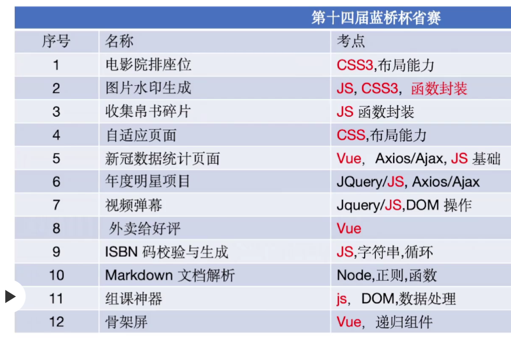

参考：https://blog.meta-code.top/2023/04/10/2023-91/



### 1 电影院排座位

```css
.seat {
  background-color: #444451;
  height: 40px;
  width: 45px;
  border-top-left-radius: 10px;
  border-top-right-radius: 10px;
  margin-left: 10px;
  margin-bottom: 10px;
}

/* TODO：待补充代码 */
.seat-area{
  padding-top: 50px;
  display: flex;
  flex-wrap: wrap;
}

.seat:nth-child(4n+3){
  margin-left: 30px;
}

.seat:nth-child(8n+1){
  margin-left: 0;
}

/* 这谁知道啊 */
.seat:nth-child(n+40){
  margin-bottom: 0;
}
```

或者：

```css
.seat {
  background-color: #444451;
  height: 40px;
  width: 45px;
  border-top-left-radius: 10px;
  border-top-right-radius: 10px;
}

/* TODO：待补充代码 */
.seat-area{
  padding-top: 50px;
  display: flex;
  flex-wrap: wrap;
  gap: 10px;
}

.seat:nth-child(4n+3){
  margin-left: 20px;
}
```

+ `gap`适用于`flex`和`grid`
+ 底下不能有`padding`，会导致判题错误

### 2 图片水印生成

```js
function createWatermark(text, color, deg, opacity, count) {
  const container = document.createElement("div");
  container.className = "watermark";
  let html = ``
  while (count--) html += `<span>${text}</span>`
  container.innerHTML = html
  Array.from(container.children).forEach(element => {
    element.style.color = color
    element.style.opacity = opacity
    // 不能用这个！！！
    // element.style.rotate = `${deg}deg`
    element.style.transform=`rotate(${deg}deg)`
  });

  return container;
}
```

+ 再看看CSS动画

### 3 收集帛书碎片

```js
function collectPuzzle(...puzzles) {
  // TODO: 在这里写入具体的实现逻辑
  let set = new Set()
  for (items of puzzles) {
    for (item of items) 
     set.add(item)
  }
  console.log(set);
  return Array.from(set)
}

// return [... new Set(puzzles.flat())]
```

+ 看看js各对象的方法，记API


### 4 自适应页面

```css
@media (max-width: 800px) {
  nav.menu {
    height: 54px;
    margin-bottom: 25px;
  }
  .collapse {
    display: none;
    position: absolute;
    top: 100%;
    left: 0;
    right: 0;
    background: inherit;
    border-top: 1px #959595 solid;
  }
  .collapse li {
    display: block;
  }
  .collapse li ul{
    position: relative;
  }
  label.menu-btn {
    display: inline-block;
    color: #999;
    cursor: pointer;
    line-height: 54px;
    margin-left: 32px;
  }
  label.menu-btn:hover {
    color: #fff;
  }

  input.menu-btn:checked ~ .collapse {
    display: block;
  }

  /* 容易权重不够 */
  div.row {
    grid-template-columns: 1fr;
  }

  /* 挤到右边了 */
  #tutorials .row img {
    margin-left: 0;
  }
}

或者：

@media (max-width: 800px) {
  .collapse {
    display: none;
    border-top: 1px #959595 solid;
  }
  .menu-btn.icon-menu {
    display: block;
    line-height: 54px;
    margin-left: 32px;
  }
  #menu-btn:checked ~ ul {
    display: flex;
    width: 100%;
    background-color: #252525;
    position: absolute;
    flex-direction: column;
  }
  .menu li {
    display: flex;
    flex-direction: column;
  }
  .dropdown li:hover a{
    color: rgb(2, 107, 107) !important;
  }
  .dropdown ul {
    position: relative;
  }
  div.row {
    grid-template-columns: 1fr;
  }
  #tutorials div.row img {
    margin: 0px;
  }
  p.box {
    margin-bottom: 15px;
  }
  nav.menu {
    margin-bottom: 25px;
  }
}
```

+ `html` `css`基本功不够，可以写一下https://www.freecodecamp.org/chinese/learn
+ css技巧：
  + `line-height`可以实现垂直居中
  + 善用`absolute`和`relative`

### 5 外卖给好评

```html
  <li>
    送餐速度：<el-rate v-model="speed" @change="onchange" show-score></el-rate>
  </li>
  <li>
    外卖口味：<el-rate v-model="flavour" @change="onchange" show-score></el-rate>
  </li>
  <li>
    外卖包装：<el-rate v-model="pack" @change="onchange" show-score></el-rate>
  </li>
```

```js
  methods: {
    onchange() {
      if (this.speed && this.flavour && this.pack) {
        this.$emit('change', {
          speed: this.speed,
          flavour: this.flavour,
          pack:this.pack
        })
      }
    }
  }
```

+ `method`访问`data`中的数据要加上`this`
+ 使用`emit`要`this.$emit(function, arguments)`
+ 可以看一下：https://cn.vuejs.org/guide/components/v-model.html

### 6 视频弹幕

```js
function renderBullet(bulletConfig, videoEle, isCreate = false) {
  const spanEle = document.createElement("SPAN");
  spanEle.classList.add(`bullet${index}`);
  videoEle.appendChild(spanEle)
  spanEle.innerText = bulletConfig.value
  // isCreate = bulletConfig.isHide
  spanEle.style.top = `${getEleStyle(videoEle).height*Math.random()}px`
  spanEle.style.left = `${getEleStyle(videoEle).width}px`
  if (isCreate) {
    spanEle.classList.add("create-bullet");
  }
  // TODO：控制弹幕的显示颜色和移动，每隔 bulletConfig.time 时间，弹幕移动的距离  bulletConfig.speed
  let tag=setInterval(() => {
    let pos=spanEle.style.left

    // parseint解析到非数字自动停止
    pos = parseInt(pos) - bulletConfig.speed
    spanEle.style.left = `${pos}px`
    
    if (getEleStyle(spanEle).right < getEleStyle(videoEle).left) {
      videoEle.removeChild(spanEle)
      clearTimeout(tag)
    }
  }, bulletConfig.time);
}
document.querySelector("#sendBulletBtn").addEventListener("click", (e) => {
  // TODO:点击发送按钮，输入框中的文字出现在弹幕中
  // console.log([e.target]);
  let config = {
    isHide: false,
    speed: 5,
    time: 50,
    value: e.target.previousElementSibling.value
  }
  renderBullet(config, videoEle,true)
});
```


### 7 年度明星项目

```js
// 保存翻译文件数据的变量
let translation = {};
let allData = {}
// 记录当前语言
let currLang = "zh-cn";
let index = 0

// TODO: 请在此补充代码实现项目数据文件和翻译数据文件的请求功能
let xhr = new XMLHttpRequest()
xhr.open('get', './js/all-data.json')
xhr.onreadystatechange = () => {
  if (xhr.readyState === 4 && xhr.status === 200) {
    allData = JSON.parse(xhr.responseText)
    // console.log(allData);
    for (let i = index; i < index + 15; i++) {
      $(".list > ul").append(createProjectItem({ ...allData[i], 'description': allData[i][currLang === 'en' ? 'descriptionEN' : 'descriptionCN'] }))
      // console.log(allData[i]);
    }
    index += 15
  }
}
xhr.send()


let xhr2 = new XMLHttpRequest()
xhr2.open('get', './js/translation.json', true)
xhr2.onreadystatechange = () => {
  if (xhr2.readyState === 4 && xhr2.status === 200) {
    translation = JSON.parse(xhr2.responseText)
  }
}
xhr2.send()

// TODO: 请修改以下代码实现项目数据展示的功能
document.querySelector('.load-more').addEventListener('click', () => {
  for (let i = index; i < index + 15; i++) {
    $(".list > ul").append(createProjectItem({ ...allData[i], 'description': allData[i][currLang === 'en' ? 'descriptionEN' : 'descriptionCN'] }))
  }
  index += 15
  if (index == 60) {
    document.querySelector('.load-more').style.display = 'none'
  }
})

// 用户点击切换语言的回调
$(".lang").click(() => {
  document.querySelectorAll('li.item p').forEach((item, idx) => {
    // console.log(item.innerText, idx)
    item.innerText = allData[idx][currLang === 'en' ? 'descriptionEN' : 'descriptionCN']
  })
});
```

+ `ajax`使用

  + 相当于只做了配置，默认是异步的

  ```js
  const xhr = new XMLHttpRequest()
  xhr.open('get', './js/all-data.json')
  xhr.onreadystatechange = () => {
    if (xhr.readyState === 4 && xhr.status === 200) {
      allData = JSON.parse(xhr.responseText)
    }
  }
  xhr.send()
  ```

  


### 8 全球新冠疫情数据统计

```js
<select v-model="selectedCountry" @change="changeSelected">

data() {
	return { covidData: [],  selectedCountry: "",  selectedItem: {}, };
},
    
methods:{
    changeSelected() {
      this.selectedItem = Array.from(this.covidData).find(
        (element) => element.Country === this.selectedCountry
      ) 
    },
}
```

+ `methods`有**`s`**
+ `method`和`mounted`中使用`data`的数据要加上`this`前缀
+ `computed`一直不成功，使用`v-model`加上`@change`代替


### 9 Markdown文档解析

```js
class Parser {
  constructor() {
    this.heading = /^(#{1,6}\s+)/;
    this.blockQuote = /^(\>\s+)/;
    this.unorderedList = /^((\*|-){1}\s+)/;
    this.image = /\!\[(.*?)\]\((.*?)\)/g;
    this.strongText = /\*{2}(.*?)\*{2}/g;
    this.codeLine = /\`{1}(.*?)\`{1}/g;
    // TODO: 补充分割符正则
    this.hr = /-{3,}/;
    this.quote = />\s+/;
    this.li = /[\*-]\s+/
    this.img = /!\[([^\]]+)\]\(([^\)]+)\)/
    this.blod = /([^*]*)\*{2}([^*]+)\*{2}([^*]*)/
    this.code = /([^\`]*)\`([^*]+)\`([^\`]*)/
  }

  // 获取单行内容
  parseLineText(lineText) {
    this.lineText = lineText;
  }

  // 是否是空行
  isEmptyLine() {
    return this.lineText === "";
  }

  // 是否为符合标题规范
  isHeading() {
    return this.heading.test(this.lineText);
  }

  // 解析标题
  parseHeading() {
    const temp = this.lineText.split(" ");
    const headingLevel = temp[0].length;
    const title = temp[1].trim();
    return `<h${headingLevel}>${title}</h${headingLevel}>`;
  }

  isHr() {
    return this.hr.test(this.lineText)
  }
  parseHr() {
    return `<hr>`
  }

  isQuote() {
    return this.quote.test(this.lineText)
  }
  parseQuote() {
    const temp = this.lineText.split(" ");
    const title = temp[1].trim();
    return `<p>${title}</p>`
  }

  isLi() {
    return this.li.test(this.lineText)
  }
  parseLi() {
    const temp = this.lineText.split(" ");
    const title = temp[1].trim();
    return `<li>${title}</li>`
  }

  isImg() {
    return this.img.test(this.lineText)
  }
  parseImg() {
    return this.lineText.replace(this.img, ``)
  }

  isBlod() {
    return this.blod.test(this.lineText)
  }
  parseBlod() {
    return this.lineText.replace(this.blod, `$1<b>$2</b>$3`)
  }

  isCode() {
    return this.code.test(this.lineText)
  }
  parseCode() {
    return this.lineText.replace(this.code, `$1<code>$2</code>$3`)
  }
}
if (this.parser.isHr()) {
    hasParsed.push(this.parser.parseHr())
    currentLine++;
    continue;
  }
  if (this.parser.isQuote()) {
    let html = `<blockquote>`
    while (1) {
      html += this.parser.parseQuote()
      currentLine++;
      this.parser.parseLineText(this.getLineText(currentLine));
      if (!this.parser.isQuote()) {
        html += `</blockquote>`
        break
      }
    }
    hasParsed.push(html)
    continue
  }
  if (this.parser.isLi()) {
    let html = `<ul>`
    while (1) {
      html += this.parser.parseLi()
      currentLine++;
      this.parser.parseLineText(this.getLineText(currentLine));
      if (!this.parser.isLi()) {
        html += `</ul>`
        break
      }
    }
    hasParsed.push(html)
    continue
  }
  if (this.parser.isImg()) {
    hasParsed.push(this.parser.parseImg())
    currentLine++;
    continue
  }
  while (1) {
    if (this.parser.isBlod()) {
      this.parser.parseLineText(this.parser.parseBlod())
    }
    if (this.parser.isCode()) {
      this.parser.parseLineText(this.parser.parseCode())
    }
    if (!this.parser.isBlod() && !this.parser.isCode()) {
      hasParsed.push(this.parser.lineText)
      break
    }
  }

  currentLine++;
```

+ `replace（reg, str）`，可以替换，可以填充捕获组，可以使用函数：
  + `func(match, p1, p2, ..., pn, offset, input, groups)` 带参数调用：
    1. `match` —— 匹配项，
    2. `p1, p2, ..., pn` —— 捕获组的内容（如有），
    3. `offset` —— 匹配项的位置，
    4. `input` —— 源字符串，
    5. `groups` —— 具有命名的捕获组的对象。


### 10 组课神器

```js
async function ajax({ url, method = "get", data }) {
  let result;
  // const local = localStorage.getItem('data')
  // return local ? JSON.stringify(local) : (await axios(url)).data.data
  // async函数总是返回一个Promise对象，无论其内部返回值是什么。
  // 当你在async函数中使用return语句返回一个值时，这个值会被自动包装在一个解决（resolved）状态的Promise中
  if (method === 'get') {
    if (localStorage.getItem('data')) {
      result = JSON.parse(localStorage.getItem('data'))
    } else {
      return new Promise((resolve, reject) => {
        const xhr = new XMLHttpRequest()
        xhr.open('get', './js/data.json')
        xhr.onreadystatechange = () => {
          if (xhr.readyState === 4) {
            if (xhr.status === 200) {
              result = JSON.parse(xhr.responseText)
              resolve(result.data)
            } else {
              reject(new Error(`${xhr.status}`))
            }
          }
        }
        xhr.send()
      })
    }
  } else if (method = 'post') {
    localStorage.setItem('data', JSON.stringify(data))
  }
  return result
}
```

非递归：

```js
function treeMenusRender(data, grade = 0) {
  let treeTemplate = "";
  // TODO：根据传入的 treeData 的数据生成树型组件的模板字符串
  for (let first of data) {
    treeTemplate += `<div class="tree-node" data-index="${first.id}" data-grade="1">
                      <div class="tree-node-content" style="margin-left: 0px">
                        <div class="tree-node-content-left">
                          
                          <span class="tree-node-label">${first.label}</span>
                          
                        </div>
                      </div>
                      <div class="tree-node-children">`
    for (const second of first.children) {
      treeTemplate += `            
            <div class="tree-node" data-index="${second.id}" data-grade="2">
              <div class="tree-node-content" style="margin-left: 15px">
                <div class="tree-node-content-left">
                  
                  <span class="tree-node-label">${second.label}</span>
                  
                </div>
              </div>
              <div class="tree-node-children">`
      for (const third of second.children) {
        treeTemplate += `<div class="tree-node" data-index="${third.id}" data-grade="3">
                  <div class="tree-node-content" style="margin-left: 30px">
                    <div class="tree-node-content-left">
                      
                      <span class="tree-node-tag">${third.tag}</span>
                      <span class="tree-node-label">${third.label}</span>
                    </div>
                    <div class="tree-node-content-right">
                      <div class="students-count">
                        <span class="number"> 0人完成</span>
                        <span class="line">|</span>
                        <span class="number">0人提交报告</span>
                      </div>
                      <div class="config">
                        
                        <button class="doc-link">编辑文档</button>
                      </div>
                    </div>
                  </div>
                </div>`
      }
      // 完成了data-index="1002"的封口
      treeTemplate += `</div></div>`
    }
    treeTemplate += `</div></div>`

  }
  return treeTemplate;
}
```

递归：

```js
function treeMenusRender(data, grade = 0) {
    let treeTemplate = "";
    // TODO：根据传入的 treeData 的数据生成树型组件的模板字符串
    grade++;
    return data.reduce((pre, cur) => {
        let isContantChild = !!cur.children;
        return (treeTemplate += `
        <div class="tree-node" data-grade=${grade} data-index="${cur.id}">
          <div class="tree-node-content" style="margin-left:${(grade - 1) * 15}px">
            <div class="tree-node-content-left">
              
              ${cur.tag ? `<span class="tree-node-tag">${cur.tag}</span>` : ""}
              <span class="tree-node-label">${cur.label}</span>
              ${isContantChild ? ``: ""}
            </div>
          ${!isContantChild ? `<div class="tree-node-content-right">
                <div class="students-count">
                  <span class="number"> 0人完成</span>
                  <span class="line">|</span>
                  <span class="number">0人提交报告</span>
                </div>
                <div class="config">
                  
                  <button class="doc-link">编辑文档</button>
                </div>
              </div>`
                : ""}
          </div>
          ${isContantChild ?
            `<div class="tree-node-children"> ${isContantChild && treeMenusRender(cur.children, grade)} </div>`
            : "" }
      </div>
      `);
    }, "");
}


// 作者: 百里飞洋 Barry - Flynn
// 链接: https://blog.meta-code.top/2023/04/10/2023-91/#10-%E7%BB%84%E8%AF%BE%E7%A5%9E%E5%99%A8%EF%BC%8825-%E5%88%86%EF%BC%89
// 来源: 百里飞洋
// 著作权归作者所有。商业转载请联系作者获得授权，非商业转载请注明出处。
```

非递归

```js
function treeDataRefresh(
  { dragGrade, dragElementId },
  { dropGrade, dropElementId }
) {
  if (dragElementId === dropElementId) return;
  // TODO：根据 `dragElementId, dropElementId` 重新生成拖拽完成后的树型组件的数据 `treeData`
  // 同级
  const searchThird = (target) => {
    for (const first of treeData) {
      for (const second of first.children) {
        for (const third of second.children) {
          if (third.id == target) {
            second.children.splice(second.children.indexOf(third), 1)
            return third
          }
        }
      }
    }
  }
  const searchSecond = (target) => {
    for (const first of treeData) {
      for (const second of first.children) {
        if (second.id == target) {
          first.children.splice(first.children.indexOf(second), 1)
          return second
        }
      }
    }
  }
  if (dragGrade === dropGrade) {
    // 都是第三级   // 绷不住了，什么屎山，好大一坨   // 但确实完成了逻辑
    if (dragGrade == 3) {
      const drag = searchThird(dragElementId)
      for (const first of treeData) {
        for (const second of first.children) {
          for (const third of second.children) {
            if (third.id == dropElementId) {
              second.children.splice(second.children.indexOf(third) + 1, 0, drag)
            }
          }
        }
      }
      // 第二级
    } else if (dragGrade == 2) {
      const drag = searchSecond(dragElementId)
      for (const first of treeData) {
        for (const second of first.children) {
          if (second.id == dropElementId) {
            first.children.splice(first.children.indexOf(second) + 1, 0, drag)
          }
        }
      }
    } else if (dragGrade == 1) {
      const searchID = (target) => {
        for (const first of treeData) {
          if (first.id == target) {
            treeData.splice(treeData.indexOf(first), 1)
            return first
          }
        }
      }
      const drag = searchID(dragElementId)
      for (const first of treeData) {
        if (first.id == dropElementId) {
          treeData.splice(treeData.indexOf(first) + 1, 0, drag)
        }
      }
    }
  } else if (dragGrade - dropGrade == 1) {
    // 不同级 再来依托吧
    // 3 和 2
    if (dragGrade == 3) {
      const drag = searchThird(dragElementId)
      for (const first of treeData) {
        for (const second of first.children) {
          if (second.id == dropElementId) {
            second.children.unshift(drag)
          }
        }
      }
    } else if (dragGrade == 2) {
      // 2 和 1
      const drag = searchSecond(dragElementId)
      for (const first of treeData) {
        if (first.id == dropElementId) {
          first.children.unshift(drag)
        }
      }
    }
  }
  // md，一遍就过了，没有bug
  // （就算有bug也不会改了）
}
```

递归

```js
function treeDataRefresh(
    { dragGrade, dragElementId },
    { dropGrade, dropElementId }
) {
    if (dragElementId === dropElementId) return;
    // TODO：根据 `dragElementId, dropElementId` 重新生成拖拽完成后的树型组件的数据 `treeData`
    // 此处需要实现根据拖拽的元素 id（dragElementId）和放置的目标元素 id（dropElementId）重新生成树型组件的数据 treeData
    // 从树形数据中获取并删除被拖拽的元素
    const getAndDeleteDragLabelObj = (dragElement, data) => {
        let result;
        // 拖拽的元素的层级与放置的目标元素的层级差值应该是 1
        if (dragGrade - dropGrade > 1 || dragGrade - dropGrade < 0) return result;
		
        // dfs
        const innerFn = (dragElementId, data) => {
            data.forEach((treeObj, index, array) => {
                if (treeObj.id === Number(dragElementId)) {
                    array.splice(index, 1);
                    result = treeObj;
                } else {
                    // 如果当前节点有子节点，则继续递归查找拖拽的元素
                    treeObj.children && innerFn(dragElementId, treeObj.children);
                }
            });
        };

        innerFn(dragElementId, data);
        return result;
    };
    // 将被拖拽的元素插入到放置的目标元素下面
    const setDragLabelObjToTreeData = (dragLabelObj, dropElementId, data) => {
        for (let i = 0; i < data.length; i++) {
            const treeObj = data[i];
            if (treeObj.id === Number(dropElementId)) {
                if (dragGrade - dropGrade === 1) {
                    // 如果拖拽的元素的层级与放置的目标元素的层级差值是 1，则将拖拽的元素设置为放置元素的子元素
                    treeObj.children
                        ? treeObj.children.unshift(dragLabelObj)
                        : (treeObj["children"] = [dragLabelObj]);
                } else if (dragGrade - dropGrade === 0) {
                    // 如果拖拽的元素的层级与放置的目标元素的层级相同，则将拖拽的元素设置为放置元素的后继元素
                    data.splice(i + 1, 0, dragLabelObj);
                    break;
                }
            } else {
                // 如果当前节点有子节点，则继续递归查找拖拽的元素应该被设置的位置
                treeObj.children &&
                    setDragLabelObjToTreeData(
                        dragLabelObj,
                        dropElementId,
                        treeObj.children
                    );
            }
        }
    };

    // 获取被拖拽的元素
    let dragLabelObj = getAndDeleteDragLabelObj(dragElementId, treeData);

    if (dragElementId) {
        // 如果存在 dragElementId，则将被拖拽的元素插入到相应位置
        dragLabelObj &&
            setDragLabelObjToTreeData(dragLabelObj, dropElementId, treeData);
    } else {
        // 否则将被拖拽的元素插入到树的顶层
        treeData.unshift(dragLabelObj);
    }
}
```


+ 扁平化数组：

  ```js
  // platObj的作用是将这一级扁平
  function flatObj(data) {
    return data.reduce((prev, cur) => {
      prev = [...prev, cur]
      if (cur?.children) prev = [...prev, ...flatObj(cur.children)]
      return prev
    }, [])
  }
  ```

  


+ 异步：

  + `await`和`then`的效果是一样的

    ```js
    const ajax = async () => {
        return (await axios('./index.html')).data
    }
    
    // const outside = async () => {
    //     console.log(await ajax());
    // }
    // outside()
    
    // 上下相同，只是await需要搭配try catch捕获错误
    
    // ajax().then((result) => {
    //     console.log(result);
    // })
    ```

  + “async” 这个单词表达了一个简单的事情：即这个函数总是返回一个 promise。其他值将自动被包装在一个 resolved 的 promise 中。

    例如，下面这个函数返回一个结果为 `1` 的 resolved promise

    ```js
    async function f() {
      return 1;
    }
    f().then(alert); // 1
    ```

  + c

+ + 实例方法  `find(item=> item.id===target)`  查找元素， 返回符合测试条件的第一个数组元素值，如果没有符合条件的则返回 undefined
  + 实例方法 `findIndex()`  查找元素的索引值
  + `indexOf(target)`：元素下标，使用的是`===`

### 8 ISBN转换与生成

```js
function getNumbers(str) {
  // TODO: 待补充代码
  let ans = "";
  for (let num of str) {
    if (num == "X") ans += num;
    else if (!isNaN(parseInt(num))) ans += parseInt(num);
  }
  return ans;
  // return str.replace(/[^\dX]/g,'')
}

// 验证当前 ISBN10 字符串是否有效
// 入参 str 为待判断的只有纯数字和大写 X 字母的字符串
function validISBN10(str) {
  // TODO: 待补充代码
  if (!/^\d{9}[\d\X]$/.test(str)) return false;
  let ans=0
  for (let index = 0; index < str.length-1; index++) {
    ans+=(index+1)*str[index]
  }

  ans = ans % 11;
  if (ans == 10 && str[9] == "X") {
    return true;
  } else if (ans == str[9]) {
    return true;
  }
  return false;
}

// 将用户输入的 ISBN-10 字符串转化为 ISBN-13 字符串
// 入参 isbn 为有效的 ISBN-10 字符串
function ISBN10To13(isbn) {
  // TODO: 待补充代码
  isbn = isbn.substring(0, 9).split("");
  isbn.unshift("9", "7", "8");
  let ans = 0;
  for (let i = 0; i < 12; i++) {
    if (i % 2) ans += isbn[i] * 3;
    else ans += isbn[i] * 1;
  }
  ans = 10 - (ans % 10);
  isbn.push(ans + "");
  return isbn.join("");
}
```

+ 字符串与数字相乘时会自动转换为数字

### 10 骨架屏

```html
<div :class="'ske-'+ paragraph.type+'-container'">
<div v-for="subItem in paragraph.rows ?? paragraph.cols" 
  :class="['ske','ske-'+subItem.type, 
  {'ske-ani': active && (subItem.type=='rect'||subItem.type=='circle' )}]"
  :style="{...subItem?.style, ...subItem?.rowStyle, ...subItem?.colStyle}" >
  <!-- ...... 根据类型判断此处是否需要添加元素。TIPS: row 里面可以继续嵌套 row -->
  <item :paragraph='subItem' :active='active'></item>
</div>
</div>
```

+ vue2中，`props`需要显式接收，`emit`不需要

+ 表达式`paragraph.rows ?? paragraph.cols`的意思是：

  - 如果`paragraph.rows`是`null`或`undefined`，那么整个表达式的结果将是`paragraph.cols`。
  - 如果`paragraph.rows`不是`null`或`undefined`，那么表达式的结果将是`paragraph.rows`本身。

  这个操作符非常适合在你需要为某个可能没有被赋值的变量提供一个回退（fallback）值的情况。它与逻辑或操作符`||`相似，但有一个关键的区别：逻辑或操作符`||`会在左侧的表达式为任何"假值"（falsy value，如`0`、`''`空字符串、`false`等）时使用右侧的值，而空值合并操作符`??`只在左侧的表达式为`null`或`undefined`时才考虑右侧的值。

+ template中就不要用es6的模版字符串了，应该用`v-bind`

+ 递归组件，组件名是name属性

+ class的v-bind要加大括号

  ```js
  :class="isActive ? 'active' : '' "
  :class="{'active': isActive, 'red-bg': isRed}"
  <div :class="[{ active: isActive }, errorClass]"></div>
  ```

+ 内联style应当是一条条配置，而不能是一个个对象（应当是一个平坦的大对象，只有一个大括号）

